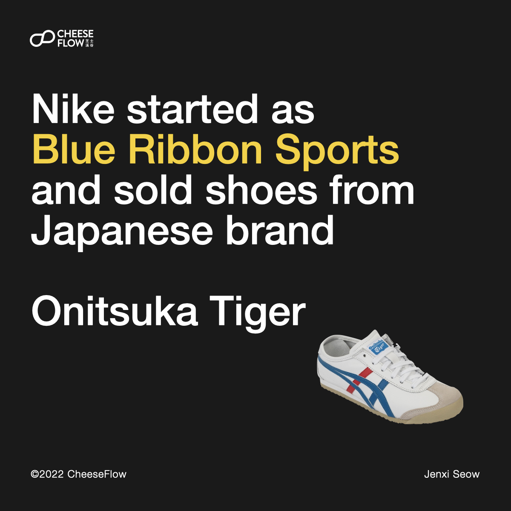
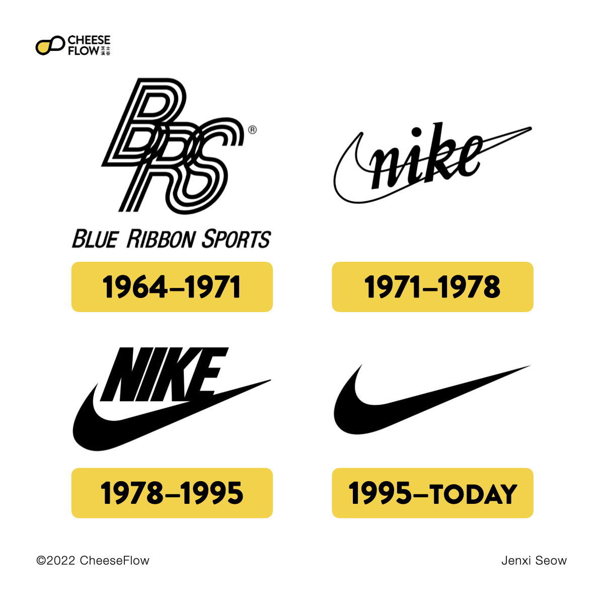
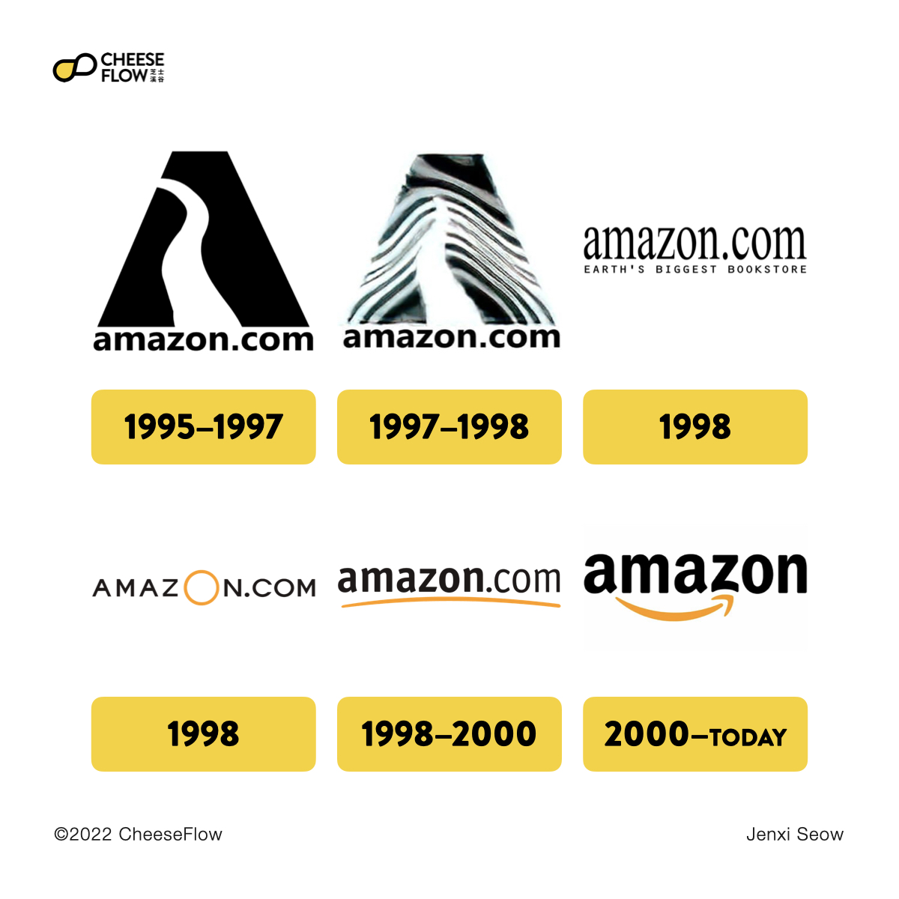
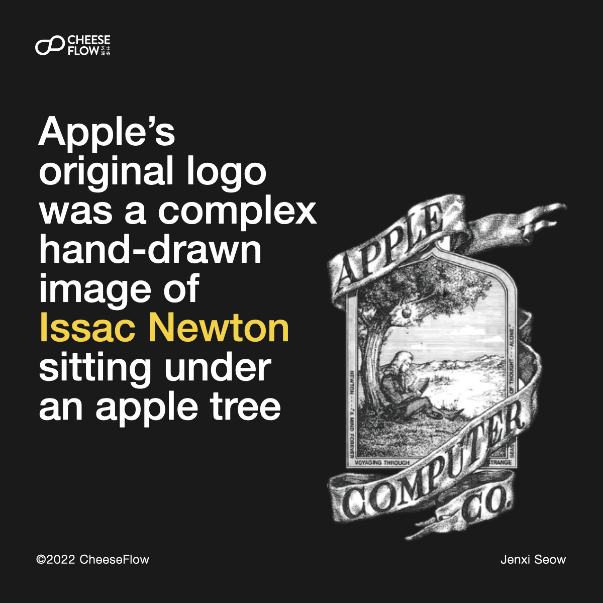
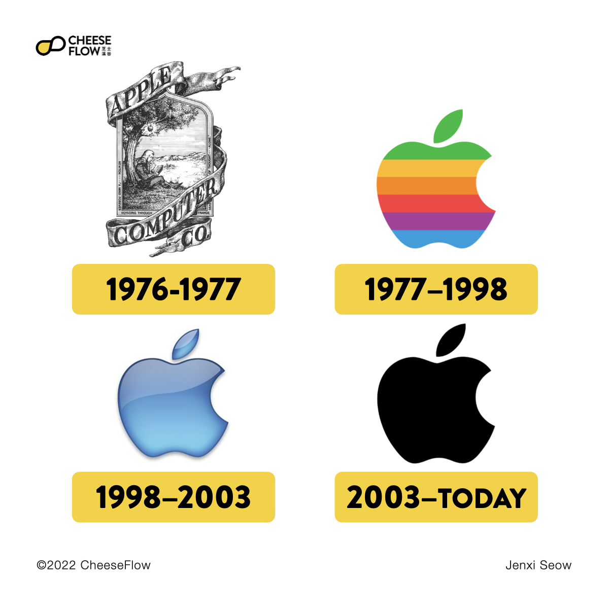
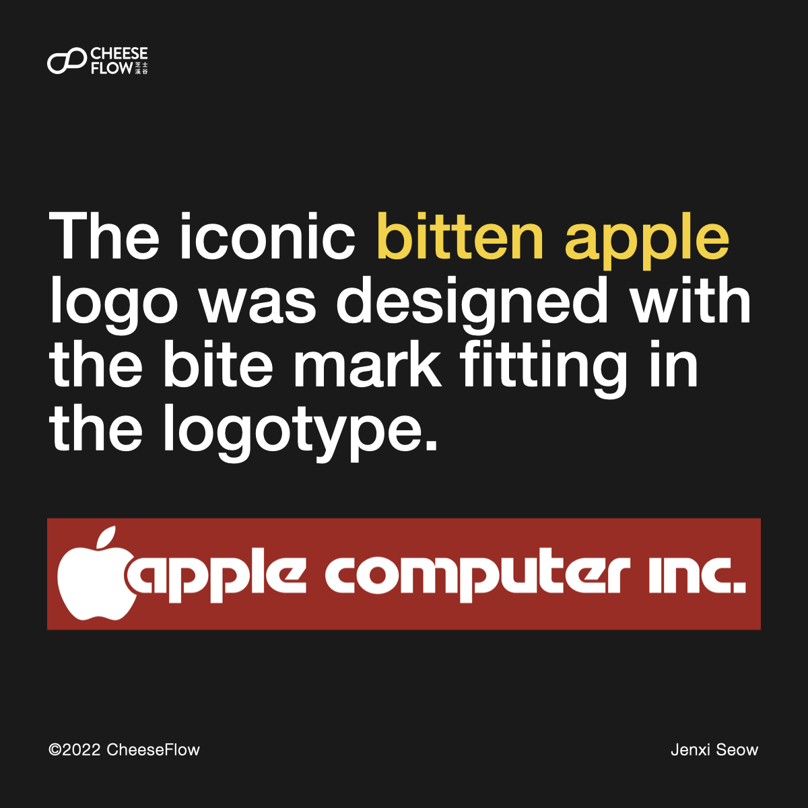

We often encounter brands that are so fixated with the logo design that they neglect or even push back the brand strategy considerations during the logo creation process. Let’s look at three famous brands that changed completely to understand that the branding journey is more than what we see today.

The most common mistake they make is looking at iconic logos without understanding the history and the journey it took for these famous brands to reach where they are today.

In the examples I chose, notice how the brands evolve through different stages of the brand’s growth. When they are new and young, the main concern is to get people to remember the brand’s name.

It is only later when the brand has become so well-known that they start to go minimal and some eventually drop the brand name in the logo. There is a strategy behind the whole brand creation process that determine the best approach and choices for brand name and logo.

## Nike

Nike first started out as Blue Ribbon Sports (BRS) in 1964. It was originally a distributor for Japanese brand Onitsuka Tiger. When the partnership ended, BRS went on to launch its own footwear and rebranded as Nike.

Carolyn Davidson was a graphic design student commissioned to design the logo for Nike. She created several designs and the swoosh logo was chosen out of the different options she delivered.

Many brands want a logo that is as iconic as Nike’s swoosh. However, it is worth noting that Nike’s swoosh carried the brand’s name from 1971 to 1995. It took the company 24 years before it could remove its brand name from the logo and still be recognisable.

If Nike started using just the swoosh as its logo, consumers would have no idea what the logo stands for or what brand it represented. Nike needed time to grow the brand awareness and allow people to associate the swoosh with the Nike brand.

They had to delight with their product and customer service to grow their brand loyalty and reputation. It was only when they are so well-known that people associated the swoosh with Nike. That was when they were able to remove the brand name from the logo.

## Amazon

When Jeff Bezos first started Amazon in 1995, the company positioned itself as an online bookstore. The original Amazon logo was a letter A with the Amazon River in it.

The logo used the company’s domain name as well. By having the domain name in the logo, it helped people to remember the website and visit it easily.

As Amazon evolved over the years, its logo changed. From including its tagline of “Earth’s Biggest Bookstore” to eventually adding its orange brand colour, before dropping the .com in the name. What we see today is the design with an arrow that looks like a smile and also indicates that Amazon sells anything from A to Z.

As you can see, what the logo is today is a far cry from what it was back in the days.

## Apple

We are all familiar with Apple’s iconic minimalist logo. It is so well known that almost all the brands we meet want a logo that is like Apple’s.

However, what many people fail to understand is that Apple’s success is not because its logo is easy to remember. It is the accumulation of decades of delightful user experience and great customer service that built the brand’s equity and reputation. All these allow the simple logo to be so recognisable.

It is not because Apple had an iconic logo that led the company to be so successful as a brand. In fact, Apple’s original logo was a complex hand-drawn image of Issac Newton sitting under an apple tree. It is an allusion to the apple incident that inspired Newton to formulate the theory of gravitation.

The logo that we see today came about in 1997 when designer Rob Janoff created the logo alongside the logotype Apple Computer Inc. The bite mark in the apple was designed to fit the letter A.

## Brands grow, logos evolve

Brands grow over time. They change with the shift in personnel, with the trends in the market, and with consumer feedback. As brands grow, their logos evolve base on what the brand stands for and wants to communicate.

They don’t start off iconic from day one. It is only when they become established that they start to adopt brand strategies that young brands are unable to use.

The right brand strategy is important during the logo creation, more so than the design of the logo.

Follow us on [Instagram @thecheeseflow](https://instagram.com/thecheeseflow/) to learn more about branding or subscribe to get the latest articles in your inbox.

