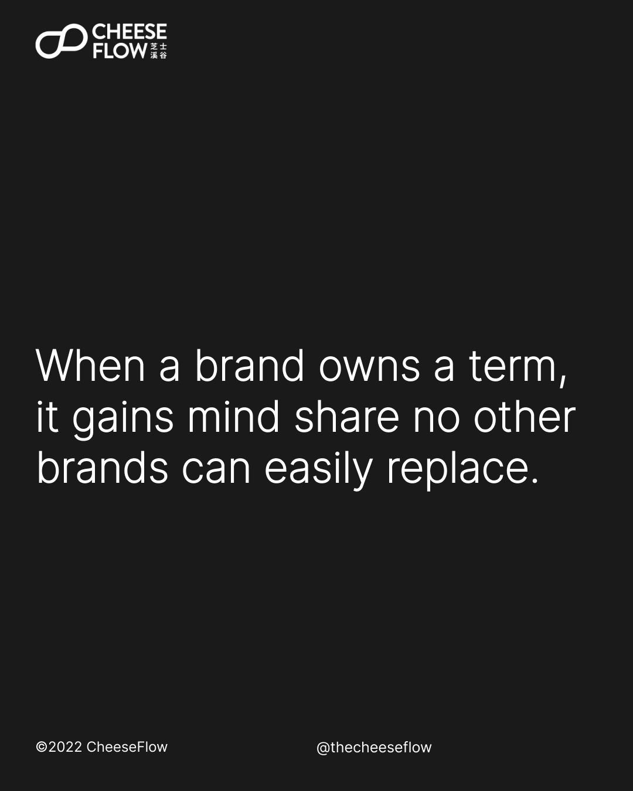
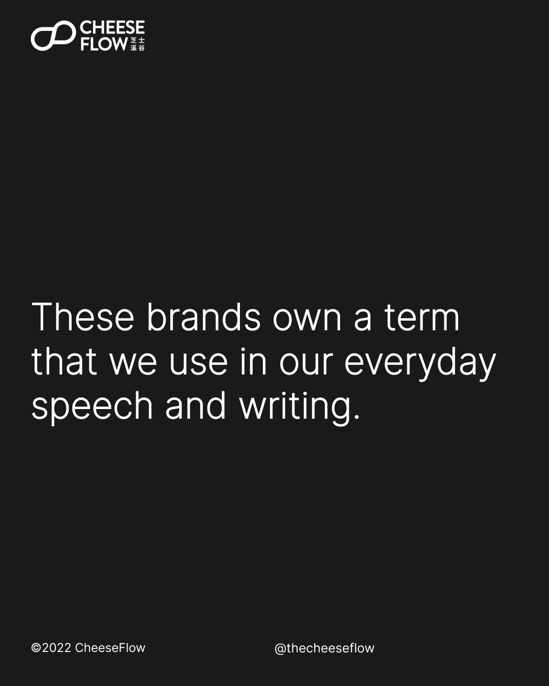
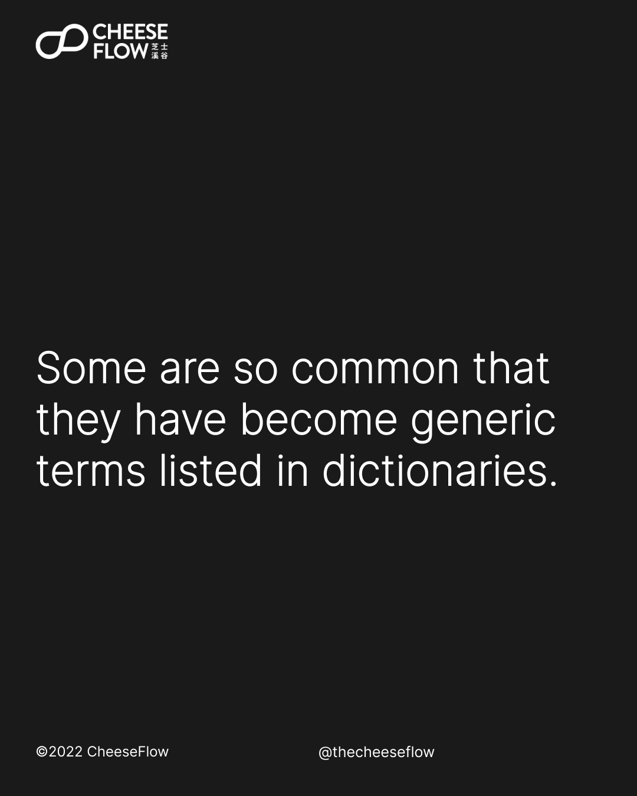
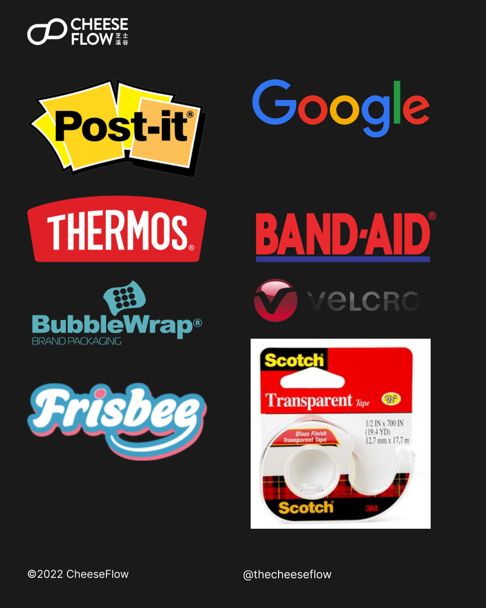
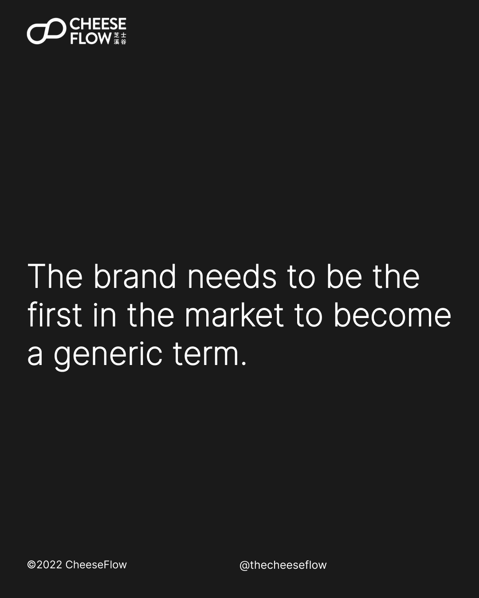
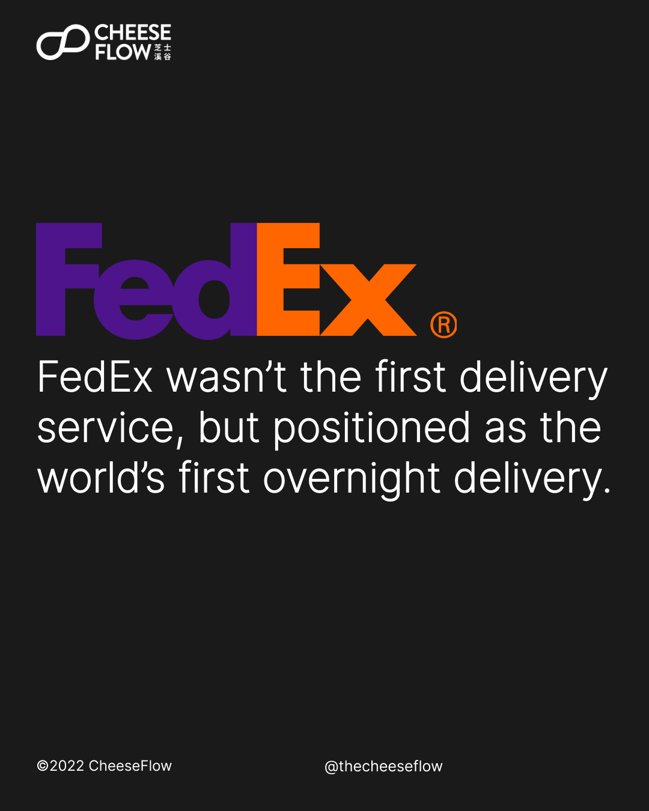
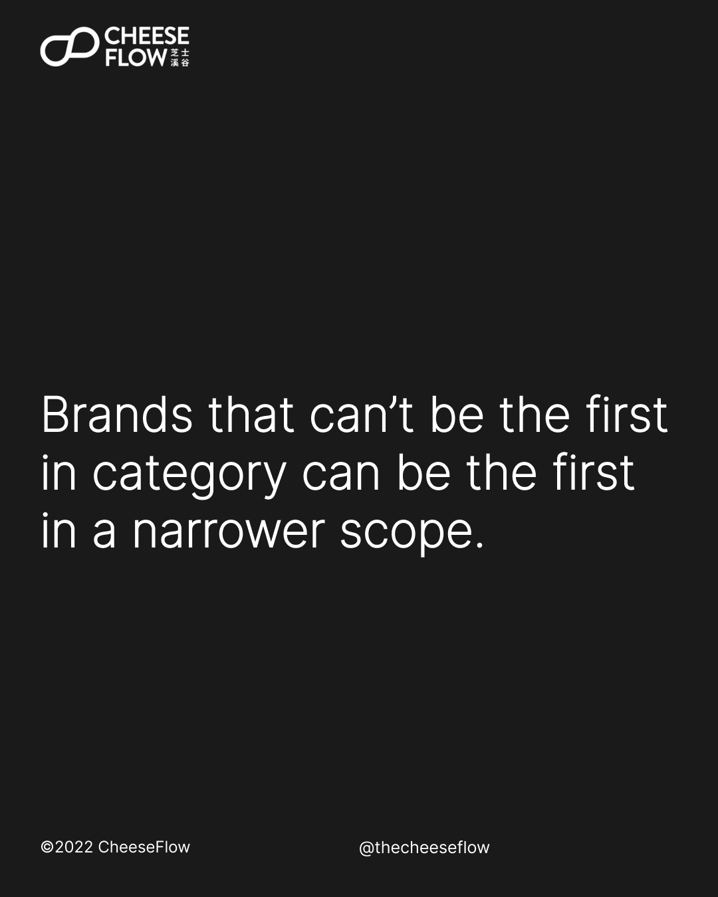

We looked at how brands should grow their brand power, and build and maintain their brand. Before we look at the importance of owning a term, let’s have a quick recap. Brand power [decreases with scope](https://cheeseflow.com/secret-of-brand-power-part-1/) and [increases with focus](https://cheeseflow.com/secret-of-brand-power-part-2/). We [build brands with publicity](https://cheeseflow.com/secret-of-brand-power-part-3/) and [maintain them with advertising](https://cheeseflow.com/secret-to-brand-power-part-4/).

Advertising lets brand stay fresh in consumers’ minds. But it is not enough to just remind consumers that the brand exists. When a brand owns a term, it gains consumer mind share that no other brands can easily replace.

## Brands that own a term

How often do you see people asking for Kleenex instead of tissue paper? Q-Tip instead of cotton buds. Xerox instead of photocopy. Ziploc instead of resealable bags. Sharpie instead of a permanent marker. Photoshop instead of image manipulation.

These are brand names that occupy the mind share by owning the term they replace in our everyday speech and writing. In fact, some of them are so commonly used that they have become generic terms that are listed in dictionaries.

Post-It instead of sticky notes. Thermos instead of a vacuum flask. Scotch tape instead of transparent adhesive tape. Band-Aid instead of adhesive plaster. Chapstick instead of lip balm. Tupperware instead of plastic containers. Frisbee instead of a flying disc. Bubble Wrap instead of packaging cushioning. Velcro instead of sticky fabric strips. Google instead of search the internet with a search engine.

Of course, it is not easy to become a generic term. The brand needs to be the first of its kind in the market and category.

## Becoming the world’s first

It might not be possible for brands to have products to be the first in their category. The way around this is to narrow the scope.

FedEx was not the first delivery service, but it positioned itself as the world’s first overnight delivery. By narrowing the focus of the brand promise, you can rightfully claim to be the first in the particular niche.

It goes without saying that this should be done right. We see many brands that claim to be the world’s first in ridiculous and meaningless ways. Doing so does not let brands gain consumers’ mind share. Instead, what seems like a false or lofty claim would increase distrust in the brand.

We found [Zeus](https://www.kickstarter.com/projects/asaptechnologies/zeus-charger) via a quick search on Kickstarter. It claims to be “Zeus: Worlds First & Smallest 270W GaN USB-C Charger”. First, it should be “World’s” instead of “Worlds”. Poor grammar is highly frowned upon. Zeus is not the world’s first GaN USB-C charger, nor is it the world’s smallest. It claims to be the world’s first and smallest 270W GaN USB-C charger.

Instead of a narrowing the focus, it zooms in on the 270W GaN USB-C charger niche. Does the claim help generates conversions? Of course. Does it help the grow brand power? No.

## Choosing the right term

You need to find a term that no other competing brands own. However, it should still be a term that consumers would think about.

Consumers would think of buying a GaN charger, a USB-C charger, or a GaN USB-C charger. Of these three, they would most likely remember a brand that sells good GaN chargers. However, they would not be thinking a brand that sells good 270W GaN charger.

Here’s another example. A consumer would look for a brand that makes a smartphone with a large screen, a smartphone with good battery life, or a smartphone with large screen and good battery life. They would not be thinking of a brand that makes a smartphone with 6.7” screen or one with video playback of 30 hours.

## Grow your brand power

Choosing the right term is important. It makes the difference between creating a short term buzz and interest in a product launch compared to building brand power.

Once you are able to own the right term, your brand gains foothold in consumers’ minds and helps your brand differentiate meaningfully from your competitors.

Coca-Cola positions itself as the timeless cola brand. Pepsi positions itself as the timely brand. Pepsi is fun, cool, and targets the young crowd through celebrity partnerships. This allows Pepsi to differentiate itself from the competitor that owns the cola term and is considered the classic cola.

Do you want to tap on the secrets of brand power? Find the term that your brand can own.

[Speak to us](https://cheeseflow.com/contact/) if you are interested to understand how we can help you to grow your brand power.

Follow us on [Instagram @thecheeseflow](https://instagram.com/thecheeseflow/) to learn more about branding or subscribe to get the latest articles in your inbox.

