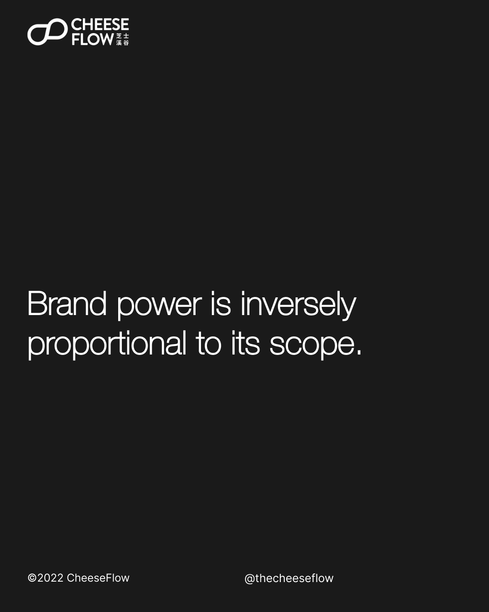
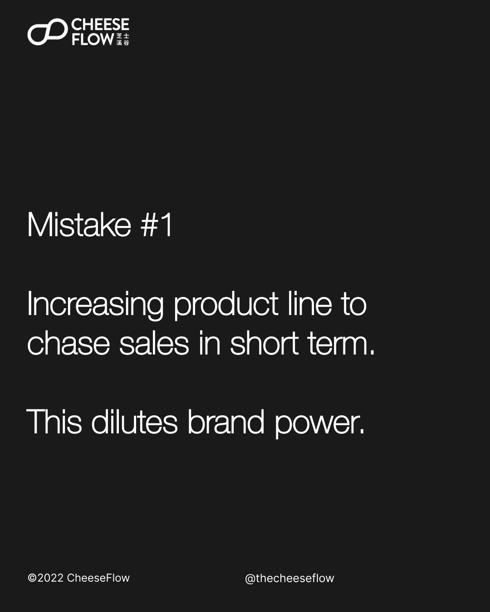
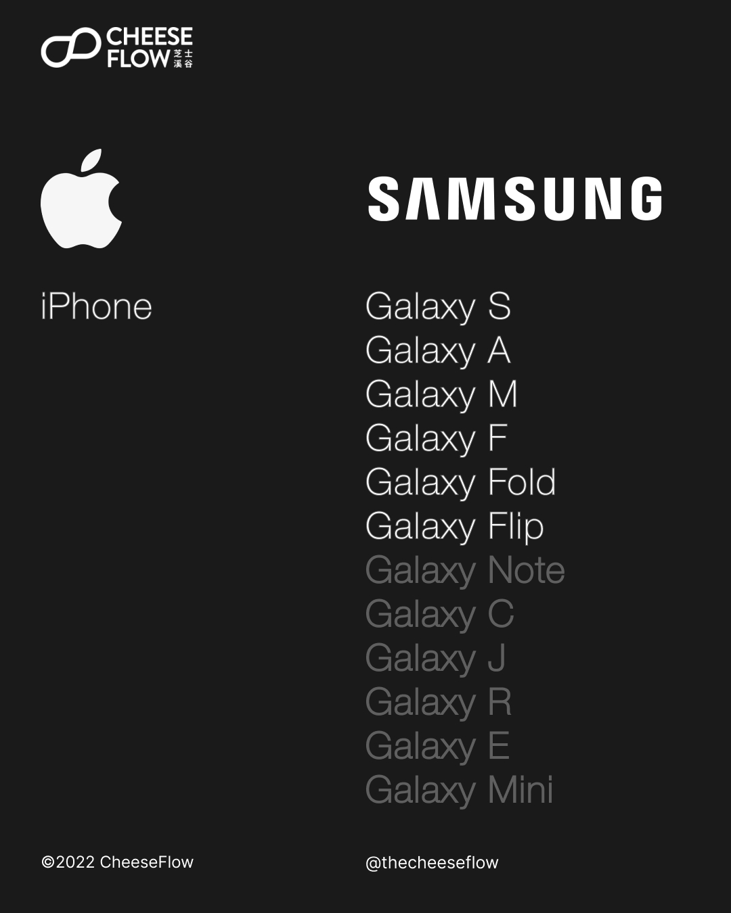
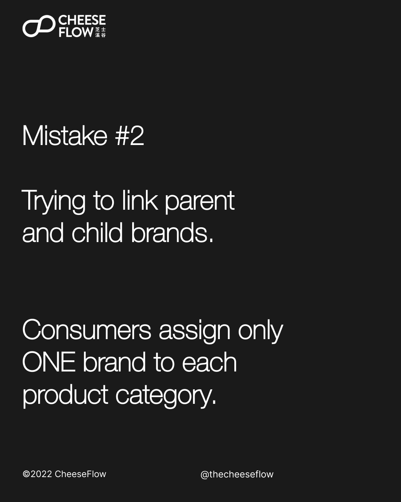
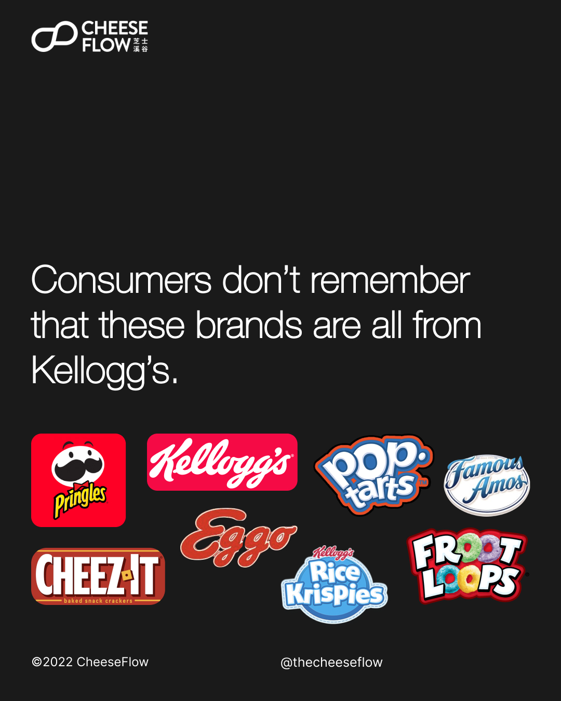
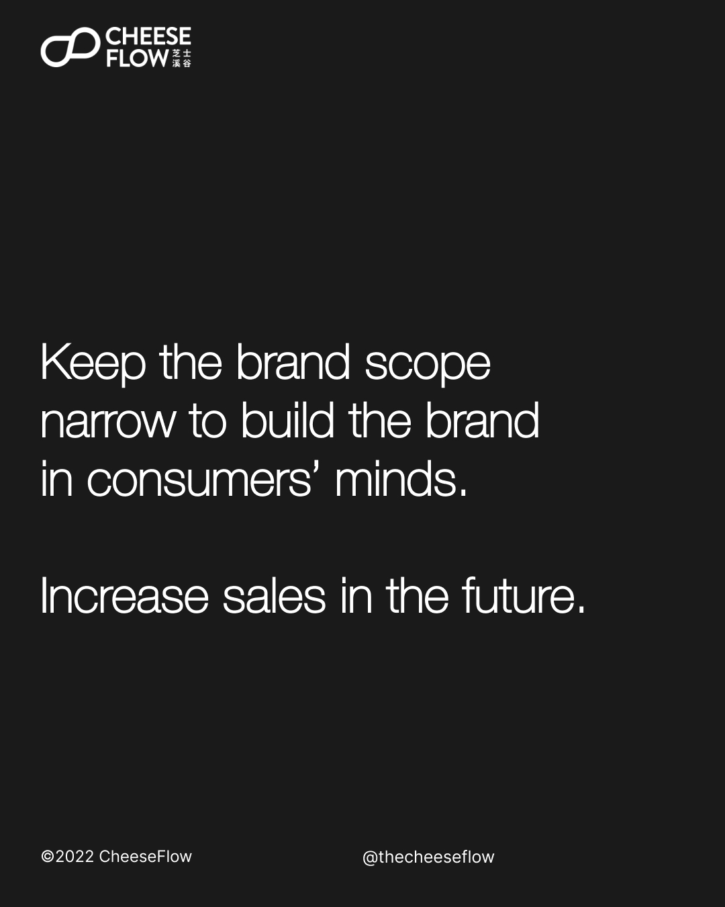
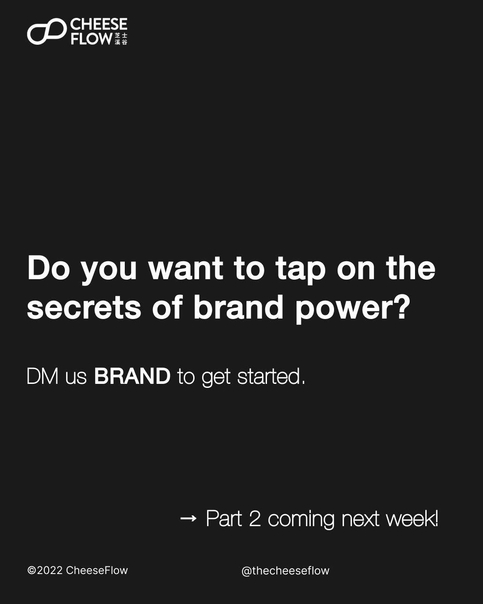

The secret of brand power is actually not much of a secret. Many people know it but they fail to act in a rationale way. They believe that their brand is special and thus immune to the principles of branding.

Brand power is inversely proportional to its scope. This means that when your brand has a wider scope, its power weakens. This happens when you put your brand on every product.

Likewise, by limiting the products you put your brand on, you strengthen your brand’s power.

Brand often make three mistakes when it comes to brand power.

## Mistake #1: Increasing product line

We often come across companies that chase short term benefits. They add a lot of products to the same brand to grow sales in the short term.

However, this dilutes the brand name in the long term, and weakens the brand power.

Samsung had the largest worldwide smartphone market share in 2012 at 23.7%. Its latest market share in 2021 is 20.1%. Apple had a worldwide market share of 8% in 2012 and 17.4% in 2021.

To cater do the mid and low end market, Samsung has many phone models in its product line with confusing naming. Meanwhile, Apple sticks to the iPhone with the use of Plus, Pro, and Pro Max to differentiate the models.

Consumers remember the iPhone brand, whereas Samsung users refer to their phones as the S22, Filp/Fold, or Note, that has been discontinued instead of Galaxy phone.

## Mistake #2: Parent and child brands

Some companies try to relate the parent brands with the child brands.

They make the mistake of thinking that the child brand will make consumers think of the parent brand, and vice versa.

Consumers only assign one brand to each product category.

When people think of cola, the first brand that comes to mind is most likely Coca-Cola. Unsurprising since the category is named after Coca-Cola.

And consumers don’t necessarily use the name the brand calls itself. How often do you hear people saying Coke instead of Coca-Cola?

While the iPhone brand is strong internationally, it is a lot less so in China due to the language. People in China are less likely to call it iPhone. Instead, they refer to it as the Apple phone.

Likewise, the iPad is simply called the pad or tablet in China. This goes to show how the brand has occupied the mindshare without consumers even remember or using the product’s name.

People want names that are easy to distinguish and easy to call.

Kellogg’s have many child brands. However, consumers remember each child brand and generally don’t think of Kellogg’s when they think of the child brands. They attach only one name to each product category, and in this case it’s the product’s name.

## Mistake #3: Mistake weak competition as success

When there is weak or no competition in the product category, companies often make the mistake of thinking that their brand extension is successful.

When there is no competition, new product lines will just cannibalise the brand’s own sales in the category.

## Grow your brand power

Keep your brand’s scope narrow to build the brand in consumers’ minds. This will increase sales in the future and grow the brand power in the long term.

Do you want to tap on the secrets of brand power? Are you making one of the mistakes?

[Speak to us](https://cheeseflow.com/contact/) if you are interested to understand how we can help you to grow your brand power.

Follow us on [Instagram @thecheeseflow](https://instagram.com/thecheeseflow/) to learn more about branding or subscribe to get the latest articles in your inbox.

