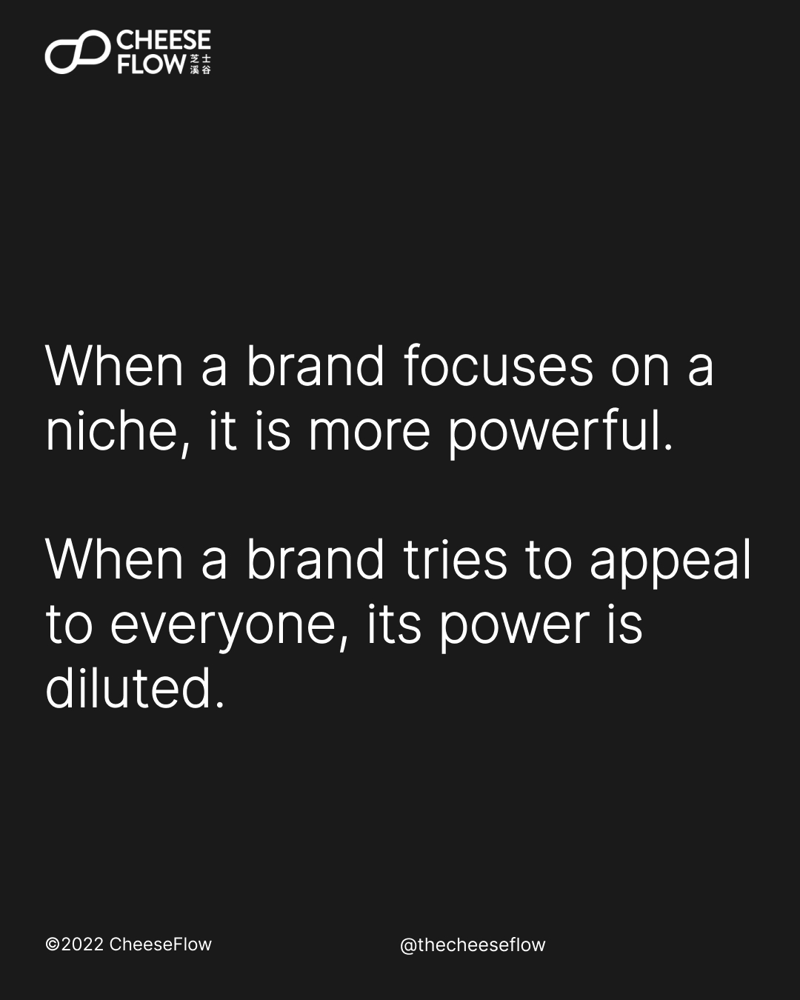
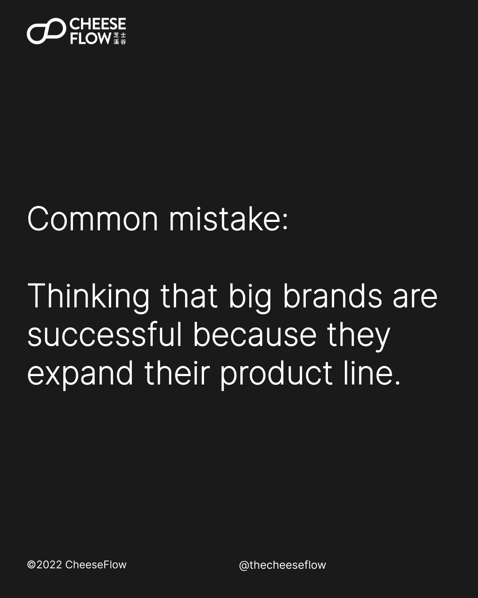
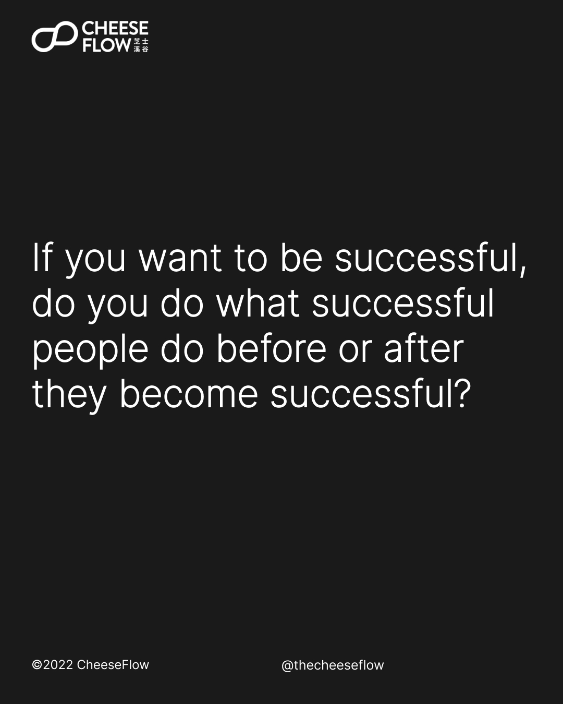
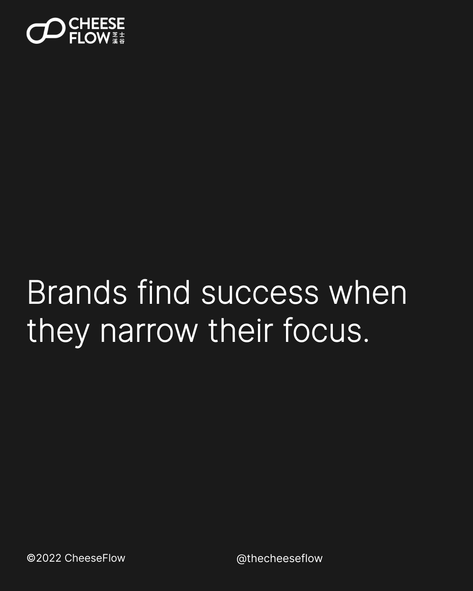
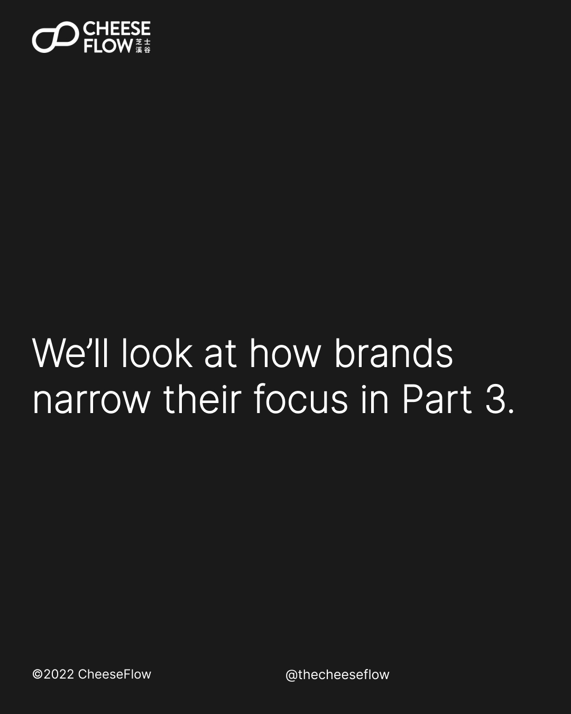
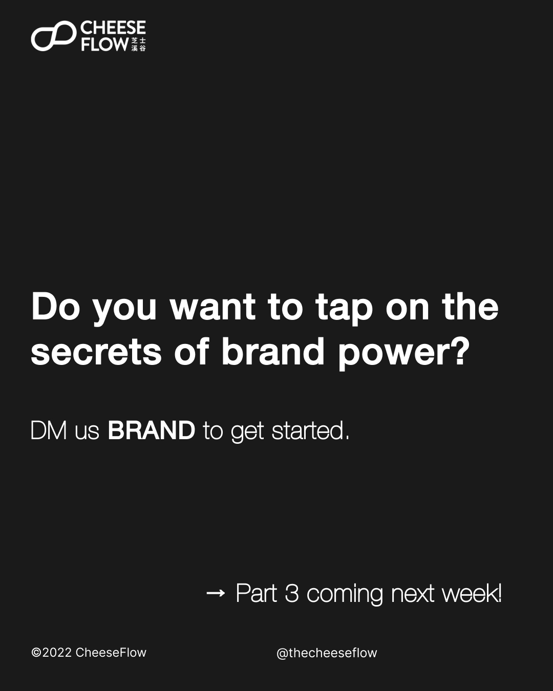

We learnt in the previous article that the secret of brand power lies in having a narrow brand scope. In other words, brand power is stronger when the brand has greater focus.

## Brand power is proportional to its focus

When a brand focuses on a niche, it is more powerful. When a brand tries to appeal to everyone, its power is diluted. Focusing on a niche makes the brand powerful, especially in the category it occupies.

But if this is the case, then why are successful brands expanding their product lines? Why are they trying to create new products to cater to different customer segments in a product category. Why are they creating new products to enter new product categories?

Look at Coca-Cola. There’s Diet Coke, Coca-Cola Zero, Coca-Cola Vanilla, and other special versions with different tastes.

Besides coffee, Starbucks sells matcha, smoothies, fruit juices, fruit beverages, mugs, bottles, muffins, sandwiches, and so on.

It is not surprising that people make the common mistake of thinking that big brands become successful because they are expanding their product line. More products means more sales, more sales means more success.

## Instead of successful brands, think of successful people

If you want to become successful like them, do you do what they do? Do you buy fancy cars, expensive houses, eat expensive meals, and buy luxury products? Of course, not every successful person would splurge their wealth but even if they don’t, they have the financial ability to if they want to.

We know that it doesn’t make sense to live the life of successful people when we are still in the process of chasing success. If you were to live the lifestyle of successful people, chances are you’ll just be pushing success further out of reach, or end up bankrupt.

Instead, you should be doing what successful people did before they become successful. We all know this. That’s why we like to read and watch the stories of how they became successful and try to learn from them.

Likewise, brands chasing success should be doing what successful brands did before they became successful.

So what did successful brands do before they became successful? No prizes for guessing the answer -- they narrow their focus.

When coffee shops were selling all kinds of food and drinks, Starbucks chose to focus on only coffee. It was only after they became a successful and recognisable brand that they started to offer other products like other coffee shops.

Coca-Cola only sold cola for decades. It is after they established themselves as a successful brand that they started expanding their product line.

Products like Diet Coke and Coke Zero were actually launched to deal with the image of carbonated drinks being unhealthy. So this is a more complicated brand strategy and a topic for another day.

In fact, most of Coca-Cola’s products use different brand names that many people don’t even relate to Coca-Cola. Sarsi, Fanta, Sprite, Minute Maid, Nestea Lemon, Dasani, Qoo, Costa Coffee and others.

## When you focus, you target a niche audience

The other important benefit of narrowing your focus is that you target a niche audience. When your target customers belong to a niche, it is easier for you to understand what them and what they value in the products they buy. This allows you to build a brand that appeals to them.

Most delicatessens in the US serve all kinds of food. Subway decided to be a deli that sold only submarine sandwiches. Yes, they were that specific with their focus. They did not just focus no sandwiches, but a particular type of sandwich.

This made Subway well-known for submarine sandwiches, and the company also became very good at making them since that was the only type of product it served.

When they become good at making submarine sandwiches, it just reinforces customer impressions that Subway served the good submarine sandwiches, if not the best. This becomes a positive feedback loop that solidifies Subway’s position as the top of customer mind share when it came to submarine sandwiches.

## Grow your brand power

Narrow your brand’s focus to magnify your brand power. Look at what successful brands did and learn from what they did, not what they are doing now.

Do you want to tap on the secrets of brand power? Are you making one of the mistakes?

[Speak to us](https://cheeseflow.com/contact/) if you are interested to understand how we can help you to grow your brand power.

Follow us on [Instagram @thecheeseflow](https://instagram.com/thecheeseflow/) to learn more about branding or subscribe to get the latest articles in your inbox.

