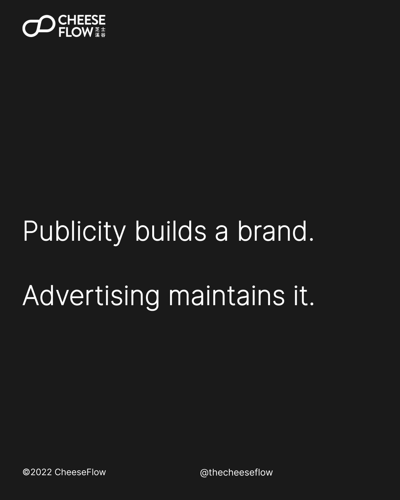
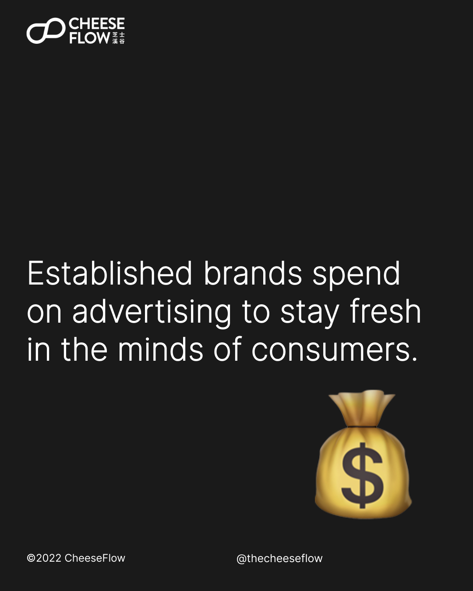
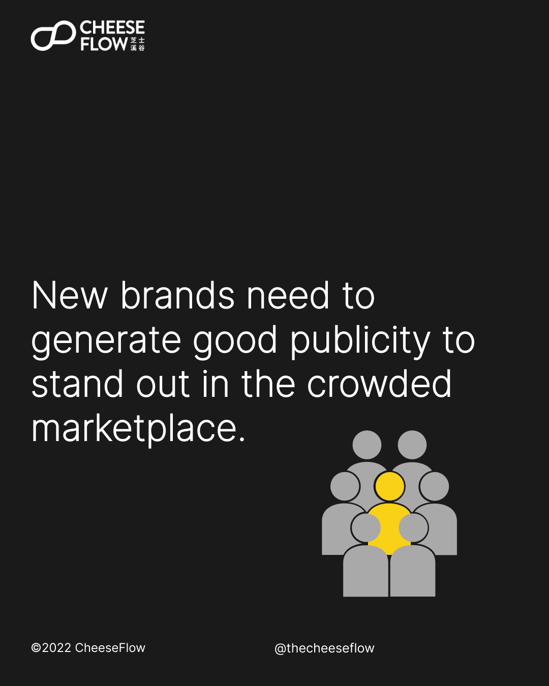
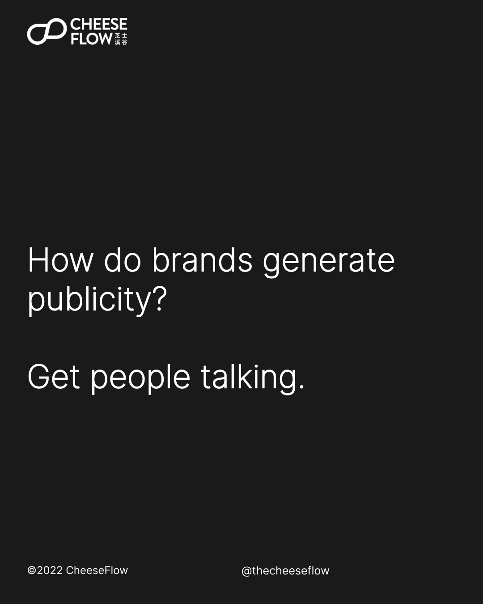
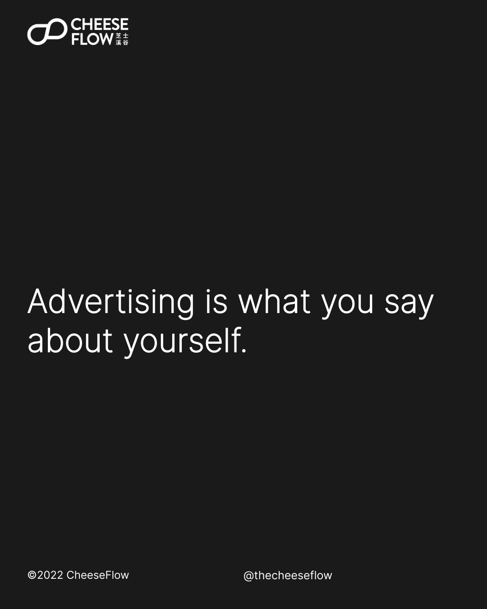
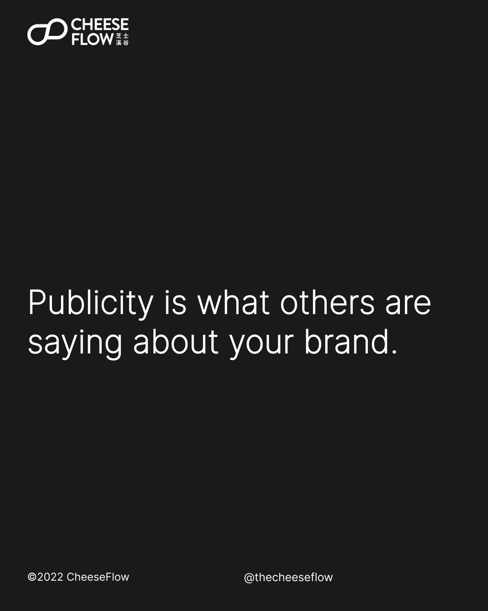
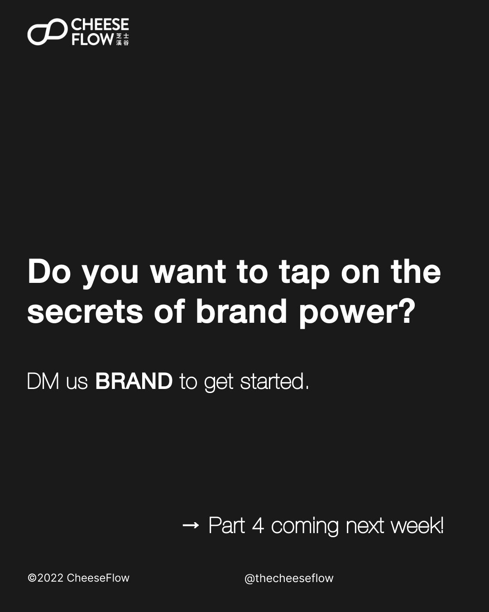
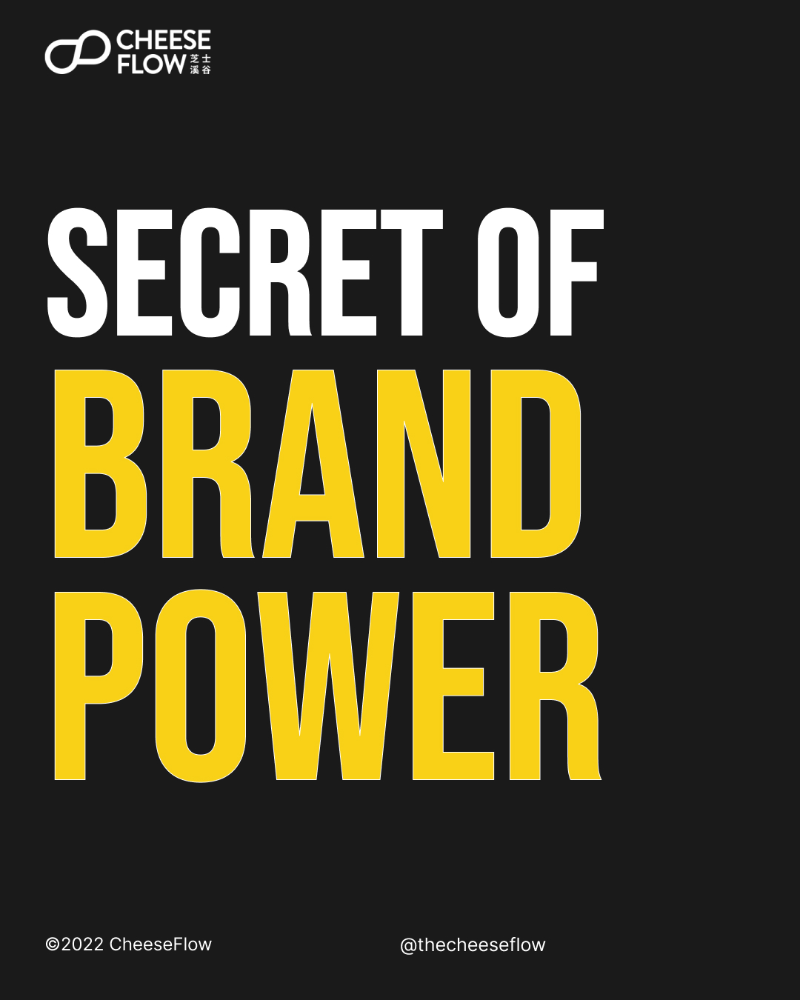
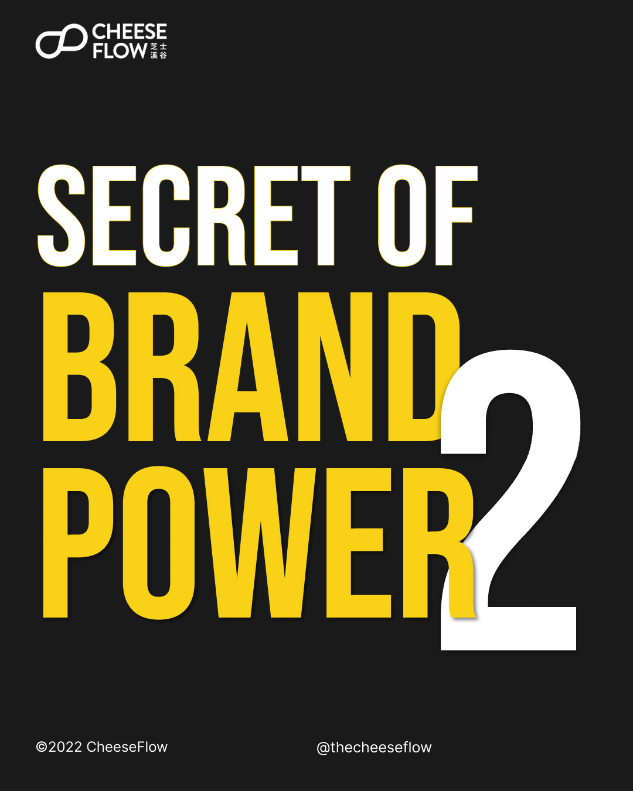

We learnt in the previous articles that the secret of brand power lies in having a narrow brand scope and narrow focus. In this article, we look at how brand power grows with publicity, not advertising.

## Publicity vs advertising

It is important to understand the difference between building a brand and maintaining it. Brand building requires creating more awareness of a brand, while advertising provides brand maintenance by reminding the consumers about the brand.

Established brands need to spend on creative advertising to stay fresh in the minds of consumers. Advertising also generate sales through marketing campaigns. They do this to maintain their brand.

New or growing brands need to generate good publicity to be seen and heard in the crowded marketplace, and potentially stand out in a way that makes consumer pay attention to them.

This generates awareness of the brands and slowly builds the brand. Brand building through publicity is a slow, long-term process.

In comparison, advertising generates more immediate and tangible results.

Yet, if new brands dive straight into advertising, they will find it harder to generate returns than if there is already publicity. This is because they are not at a stage where they need to maintain the brand.

Does that mean that you shouldn’t be spending money on digital ad-buy? Not necessarily. There are ways to generate publicity through the right type of ad-buy.

## How to and why generate publicity?

How can a brand generate publicity? Make the news media want to talk the brand. This includes KOLs and influencers.

They are always looking for content that would be interesting for their audience. So your brand needs to be newsworthy or have a story that they might be interested to talk about.

Why is it important to generate publicity? What others say about your brand has more power than what you say.

> Your brand isn’t what you say it is.  
> It’s what they say it is.
> 
> Marty Neumeier

Publicity is all about what others are saying about your brand. Advertising is what you say about yourself. That’s why publicity is more effective than advertising.

## Grow your brand power

Narrow your brand’s focus to magnify your brand power. Look at what successful brands did and learn from what they did, not what they are doing now.

Do you want to tap on the secrets of brand power?

[Speak to us](https://cheeseflow.com/contact/) if you are interested to understand how we can help you to grow your brand power.

Follow us on [Instagram @thecheeseflow](https://instagram.com/thecheeseflow/) to learn more about branding or subscribe to get the latest articles in your inbox.

## [Secret of Brand Power Part 1 →](https://cheeseflow.com/secret-of-brand-power-part-1/)

Brand power is inversely proportional to its scope.

## [Secret of Brand Power Part 2](https://cheeseflow.com/secret-of-brand-power-part-2/) →

Brand power is proportional to its focus.

