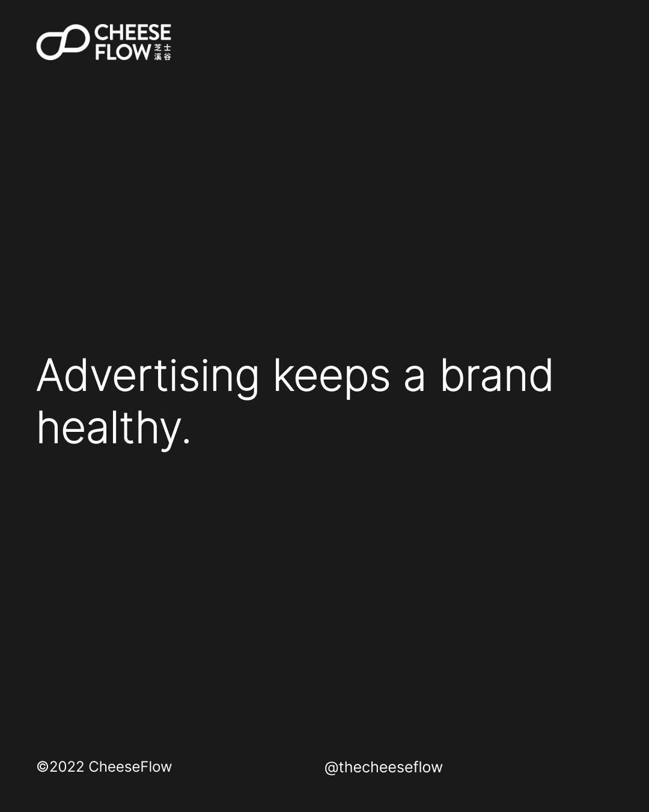
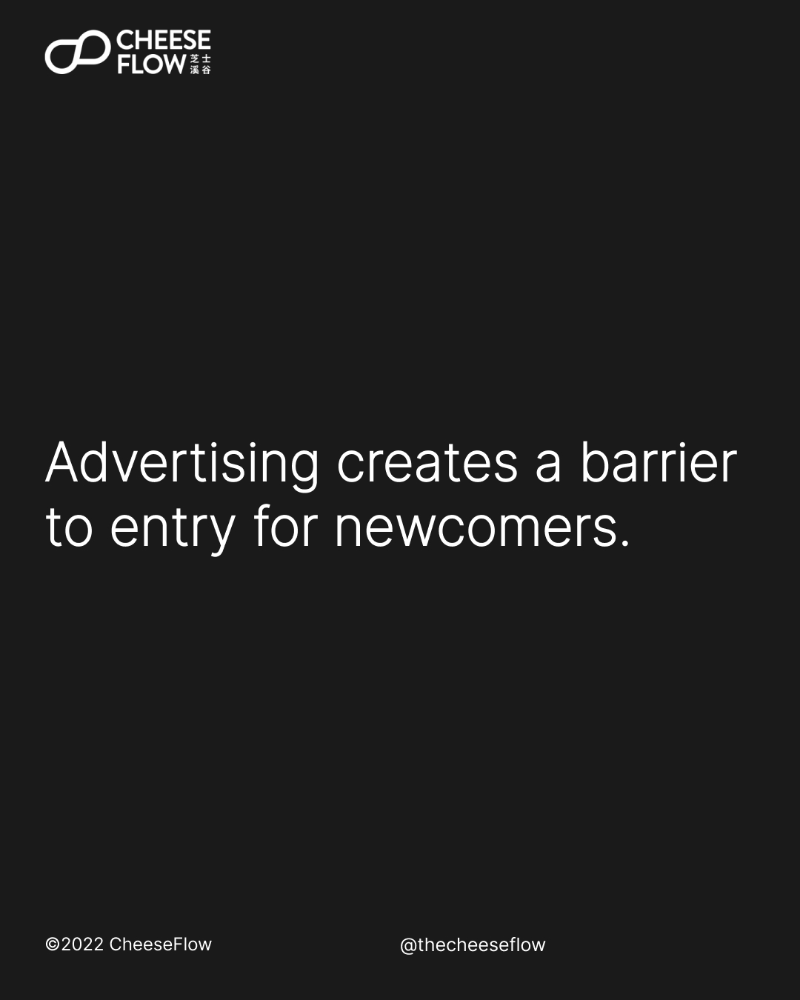
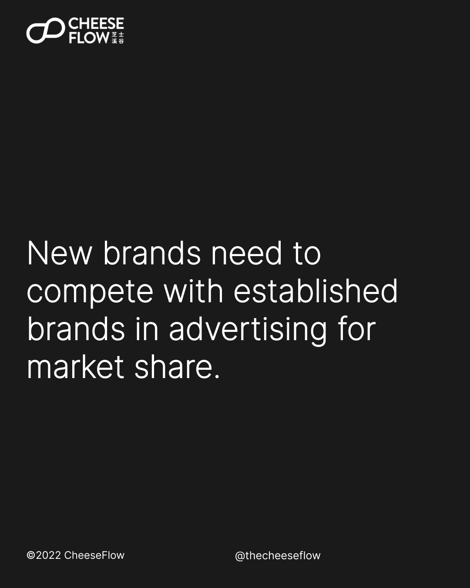
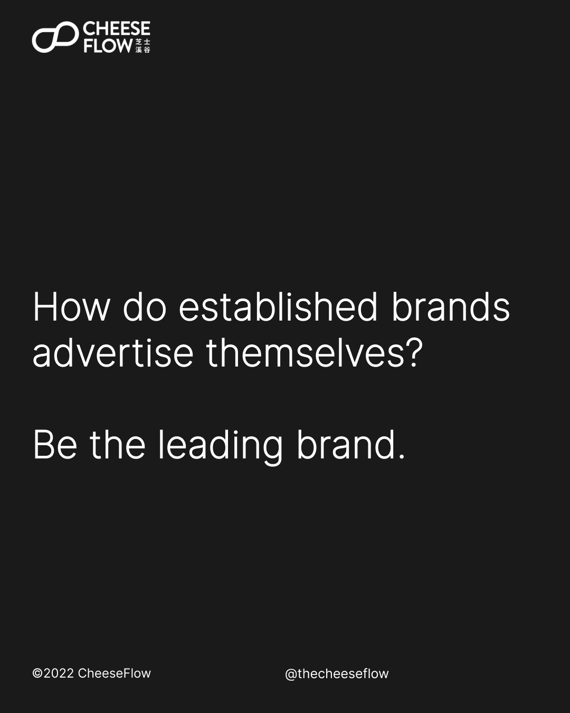
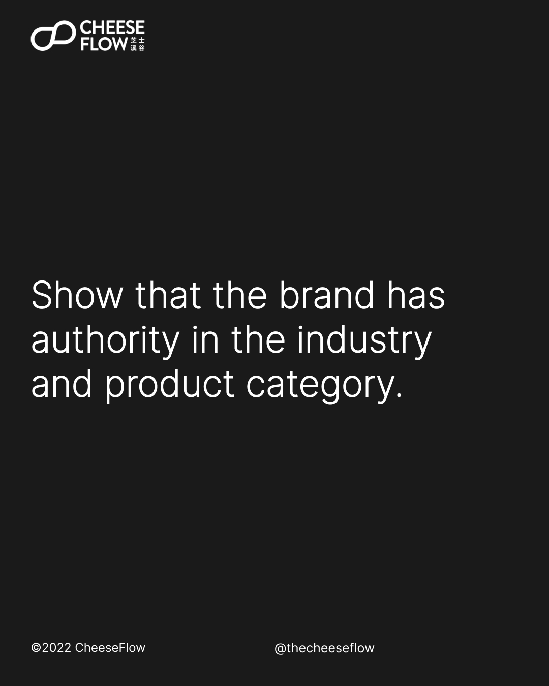
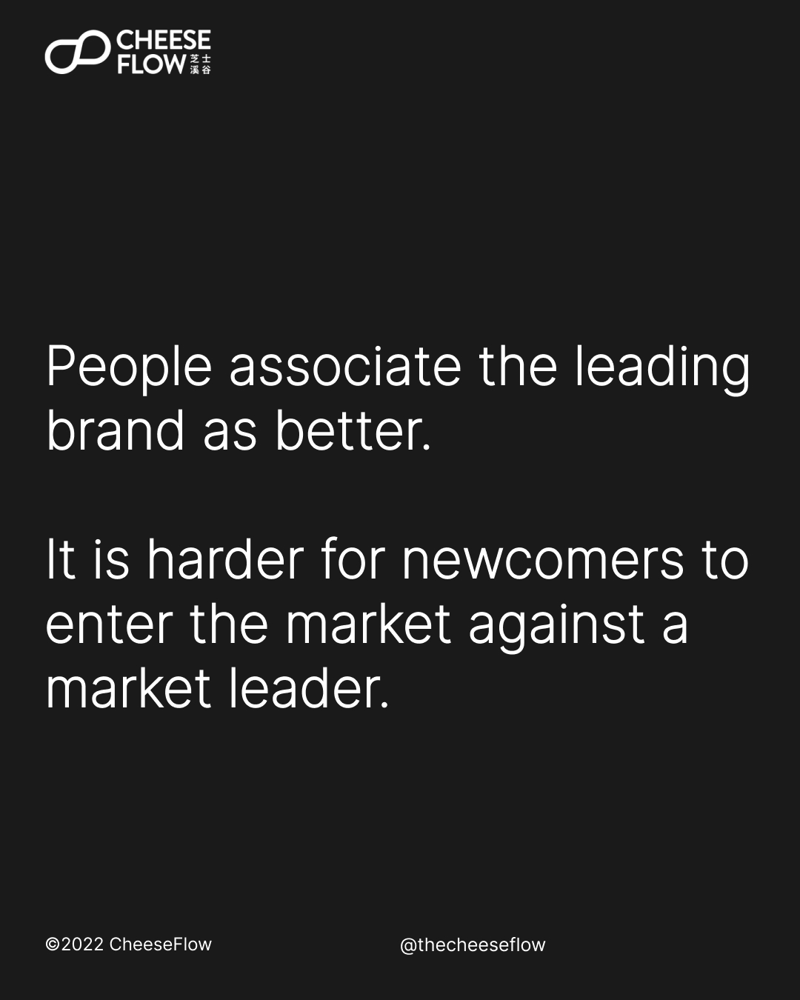
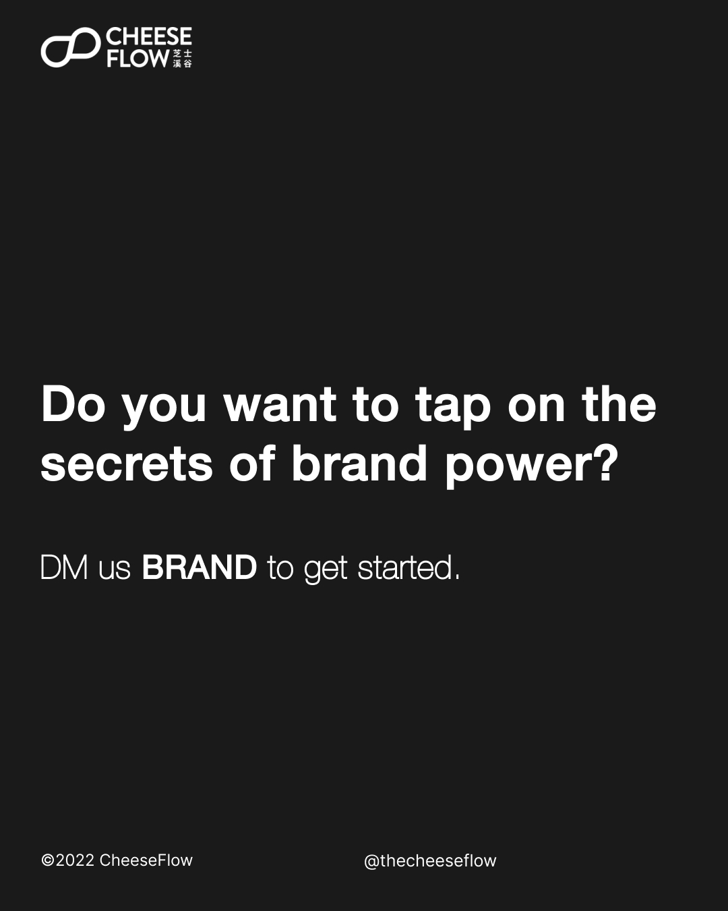

We learnt in the previous articles that having a narrow brand scope and narrow focus are the secrets of brand power. We also discussed how a brand grows with publicity, not advertising.

## Advertise when publicity fades

However, when brands become established, they rely on advertising to maintain the brand.

Once publicity fades, brands to advertise to stay fresh in consumers’ minds.

There are thousands of brands in the market and consumers are likely to come across hundreds of them each day in their daily lives. Advertising is how brands remind consumers that they exist.

Since established brands are advertising to get the attention of consumers, brands that do not advertise would not appear in consumers’ minds that often and risk being forgotten.

## Advertising is a barrier to entry

The need to advertise requires brands to set aside budget for ads and the creation of marketing campaigns. It pushes brands to constantly think of new ideas to look fresh and relevant to consumers.

While this might seem like a burden on a brand, the need for advertising to carve out market share is also beneficial.

New brands need to compete with established brands to get a slice of market share. This means that advertising creates the barrier of entry for newcomers.

This provides established brands with a certain level of protection against new competitors, especially those with limited or no budget to invest in advertising.

## Advertise the right way

A common mistake brands make is to advertise just to tell their target audience about the products or benefits. They fail to understand how established brands advertise effectively.

When your brand tries to highlights why it is better, consumers tune out your marketing spiel. It is what you say about yourself, of course you would say good things about yourself.

We talked about how publicity is more power than advertising because publicity is what others say about you, and hence is more believable.

However, there is a way to talk about yourself in a convincing way. The key to a good advertising strategy is to position an established brand as the leading brand.

## Power of the leading brand

People tend to associate leading brands with better products. If your brand is the market leader, then it should know a lot about the industry, the product category, and knows how to create a good product.

Barilla positions itself as Italy’s number one pasta. Coca-Cola claims to be the real cola. Heinz calls itself America’s Favorite Ketchup.

Apple is the leading brand in the world. People automatically think Apple products are better.

Being a market leader gives the brand more authority in the industry and product category.

When consumers consider your brand the leading brand, new brands will have to pay even more in order when they advertise to compete against you. If they are unable to go head on with you, consumers will view them as the smaller brand.

## Grow your brand power

We see this transition with Apple. When Apple was competing with market leader Microsoft, we saw ads that showed why Apple products were better than the market leader. In contrast, modern day Apple positions itself as the leader in innovation and privacy.

However, even when Apple was competing against the market leader, it positioned itself as the leader in user experience. Apple found ways to advertise in such a way that it was a leading brand even when compared to the market leader.

Having the right advertising strategy will give you better returns on the money you invest in ads.

Do you want to tap on the secrets of brand power?

[Speak to us](https://cheeseflow.com/contact/) if you are interested to understand how we can help you to grow your brand power.

Follow us on [Instagram @thecheeseflow](https://instagram.com/thecheeseflow/) to learn more about branding or subscribe to get the latest articles in your inbox.

