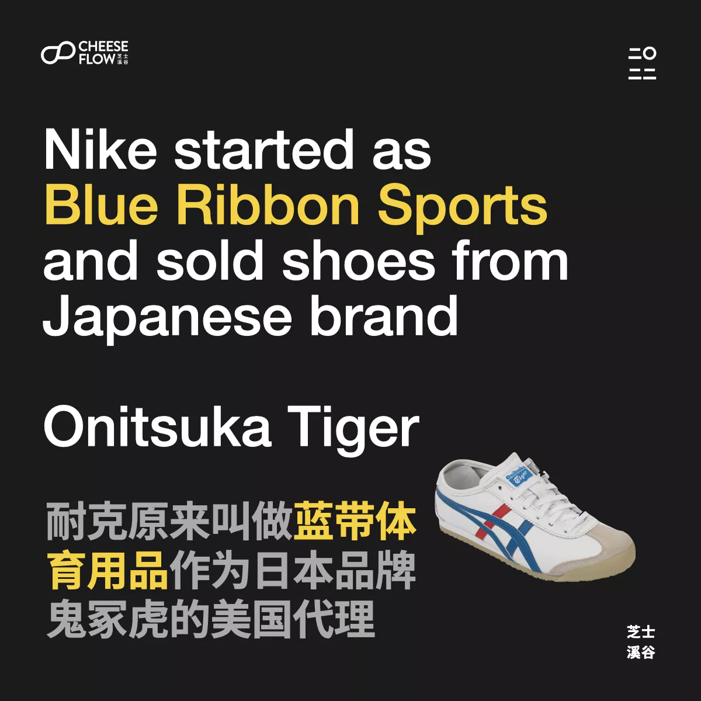
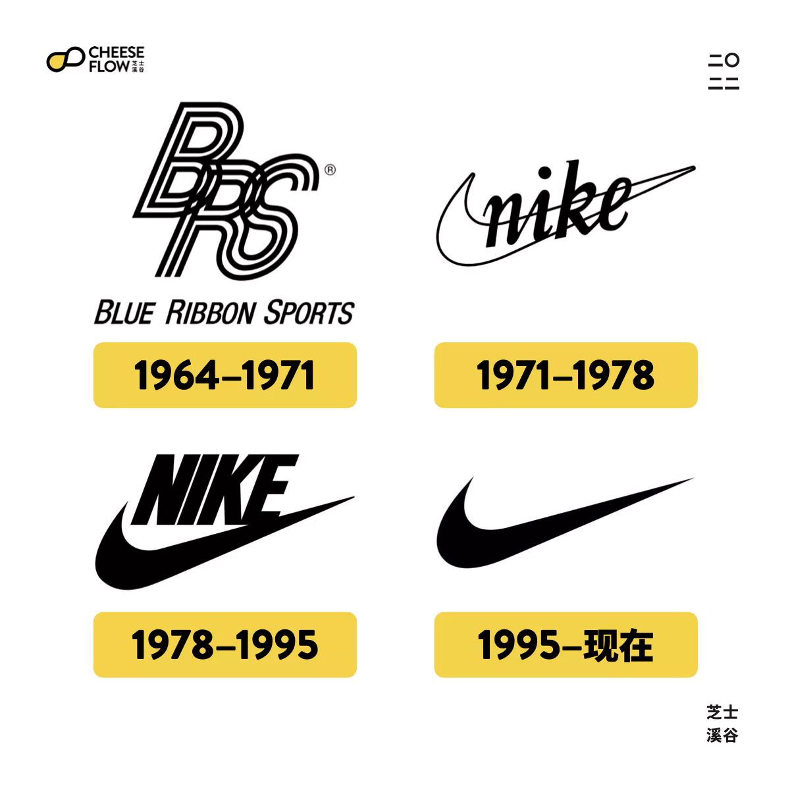
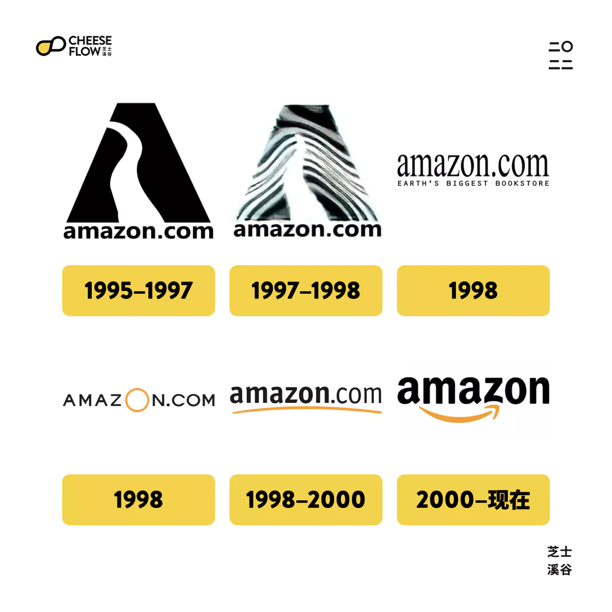
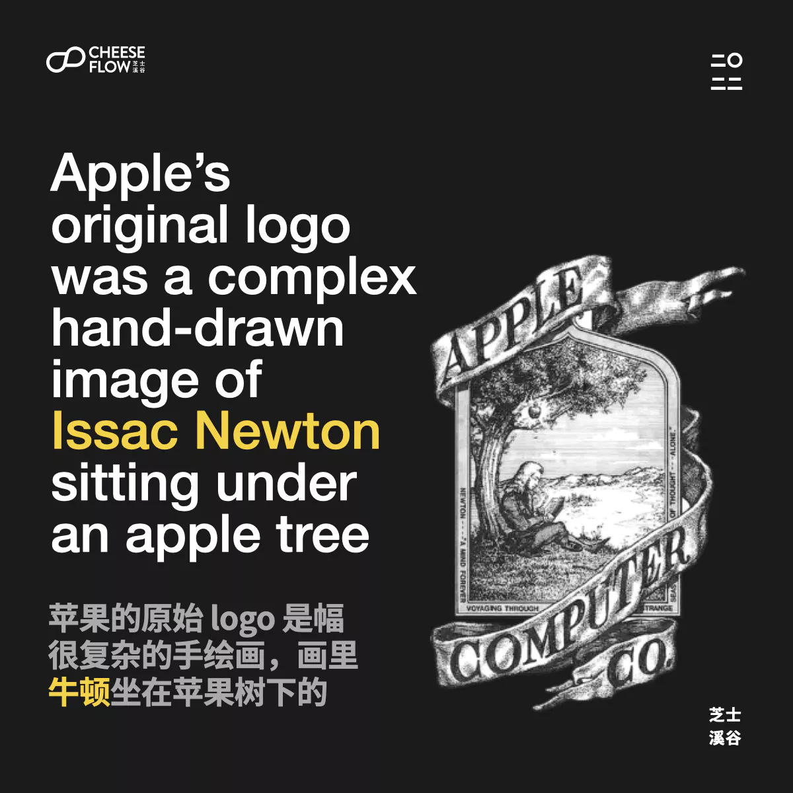
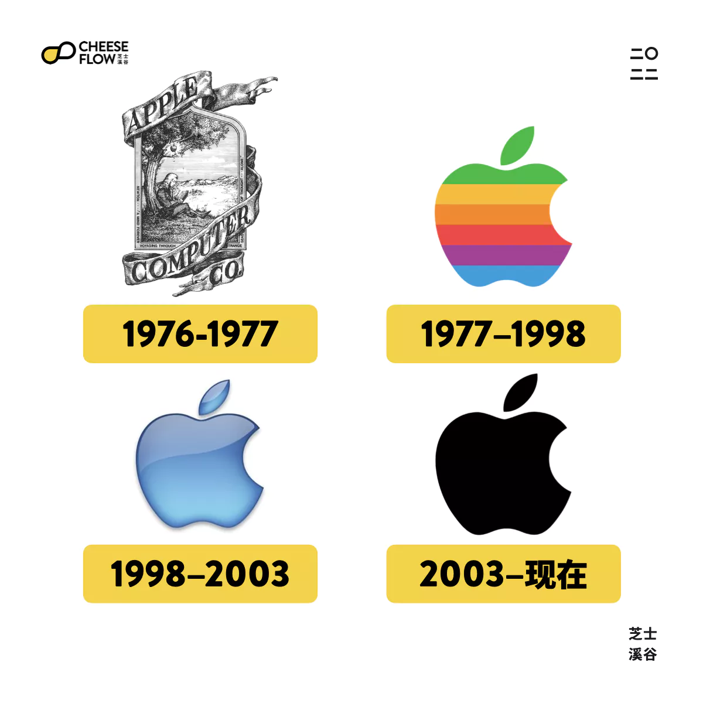
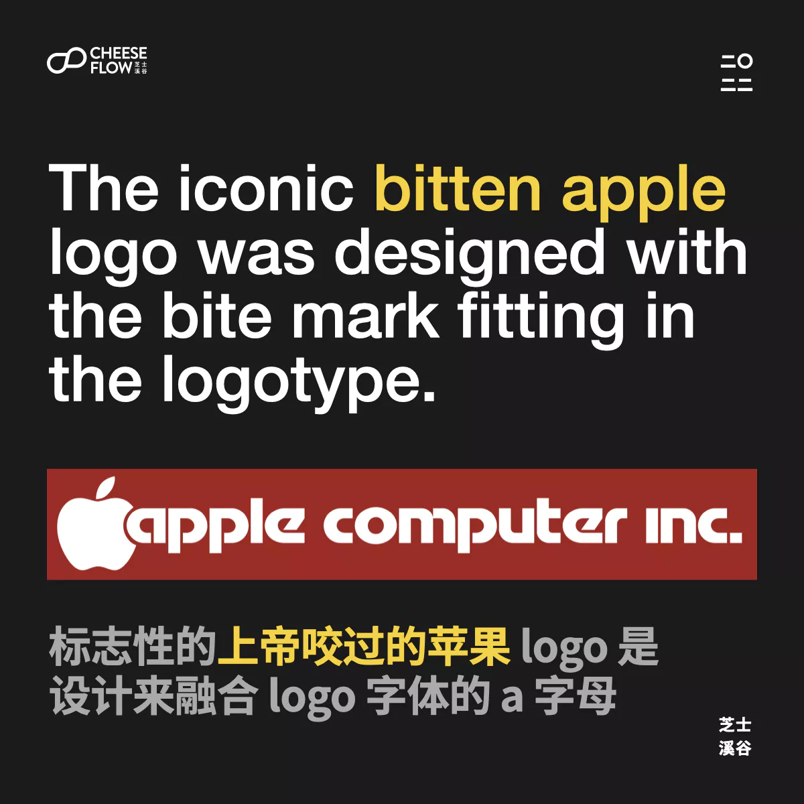

我们经常遇到品牌太过于注视标志设计，导致它们忽略甚至否认在 logo 设计过程中的品牌战略顾虑。让我们分析三个改头换面的大品牌来了解品牌打造的过程不仅是我们今天能看到的。

最常犯的错误就是在不了解品牌的历史背景和这些著名品牌如何能取得今天的地位的过程的情况下去看待这些标志性徽标logo。

在以下三个例子里，注意这些品牌是如何在品牌成长的不同阶段中演变。当它们还是新品牌是，它们最关注的是如何让人们记得它们的名字。

到了它们成为知名品牌后，它们才开始往简约方向走，有的甚至去掉 logo 里的品牌名称。这整个品牌创建过程是通过战略来定最佳的品牌命名和 logo 设计的方式和选择。

## Nike 耐克

耐克在 1964 年的原来品牌名字是蓝带体育用品（BRS），当时它是日本著名品牌鬼冢虎的美国代理，当它们的合作结束后，BRS 就推出自己的鞋类品牌，并且改名为 Nike 耐克。

卡洛琳·戴维森是为耐克设计 logo 的平面设计学生，当时她设计了几个选择，最终勾形标志在交付的设计当中被选中。

很多品牌想要和耐克的勾一样标志性的 logo，但是很多人忽略了一件事，耐克的勾是从 1971 年到 1995 年都是带着品牌名字的。也就是说，耐克等了 24 年才能将品牌名字从 logo 上去掉，但还能确保人们能认出它。

如果耐克一开始就只用个勾作为 logo，消费者完全不知道这个标志代表什么意思和品牌。耐克需要时间积累品牌意识，让人们将勾和耐克品牌关联在一起。

耐克实现通过好产品和服务来喜悦客户，提供消费者对品牌的忠诚度和品牌自身的信誉。当它有足够的影响力时，让人们一看到勾就联想到耐克。到这个时候它才能把品牌名称从 logo 上去掉。

## Amazon 亚马逊

当杰夫·贝索斯在 1995 年创立亚马逊时，公司的定位是个线上书店。原始的亚马逊 logo 是个带着亚马逊河的 A 字母。

品牌 logo 里也用了公司的网站域名，帮助人们记住品牌的网站，让他们更容易进入网站购物。

随着亚马逊的持续变化，它的 logo 也跟着改变，包括带着「地球最大的书店」的品牌口号，然后添加了品牌颜色，到后面把 .com 的后缀给去掉。我们现在看到的亚马逊 logo 设计是带着一个看起来像个微笑的箭头，它也表示亚马逊卖从 A 到 Z 开头的产品，意思是什么都卖。

亚马逊现在用的 logo 和原来的样子是天地之差。

## Apple 苹果

大家都很熟悉苹果标志性的极简 logo，它有多标志性呢？可以说几乎我们见过的所有品牌都想拥有想苹果一样的 logo。

但是很多人不理解的是苹果能做的这么成功不是因为它的 logo 好记，而是它通过惊艳用户体验和很棒的客户服务，几十年累计下来的品牌价值和信誉，让它这么简单的 logo 能说那么有辨识度。

苹果不是因为有个标志性的 logo 才变成这么成功的一个品牌，苹果的原始 logo 是个很复杂的手绘画，画里牛顿坐在苹果树下，这个典故是著名的苹果事件：牛顿坐在苹果树下，一个苹果掉下砸到他的脑袋，激励他想出引力理论。

大家都熟悉的苹果 logo 是在 1997 年由罗伯·詹诺夫设计的，当时是把 logo 和公司名称 Apple Computer Inc 放在一起，标志性的上帝咬过的苹果设计是为了融合 logo 字体的 A 字母。

## 品牌不断成长、标志不断演变

品牌随着时间也会不断的成长，它们通过人员变动、市场趋势的变动以及消费者反馈而不断发生改变。随着品牌成长，他们的 logo 也会跟着品牌的立场和传播交流的理念而演变。

它们不是打从一开始就是很标志性的品牌，而是在变成资深的品牌后才开始采取一些新品牌无法利用的品牌战略。

在 logo 创造过程当中拥有正确的品牌战略比设计更重要。

⭐️ 我们知道品牌建立的过程有多艰难，第一个关键步骤就是先接受要创建品牌不容易，然后咨询能协助你寻找品牌名字的专家。非常欢迎[联系我们](https://web.archive.org/web/20240227053821/https://cheeseflow.cn/#contact)。
