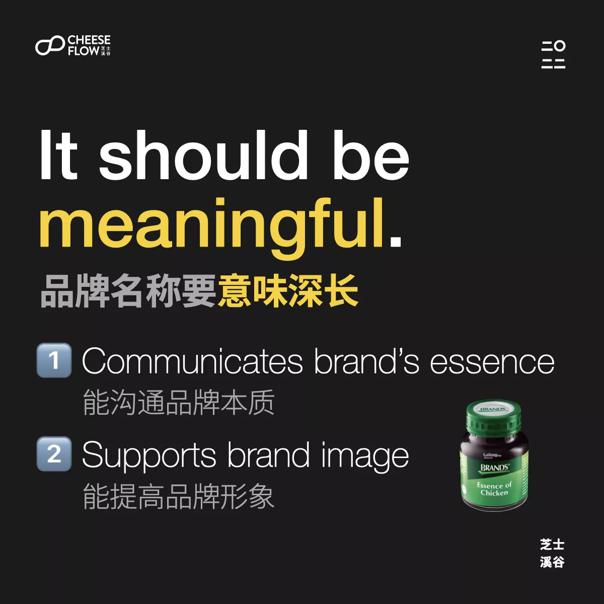
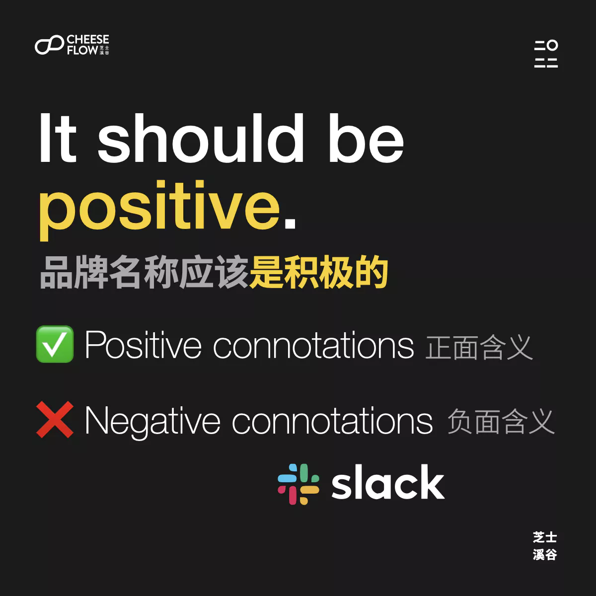
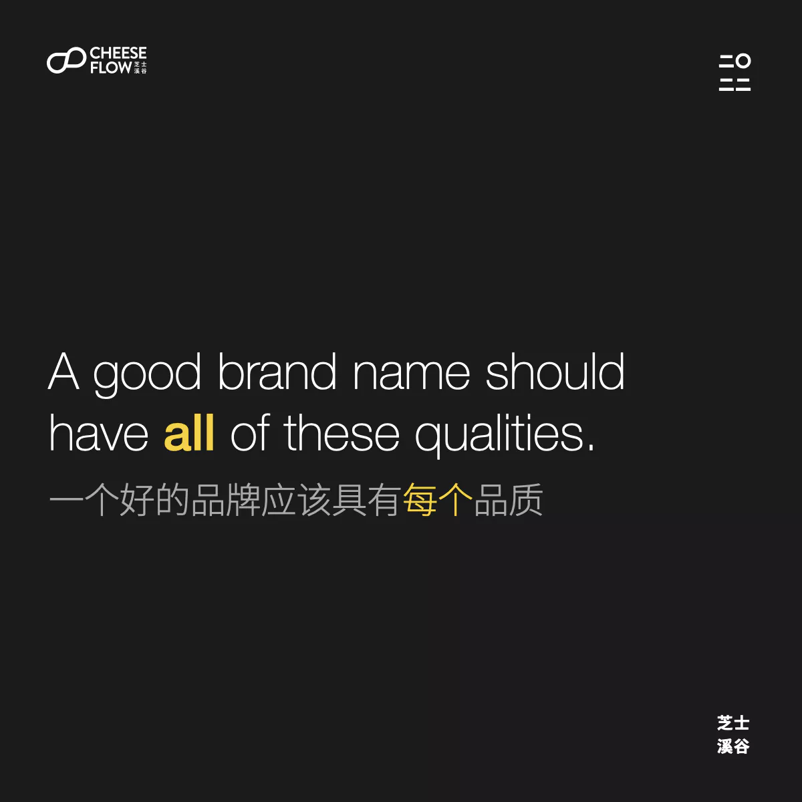
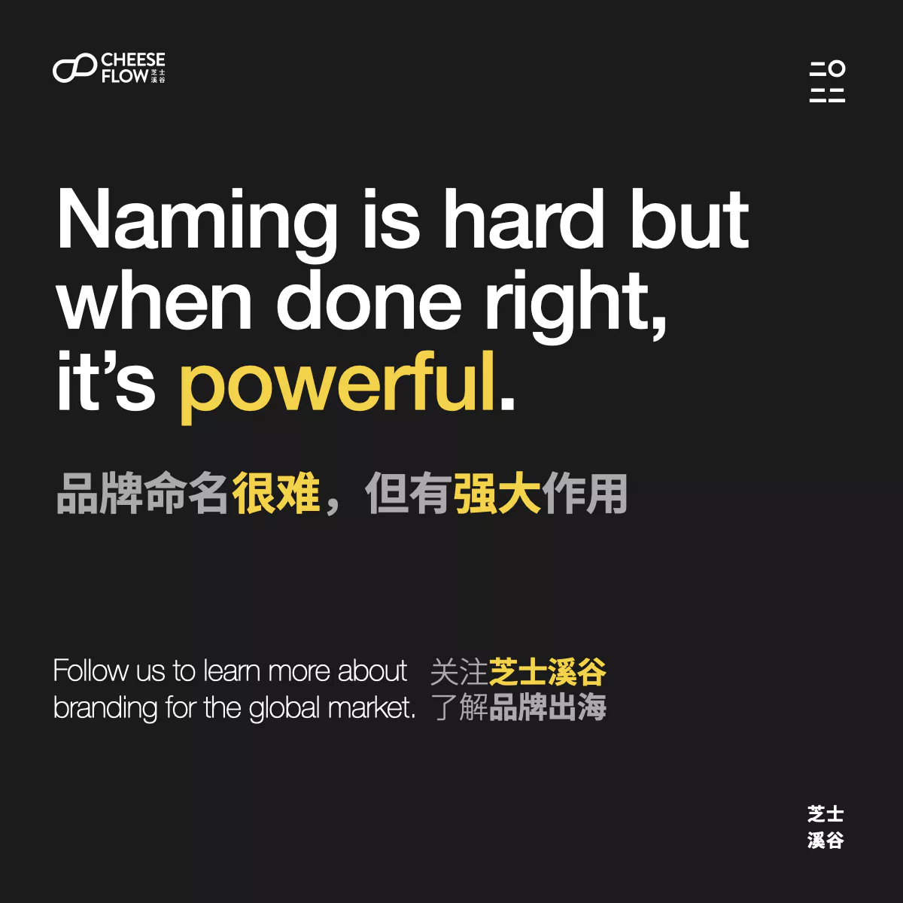

我们在之前的文章里聊过[品牌命名的错误观念](https://web.archive.org/web/20240423233732/https://cheeseflow.cn/importance-of-brand-taglines/)，那品牌名称应该有哪些特征呢？品牌名称该怎么取？

## 品牌名称要意味深长

品牌名字必须能沟通品牌的本质，同时也要能提高品牌的形象。

## 品牌名称要有辨别性

大家都知道品牌名称应该是独特难忘的，但是我们经常看到很多品牌在跟风而不是让自己有辨别性。看看有多少品牌学 Flickr、Tumblr 和 Grindr 去掉 “er“ 里的 ”e“ 来看起来很酷很时尚。

索尼（Sony）和柯达（Kodak）是两个我们喜爱的独特品牌名字，这两个名字本身没什么意思，但是现在已经包含各自品牌所代表的意义。

## 品牌名称应该不会过时

品牌名称应该为未来做好打算，为品牌的成长做好准备，才能确保品牌的长寿。

唐恩都乐（Dunkin’ Donuts）把它英文名字里的 “donuts” 去掉，采用 Dunkin’ 的新名称，因为它不想只做食物，而像转型以饮料为主，我们也怀疑它是想摆脱甜甜圈关联的不健康形象。

## 品牌名称应该是积极的

这是理所当然的，避开负面含义能确保品牌能躲开争议。话虽如此，某些品牌反而会想要和负面含义关联来挺身而出，但是这么做是很讲究技巧和勇气来拿捏的。

我们或许不想要在工作提到懒散（slack），但是 Slack 却想那么做，这个选择效果非常棒，因为它的软件效果好到让使用者能在懒散中提升工作效率。

## 品牌名称应该是模块化的

模块化的品牌名称让品牌在不同产品名字里保留品牌识别。

当你看到 Adizero 和 Adiprene 的产品名字是，你应该也会联想到阿迪达斯（Adidas）然后猜测它们应该和品牌有关系。

那你对 MacBook、Mac Studio、Mac Pro 和 iMac 有什么看法？

## 品牌名称应该受保护

能注册商标不仅能保护品牌，也意味着品牌名字够独特，才能成功注册商标。

当域名和社交媒体账号也能注册时，这代表品牌名字是独特的，那你也能在多个平台上保持统一的品牌名称。

你的品牌有以上多少个品牌名称特征呢？好的品牌应该具有所有的特征。

⭐️ 我们知道品牌命名的过程有多艰难，第一个关键步骤就是先接受取品牌名字不容易，然后咨询能协助你寻找品牌名字的专家。非常欢迎联系我们。

