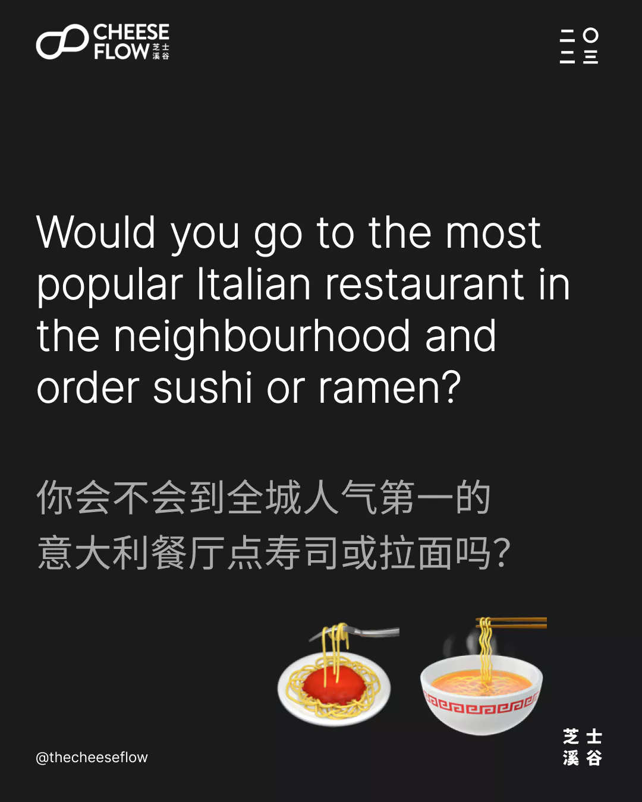
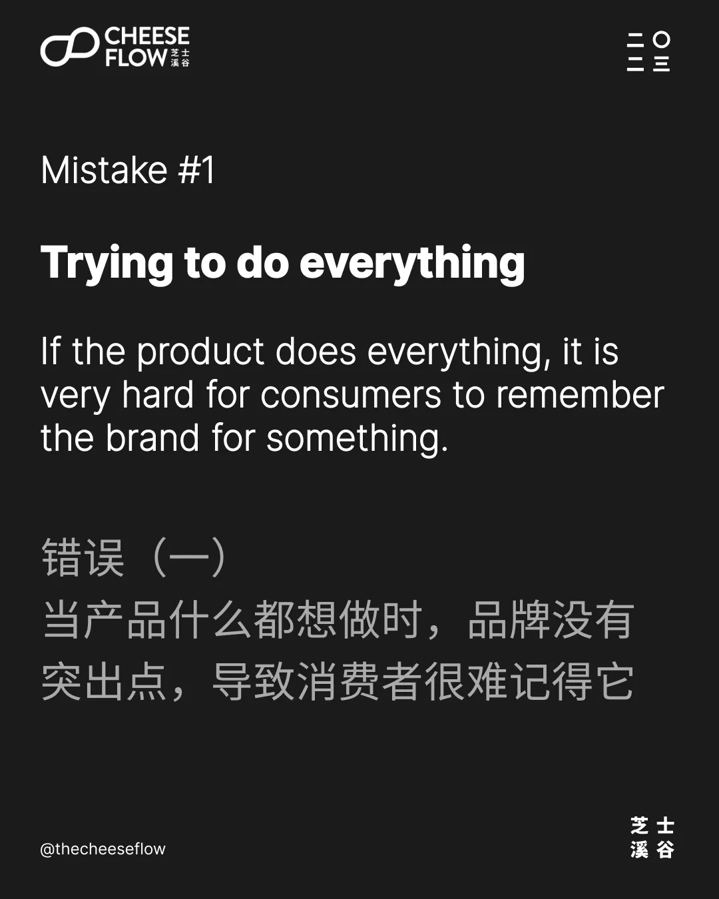
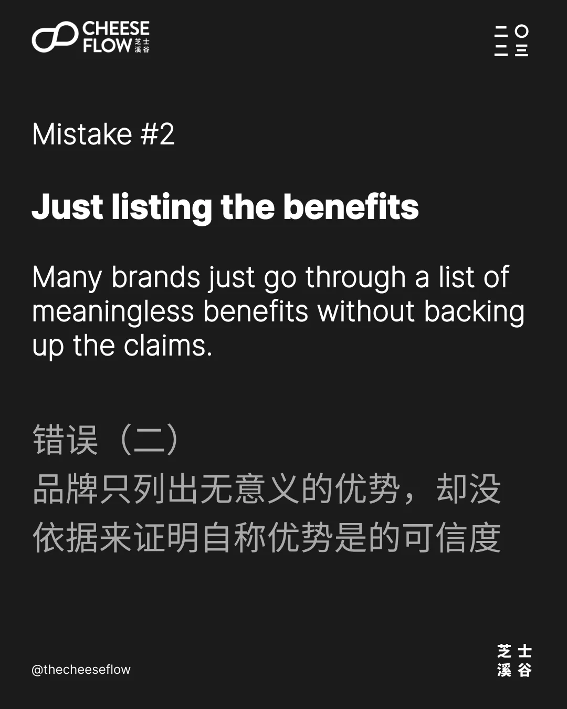
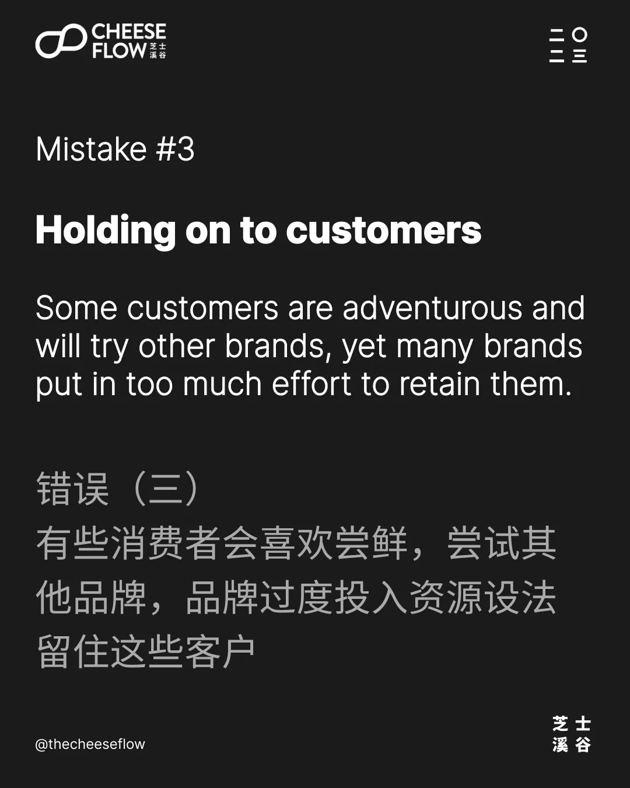
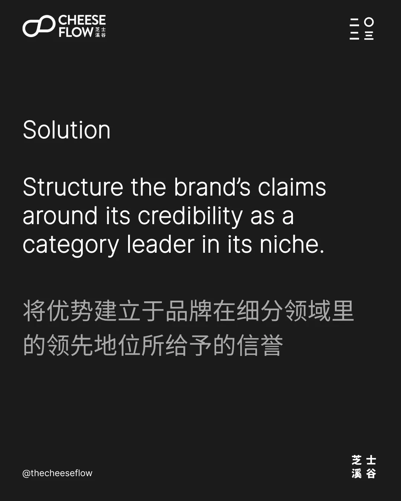

消费者一般不相信品牌自称的优势，因为他们已经对营销手段很熟悉。

回想你最近看过的广告，你是否相信品牌在广告里所说或者暗示的信息吗？

品牌怎么让消费者相信自称的优势呢？

能自称是行业第一或者是真材实料的品牌会得到更高的可信度，其他品牌则变成模仿品。可口可乐就是最出名的例子。

## 拥有可信度

当一个品牌有正确、值得相信的凭证，消费者比较会相信品牌所说的。那我们怎么样才知道品牌是否有正确的可信度呢？

你会到全城人气第一的意大利餐厅点寿司或拉面吗？当然不会。意大利餐厅的信誉建立于它做的意大利食品很受欢迎，它在日本食品领域里是没有正确可信的凭证。

成为产品分类里的领先品牌给予品牌可信度。如果品牌不能成为分类里的龙头，那就要缩小品牌的焦点，成为细分类的领先品牌。

## 误解（一）：什么都想做

我们经常看到品牌通常会犯一个错误：那就是什么都想做。当什么产品都想做时，品牌没有一个突出点或特征，导致消费者很难记得住品牌。

人们去肯德基不是为了吃汉堡，即使肯德基也卖汉堡。肯德基专注于做炸鸡，肯德基的品牌信誉是建于炸鸡上，只不过他们刚好同时也卖汉堡。

## 误解（二）：只顾着列出功能

很多品牌只是列出一些无意义的优势。品牌自称自己更廉价、更好、更快、效率更高、更小、更大、更轻、更耐用等等。有一些消费者可能会对这些特征有兴趣，但是它们需要有依据才觉得是可信的。否则，这些只是品牌所自称的优势。

建立于品牌信誉的优势会更有说服力。当品牌是行业龙头，它们有这个可信度在它们的细分领域里去声称自己的优势。

## 误解（三）：只顾着流着客户

当然，有些消费者会比较大胆喜欢新鲜，会考虑不是非领先的品牌。我们经常看到一个误区就是：品牌设法去留住这些客户。

这些客户属于小群体，正所谓众口难调，如果这部分的用户能带动整个行业，那设法推出能专门针对这些精明客户的产品是个合理的选择。但是，这是次要。品牌的重点还是成为目标细分领域的领先品牌。

## 提升您的品牌力

信誉给予品牌力，成为产品细分类的行业龙头则给予品牌凭证，因为消费者会把领先品牌看待成有知识、专场和权威。

如果你的品牌还未成为行业龙头，探讨如何把它打造成领先品牌。

想挖掘更多的品牌力的秘诀吗？

如果您有兴趣了解我们能如何帮助您提升品牌影响力，请联系我们。
