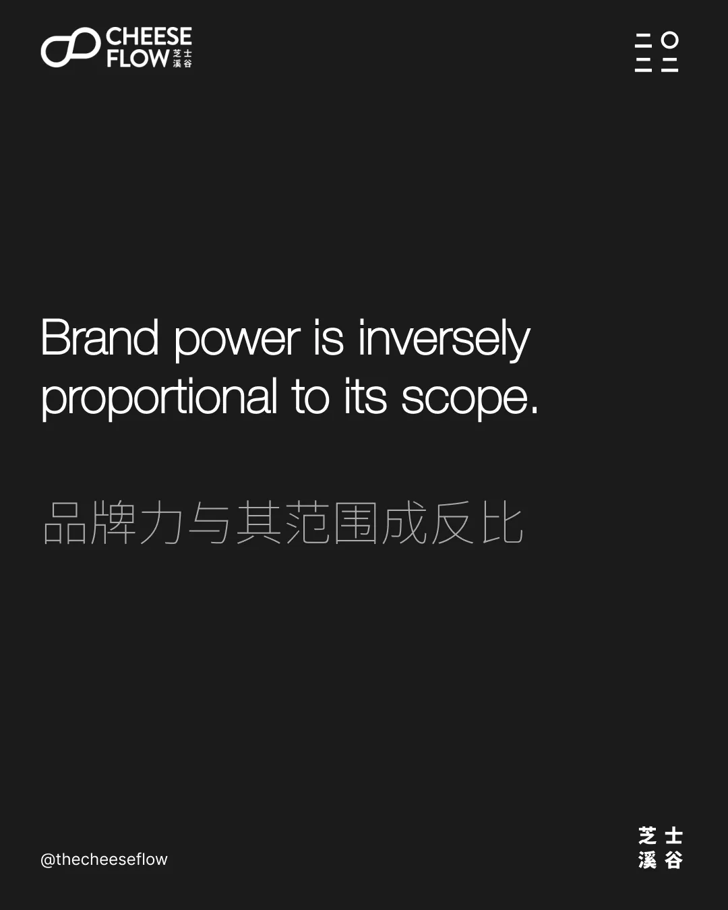
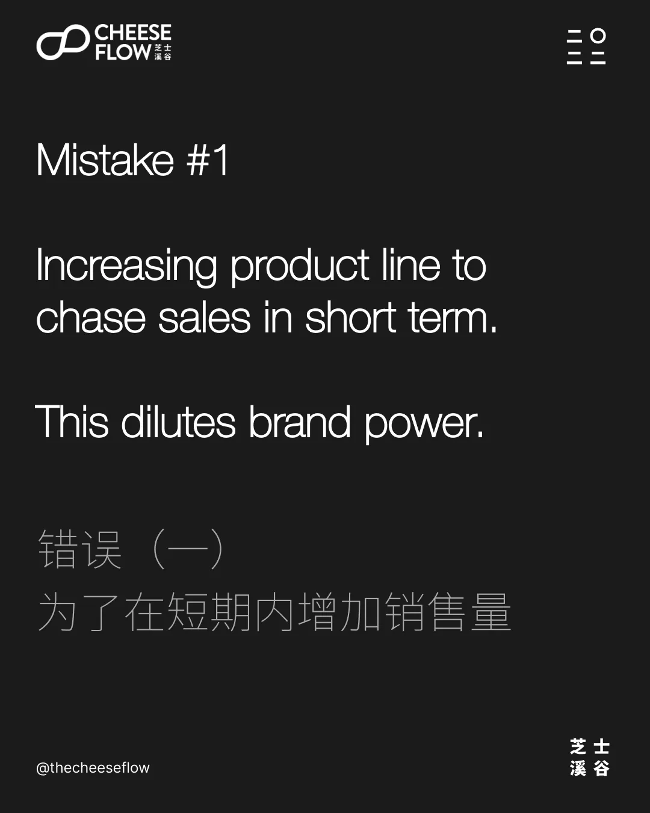
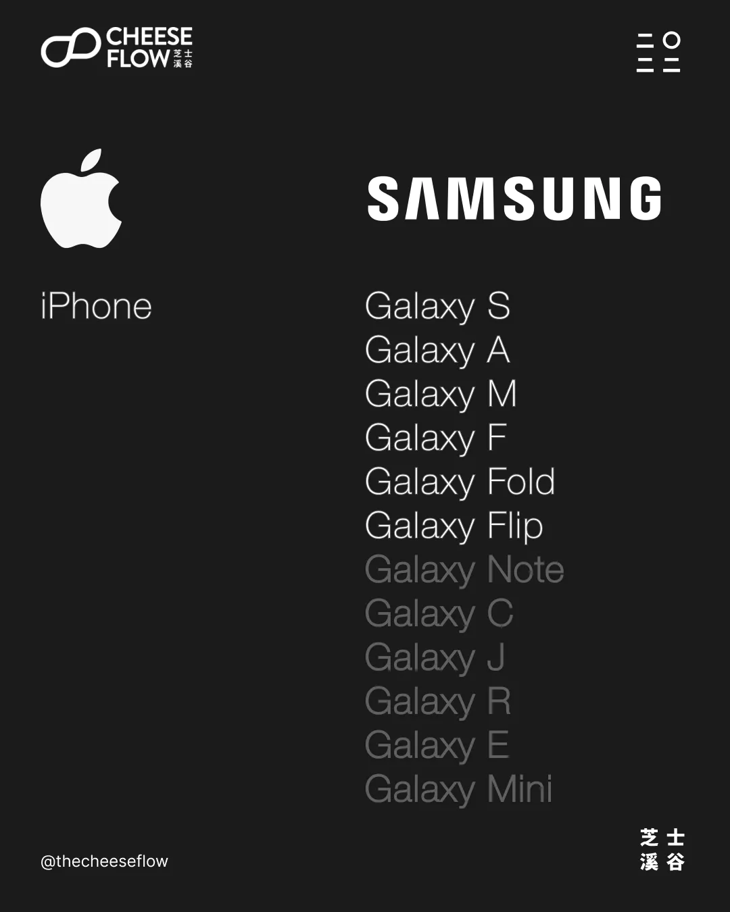
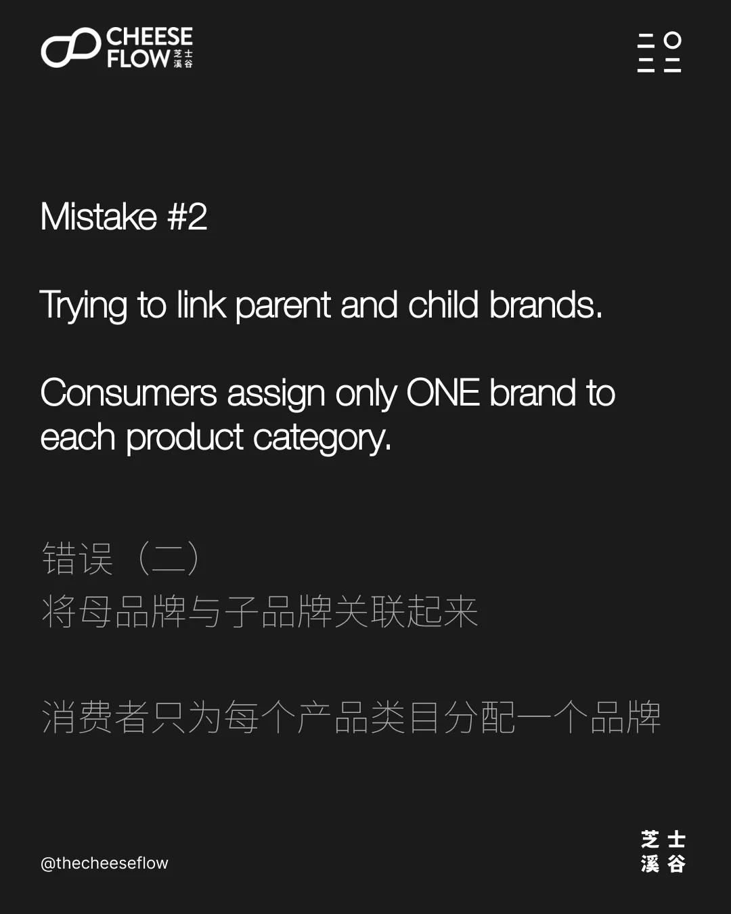
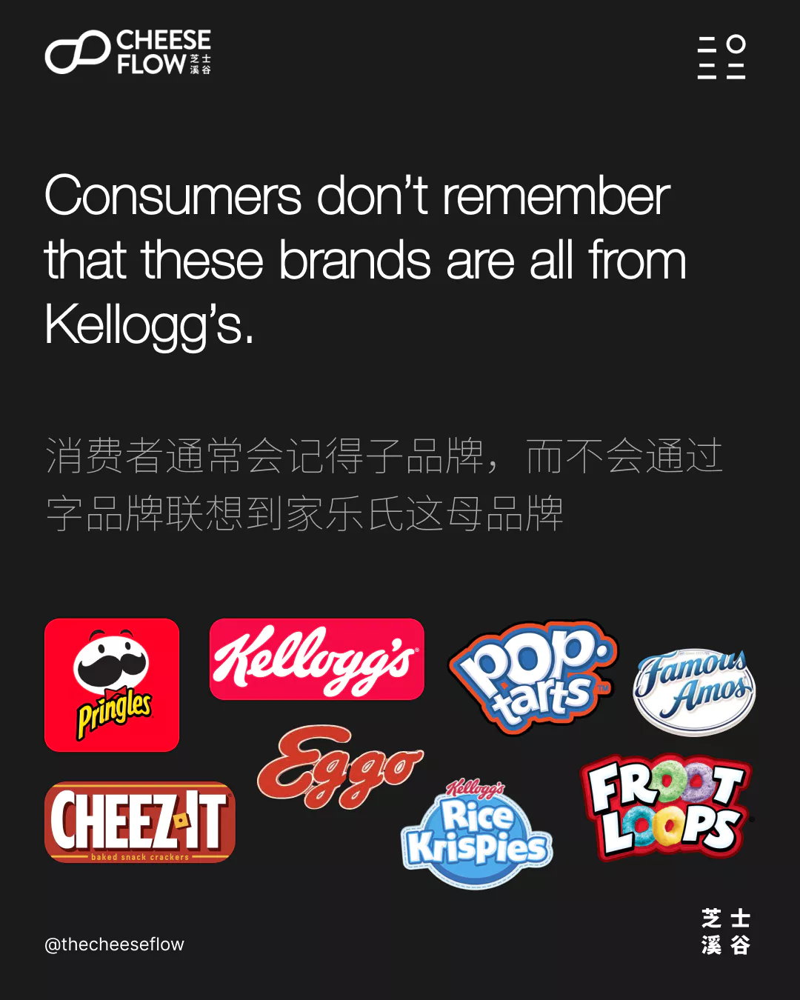
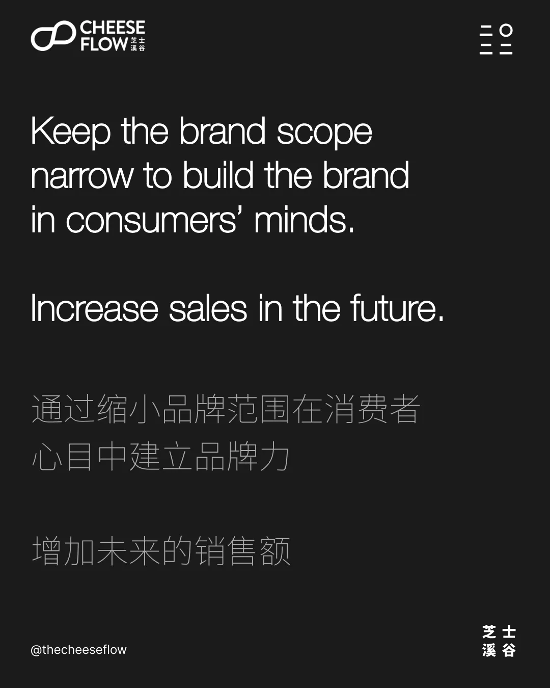
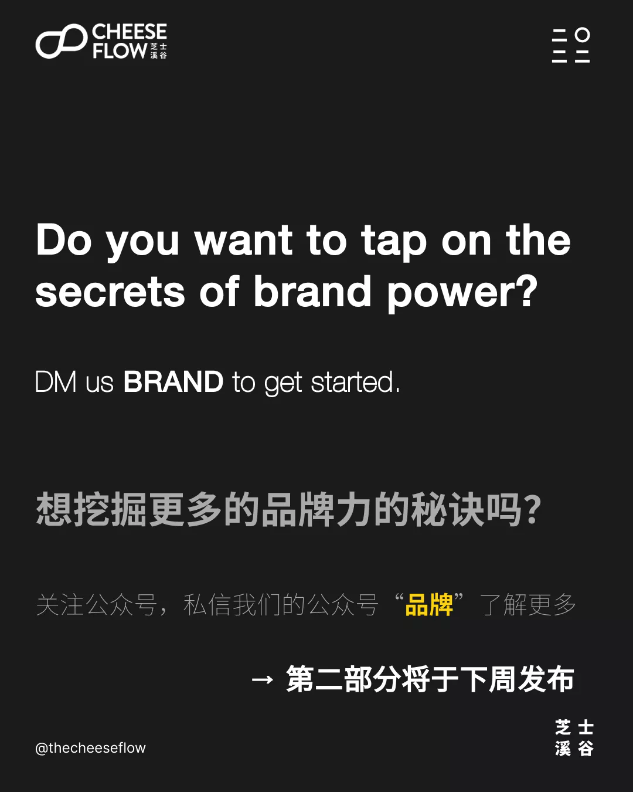

品牌力的秘诀其实并不是什么秘密，很多人都知道，但未能理性行事。他们认为自己的品牌是特别的，因此不必遵守品牌法则。

品牌力与其范围成反比。这就意味着当你的品牌范围变得越广时，品牌力就会变得越弱。当你将品牌用在每种产品上时，这个情况就会出现。

同样，你能通过限制使用你的品牌的产品来增强你的品牌力。

在品牌力量方面，品牌经常会犯以下三个错误。

## 错误（一）：增加产品线

我们经常遇到一些追求短期利益的企业，为了在短期内增加销售量，他们不断在同个品牌下扩展产品线。

然而，从长远来看，这会淡化品牌知名度，削弱品牌力。

三星在 2012 年在全球智能手机市场占比以 23.7% 份额位居第一，在 2021 年的最新市场份额降为 20.1%。苹果品牌在 2012 年的全球市场占比以 8% 份额，在 2021 年的份额增长到 17.4% 了。

为了迎合中低端市场，三星的产品线中有许多命名混淆的名称。与此同时，苹果一直坚持使用 iPhone 名称，同个 Plus、Pro 和 Pro Max 来区分型号。

消费者记得 iPhone 品牌，而三星用户则经常把手机以 S22、Filp/Fold 或 Note（已停产）称乎，而不是 Galaxy 手机品牌。

## 错误（二）：母品牌和子品牌

有些公司试图将母品牌与子品牌关联起来。

他们误以为子品牌会让消费者想到母品牌，反之亦然。

消费者只为每个产品类目分配一个品牌。

提起可乐，人们第一个想到的品牌很可能是可口可乐。不足为奇，因为该类别以可口可乐命名。

其实消费者不一定会使用品牌自称的名称。你是否听到人们是用可乐还是可口可乐来称呼？

虽然 iPhone 品牌在国际上很强大，但由于语言的原因，它在中国的影响力要小得多。国内很少称它为 iPhone，反而将其称为苹果手机。苹果的品牌比 iPhone 的品牌占更大的心智占有率。

同样，iPad 在国内也简称为 pad 或 平板。这表明苹果是如何在消费者甚至不记得或使用产品的名称的情况下占据了消费者的心智占有率。

人们其实是想要易于区分且易与称呼的名称。

家乐氏有很多子品牌，但是消费者通常会记得子品牌，而不会通过字品牌联想到家乐氏这母品牌。他们只为每个产品类目附上一个名称，在这种情况下，它就是产品的名称。

## 错误（三）：将弱竞争误认为是成功

当产品品类竞争薄弱或完全没竞争时，企业往往会误以为自己的品牌延伸是成功的。

在没有竞争的情况下，新的产品线只会在该品类中同类相食品牌自身的销售额。

## 提升您的品牌影响力

通过缩小品牌范围在消费者心目中建立品牌力，将有助于增加未来的销售额，并会在长期时间内增强品牌力。

想挖掘更多的品牌力的秘诀吗？是否也犯了以上的错误呢？

如果您有兴趣了解我们能如何帮助您提升品牌影响力，请联系我们。
