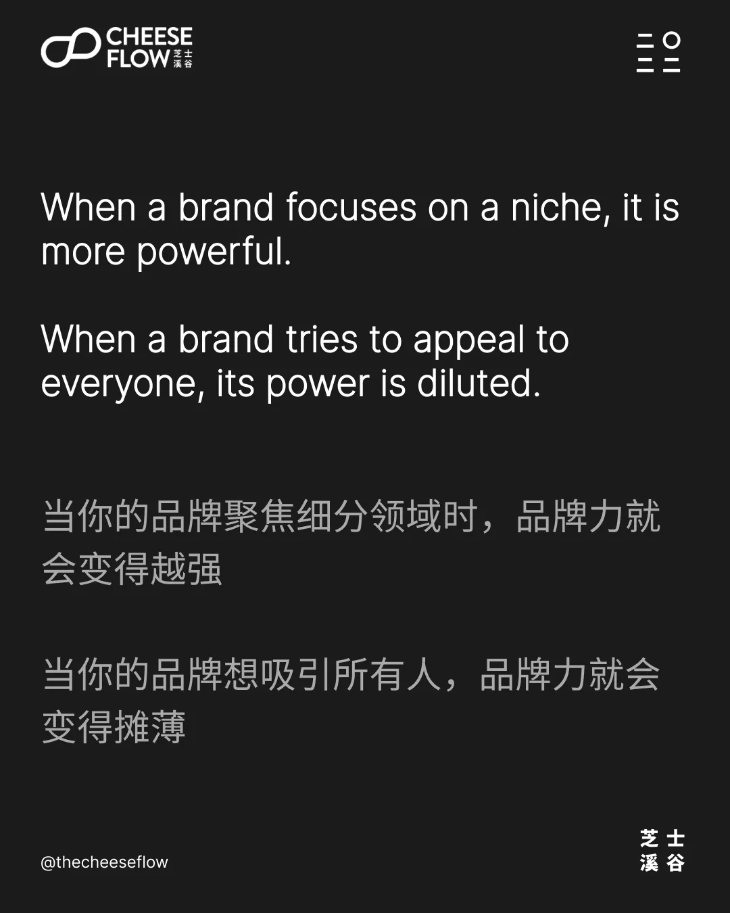
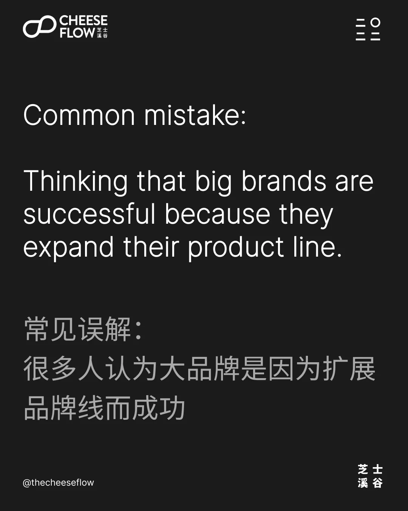
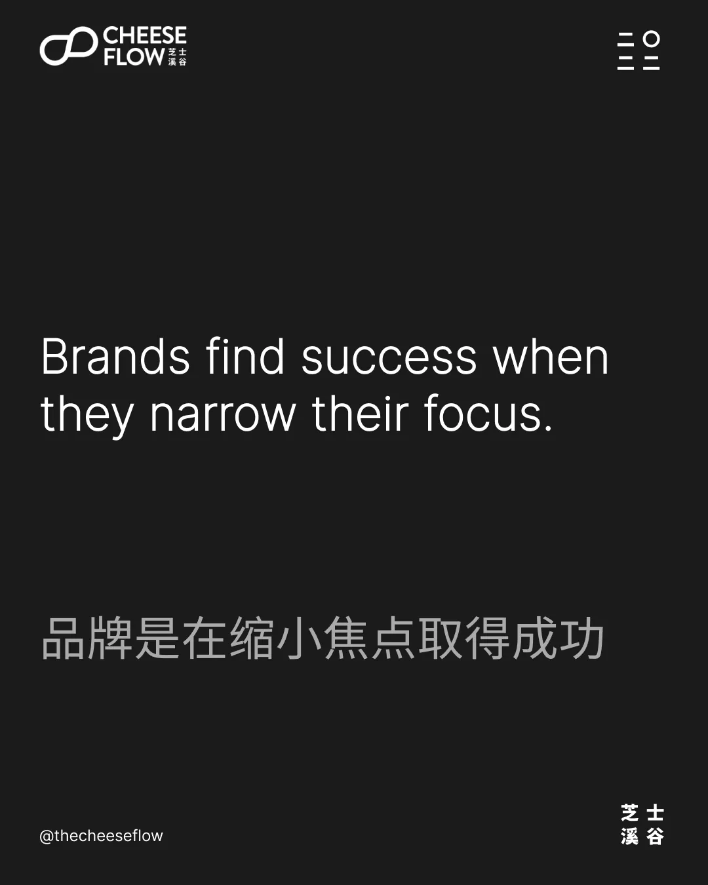
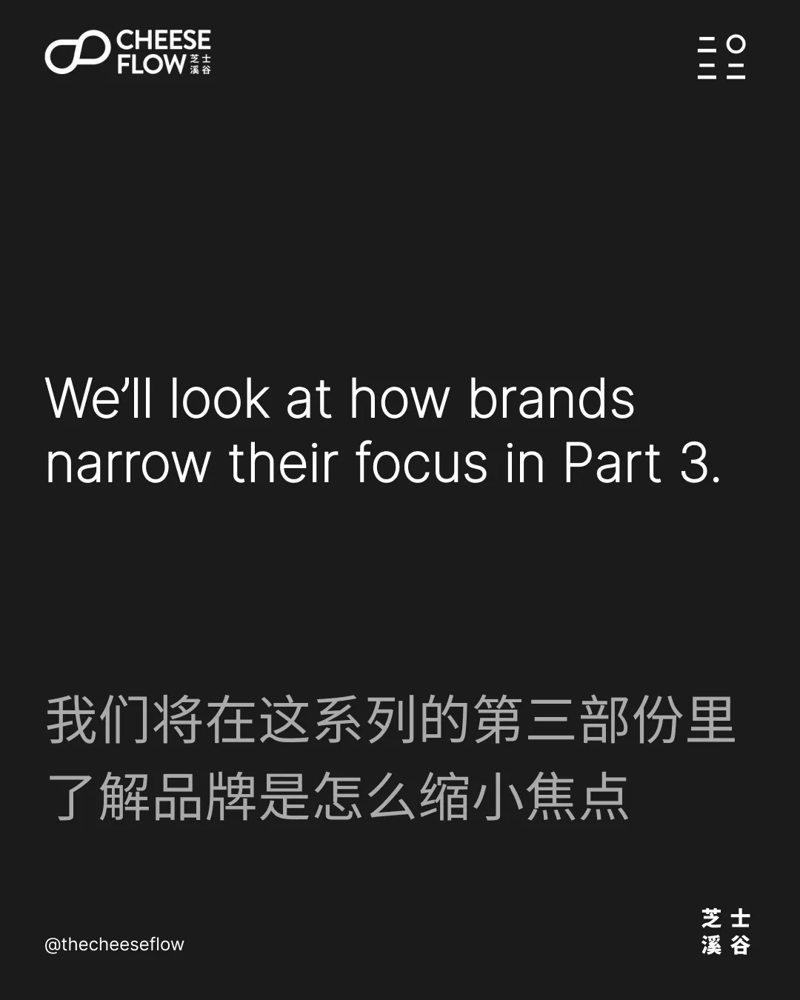
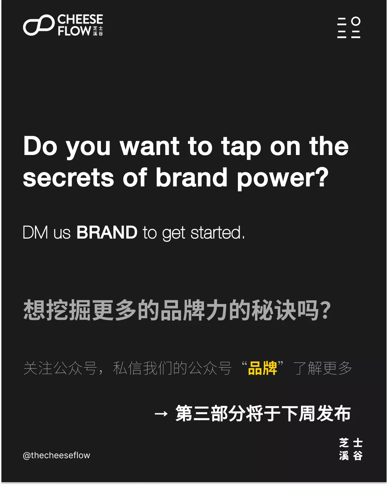

我们在上一篇文章中了解到，品牌力的秘诀在于品牌缩小范围。换言之，品牌越专注，品牌影响力越强。

## 品牌力与其焦点成正比

当一个品牌聚焦一个细分领域，品牌力就变得越强。当一个品牌试图吸引所有人时，品牌力就会变得摊薄。专注于一个细分领域会使品牌力变得强大，尤其是在它所占据的类别中。

但如果是这样的话，那么成功的品牌为什么要扩展它们的产品线呢？为什么它们要尝试创造新品来迎合产品类别中的不同客户群呢？为什么它们要创造新品进入新的产品类别呢？

看看可口可乐。它旗下有健怡可乐、零度可口可乐、可口可乐香草和其他不同口味的特殊版本。

除了咖啡以外，星巴克也卖抹茶、冰沙、果汁、果汁饮料、马克杯、瓶子、松饼、三明治等。

人们普遍误以为大品牌之所以成功，是因为它们不断的扩展产品线，这并不奇怪。因为更多的产品意味着更多的销售，更多的销售意味着更加成功。

## 让我们​用成功人士来代替成功品牌来思考

如果你想像他们一样成功，你会做他们做的事吗？你会买豪车、豪宅、吃好的、住好的、买昂贵的奢侈品吗？当然，并不是每个成功的人都会挥霍他们的财富，但即使他们不这样做，如果他们愿意的话，他们也有这个经济能力。

我们知道，当我们还在追求成功时，过成功人士的生活其实是没有意义的。如果你过着这样成功人士的生活方式，很可能你只会把成功推得更遥远，甚至会破产。

相反，你应该做成功人士在成功之前所做的事情。我们都清楚这一点。这就是为什么我们喜欢阅读和观看关于他们如何成功的故事，并尝试向他们学习。

同样，追求成功的品牌也应该做成功品牌在成功之前所做的事情。

那么成功的品牌在成功之前都做了些什么呢？猜测答案没有奖品哈——他们缩小了焦点。

当咖啡店都出售各种食品和饮料时，星巴克选择只专注于咖啡。直到他们成为一个成功且知名的品牌之后，他们才开始像其他咖啡店一样去提供其他产品。

可口可乐几十年来只卖可乐。在它们将自己建立成为一个成功的品牌之后，他们才开始扩大它们的产品线。

健怡可乐和零度可乐等产品实际上是为了应对碳酸饮料不健康的形象而推出的。所以这是一个更复杂的品牌战略，我们改天再探讨的话题啦（如果想了解的话，可以评论区留言，点赞哈）。

事实上，可口可乐的大部分产品都使用不同的品牌名称，许多人甚至没有把它们与可口可乐联想起来。比如沙士、芬达、雪碧、果粒橙、雀巢冰爽茶、达萨尼、酷儿、咖世家咖啡等品牌。

## 缩小焦点，聚焦细分受众

缩小焦点的另一个重要好处是，您可以聚焦细分受众。当您的目标客户属于某个细分领域时，您就更容易了解他们以及他们购买产品中看重的是什么。这可以让您建立一个吸引他们的品牌。

美国的大多数熟食店供应各种食物。赛百味决定成为一家只卖潜艇三明治的熟食店。是的，他们的焦点非常具体。他们不仅只专注于三明治，而且专注于一种特殊类型的三明治。

这使得赛百味以潜艇三明治而闻名，而且因为这是它所服务的唯一类型的产品，该公司也非常擅长制作它们。

当他们擅长制作潜艇三明治时，只会强化赛百味在客户印象中是做的好吃的潜艇三明治的品牌，甚至是潜艇三文治天花板。这成为一个正反馈循环，巩固了赛百味品牌在潜艇三明治方面成为客户心目中首选的地位。

## 提升您的品牌力

缩小你品牌的焦点来放大你的品牌力。看看成功的品牌做了什么，并从他们所做的事情中学习，而不是他们现在正在做的事情。

想挖掘更多的品牌力的秘诀吗？是否也犯了以上的错误呢？

如果您有兴趣了解我们能如何帮助您提升品牌影响力，请联系我们。
