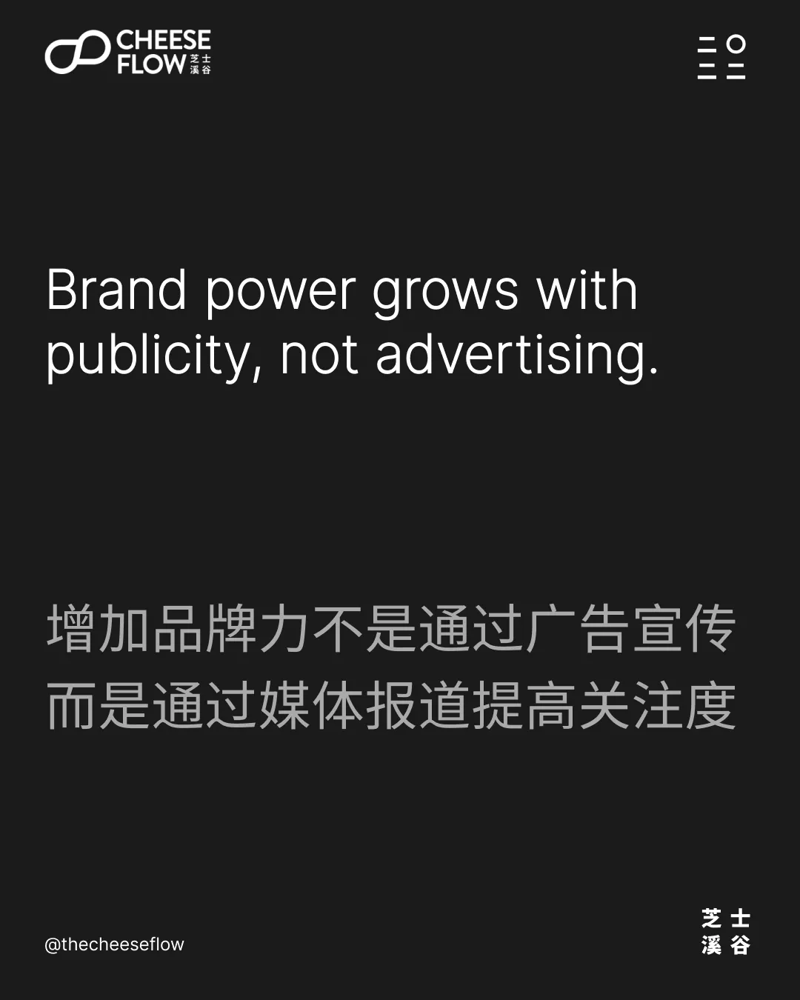
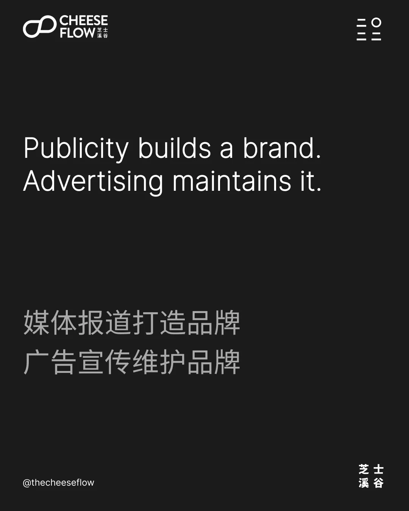
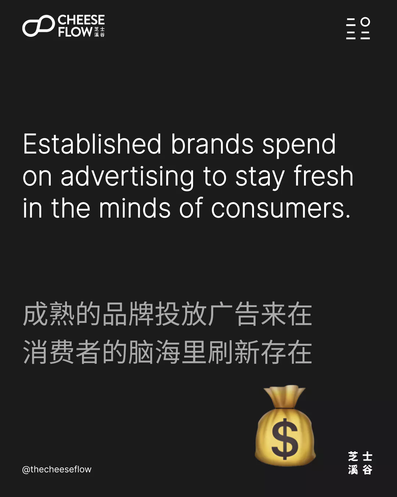
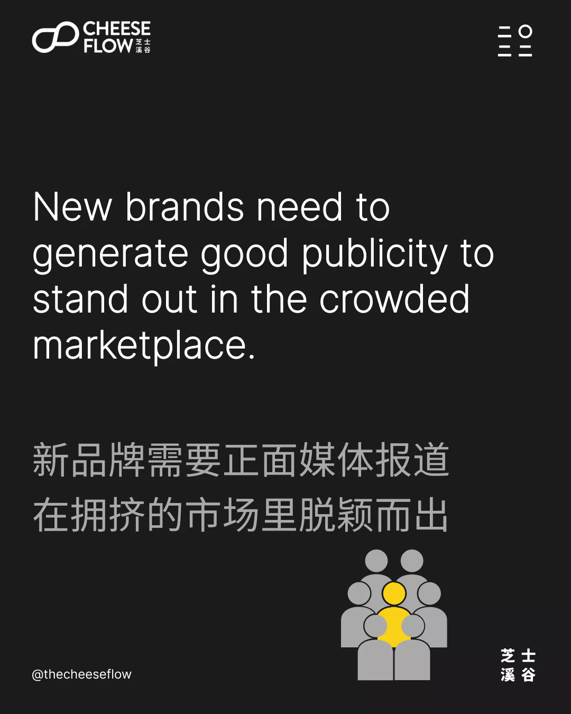
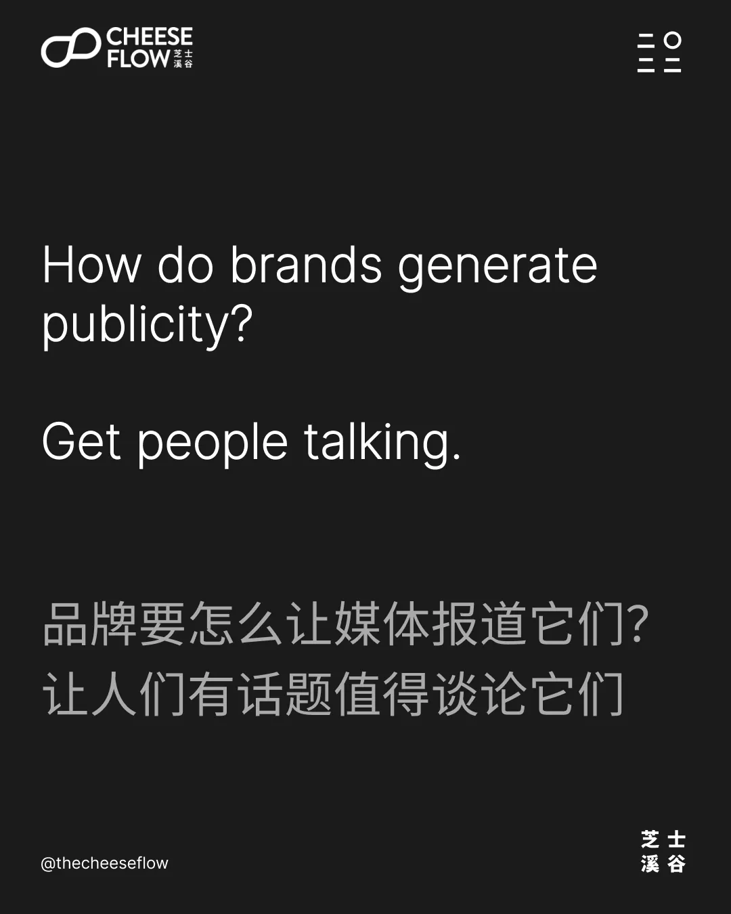
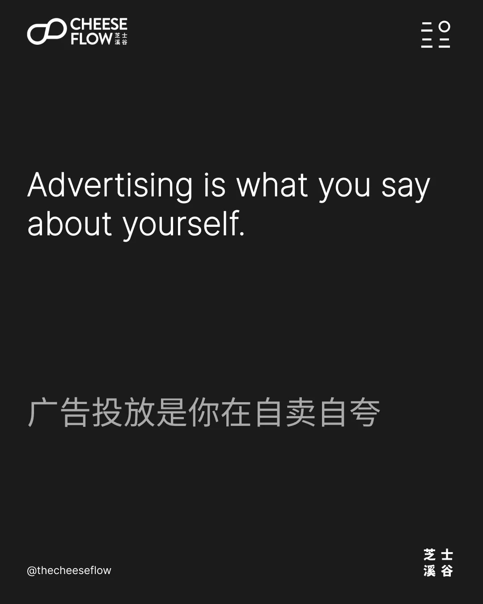
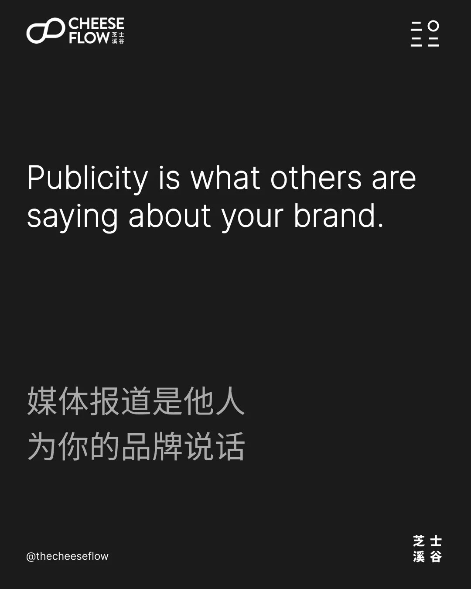
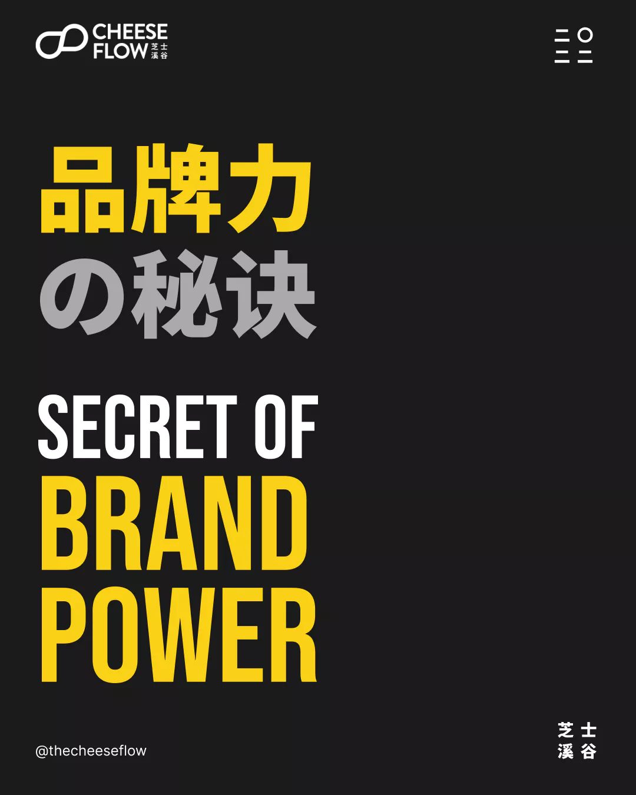
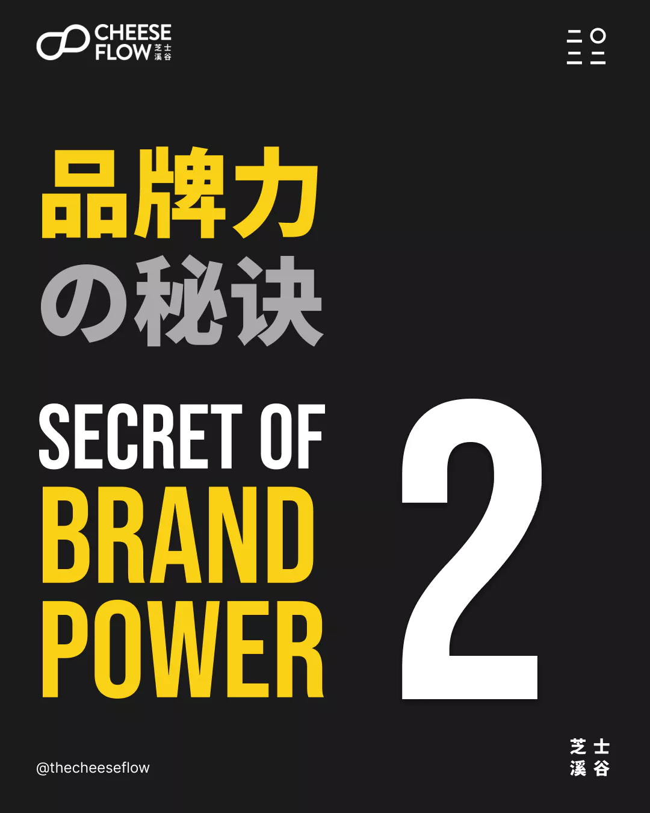

我们在之前两篇文章中了解到，品牌力的秘诀在于品牌缩小范围和聚焦一个细分领域。这次，我们来探讨增加品牌力为何不是通过广告宣传，而是通过媒体报道提高关注度。

## 媒体报道和广告宣传对比

打造品牌和维护品牌其实是有很大区别的。打造品牌需要建立品牌知名度和消费者对品牌的意识，品牌维护是通过投放广告来提醒消费者品牌的存在。

成熟的品牌投放广告来在消费者的脑海里刷新存在，广告宣传也能通过市场营销活动给它们带来销量。

新品牌需要正面媒体报道在拥挤的市场里脱颖而出，让消费者注意到它们。

这会慢慢地让消费者形成对品牌的意识，建立品牌。通过媒体报道打造品牌是个很漫长的长期过程。

相比来说，广告宣传能产生更快速和显性效果。

然而，如果新的品牌直接开始做广告宣传，它们会发现要产生回报会更难相比如果先有媒体报道的铺垫后的得到的回报。这是因为它们还处在不需要维护品牌的阶段。

那这是否意味着你不应该投放线上广告吗？这也未必，通过适当的广告投放还是能产生媒体报道和消费者的关注。

## 如何并且为何要得到媒体关注？

品牌要怎么让媒体报道它们？给到媒体值得讨论的话题，这也包括自媒体的关键意见领袖和网红们。

他们不断在为他们的观众寻找有趣的内容。所以你的品牌必须有新闻价值或者有个他们会感兴趣报道的故事。

媒体报道为何更重要呢？因为他人所说关于你品牌的内容会比品牌自述更有力量。

> 你的品牌不是你所说的，而是他人所说的
> 
> _马蒂·诺伊迈尔_

媒体报道是他人为你品牌说话，广告宣传是你在自卖自夸。这就是为什么媒体报道会比广告宣传更有效果。

## 提升您的品牌影响力

如果你有个新品牌，专注产生好的媒体报道能建立你的品牌力。你只需在品牌已有知名度力才需要维护品牌。

想挖掘更多的品牌力的秘诀吗？

如果您有兴趣了解我们能如何帮助您提升品牌影响力，请联系我们。

## [品牌力的秘诀（一）](https://cheeseflow.cn/secret-of-brand-power-part-1/)→

品牌力与其范围成反比，很多人都知道，但不遵守品牌法则

## [品牌力的秘诀（二）](https://cheeseflow.cn/secret-of-brand-power-part-2/) →

品牌力与其焦点成正比
