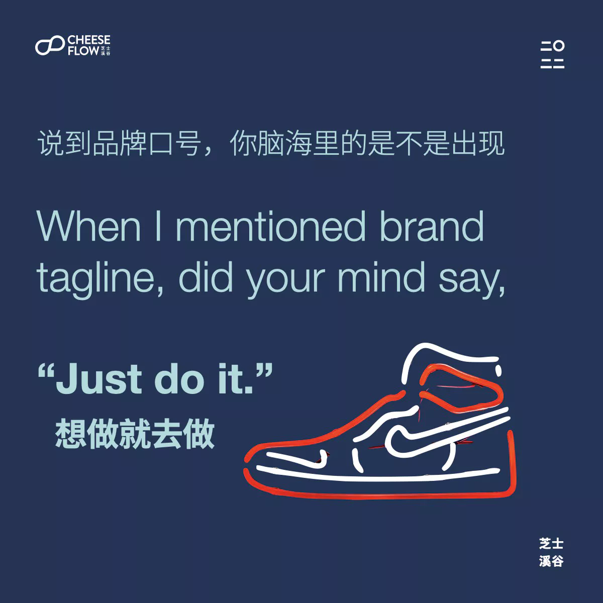
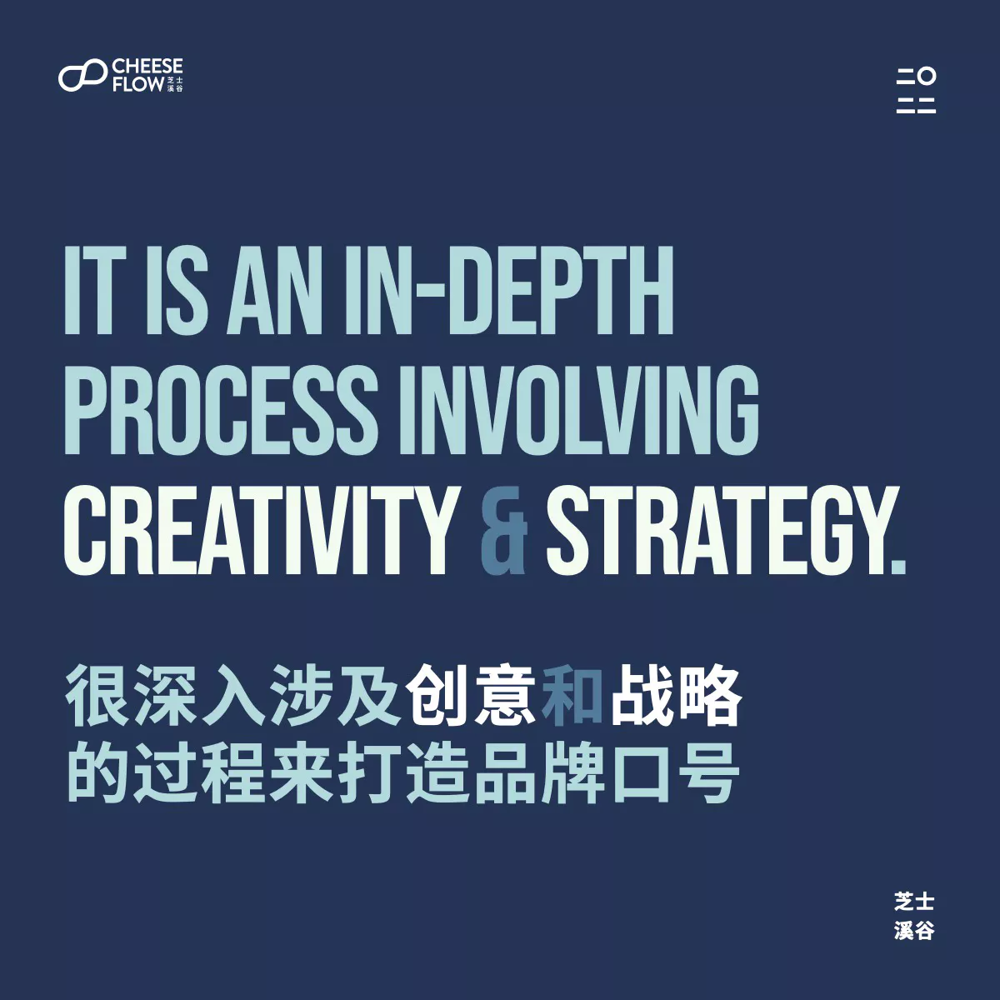

品牌口号不仅是通过简明的方式来介绍品牌具体是做什么的，它是你的品牌对你的客户和员工（也就是内部客户）所代表的本质。

我们经常看到新品牌通过口号以一个聪明机智的方式描述自己，这能让它令人难忘，但是这能让它足够有意思吗？

## 第一个回想起的品牌口号是什么？

当你听到品牌口号第一个出现在你脑海里的是什么？我最常见的答案是：Just Do It（想做就去做）。

耐克的口号很简单，也因此变得很标志性、很难忘。但是它不仅是简单，它也象征一种让你不感到约束去做你想做的自由。阿迪达斯的口号 Impossible is nothing（没不可能）也用了同样的方法。

你可能觉得打造品牌口号是想做就是去做那么简单，但是它其实是个很复杂的过程。品牌会有多层隐藏或可见含义的口号，是需要大量工作来把想表达的意思提炼成几个字。

## 品牌口号是什么？

很多人知道品牌口号通过难忘的方式告诉消费者其品牌是做什么的，它是很简单（也许带耳虫效应）的一句话，帮助品牌让消费者记得它。

只溶在口，不溶在手。

品牌不仅如此，它包含了品牌的本质、个性和定位。这也是好品牌口号的魅力所在。耐克的 Just do it 也告诉了我们它代表什么、品牌的个性和它对自己在市场里的定位。

品牌口号也将品牌在竞争对手中显得突出。耐克要你去做，而阿迪达斯选择鼓励你去做一般人觉得不可能的事。

口号不只是在跟客户品牌是什么，它也在跟员工说企业代表什么。苹果的口号是 Think different（不同凡想）时刻提醒员工公司想通过创新产品带给用户最佳的体验。

## 怎么样才是更好的品牌口号？

品牌口号要称得上好应该具有以下特征：

*   短
*   独特
*   意味深长
*   念起来很顺口
*   可注册商标
*   好记
*   小字体展示也清楚
*   唤起情感反应
*   无消极含义

要能在以上每个特征打个勾需要通过很深入、涉及创意和战略的过程来打造品牌口号。

## 品牌命名很艰难但具有强大作用

不要低估您品牌口号的重要性，如果忽视它了就让个专家分析。有兴趣咨询怎么帮你取个品牌名字，非常欢迎[联系我们](https://web.archive.org/web/20240524174034/https://cheeseflow.cn/#contact)。
