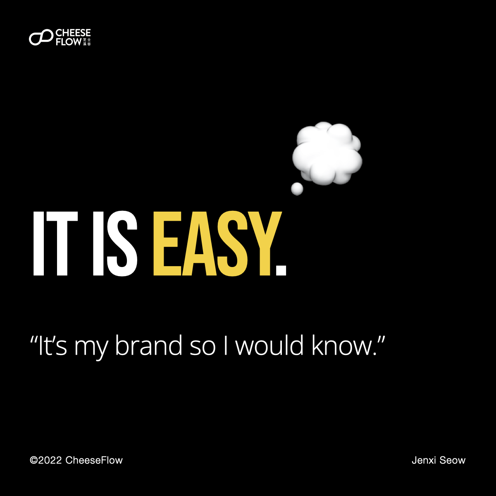
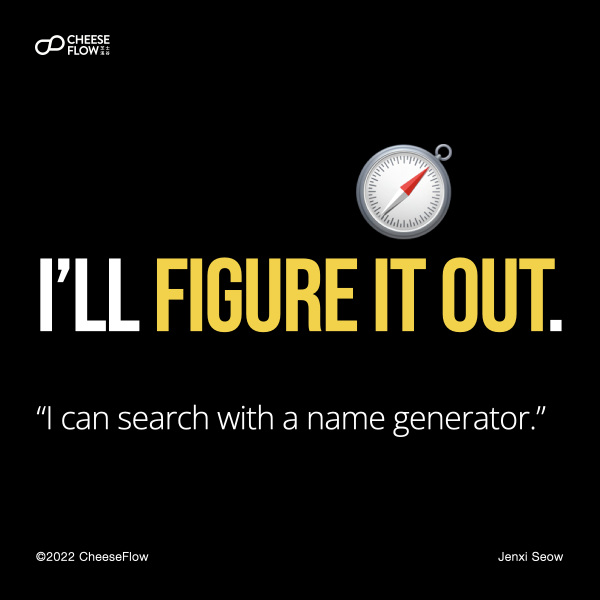

Creating a brand name is more than just finding a name that sounds or feels right. Let’s break down the myths of brand names people have.

Many small and medium enterprises, and even some large corporations make the mistake of thinking that finding a name for their brand is a very straightforward process.

This is especially so when the brand owners, including the actual owner and the people involved in creating the brand, make the mistake of thinking that they can decide on the best brand name since they are the ones who came up with the brand.

## 1\. It is easy.

It is your brand, so you know what is best for it.

Good brand names are discovered through a complex process.

You need someone outside the brand to help you navigate your blind spots. It is precisely because you are so involved in the creation of the brand that you often fail to see that certain names are bad choices, something that is clear to others looking from outside in.

## 2\. It is a feeling.

You trust your gut feeling. You know it will help you to find the best brand name. Your feelings matter, but not as much as your target audience’s feelings.

Good names require vigorous testing.

There are mature and well-researched methods in the industry to help you understand how the market take to your brand name.

## 3\. I’ll figure it out.

You can use a search engine or name generator to help you find the name that feels right (see number 2).

Good names need to tie in with good strategy.

It is important to start with a brand strategy to empower the naming process. The brand discovery phase will provide you with information and key messages you want to communicate through your brand.

## 4\. The perfect name is out there.

I hate to break it to you, but you won’t find the perfect name for your brand.

No name is perfect, only the most suitable.

Every option comes with a compromise. The key is to find the one that has the ideal compromise, meaning it has the best fit with your brand strategy.

You might be extremely lucky and think of the perfect name, only to realise that you are unable to register as a trademark for one reason or another.

## Naming is hard, but powerful when done right.

The myths of brand names are reminders that creating a brand name is hard. We know how difficult the process it, and we also know what to look out for to avoid potential landmines. [Speak to us](https://cheeseflow.com/contact/) if you are interested to understand how we can help you name your brand.

Follow us on [Instagram @thecheeseflow](https://instagram.com/thecheeseflow/) to learn more about branding or subscribe to get the latest articles in your inbox.

