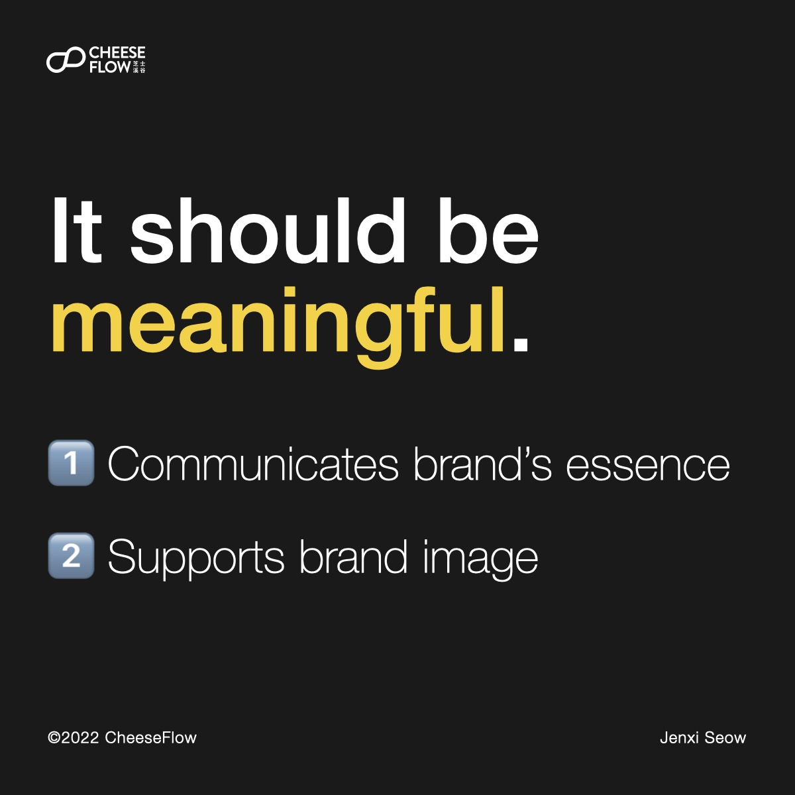
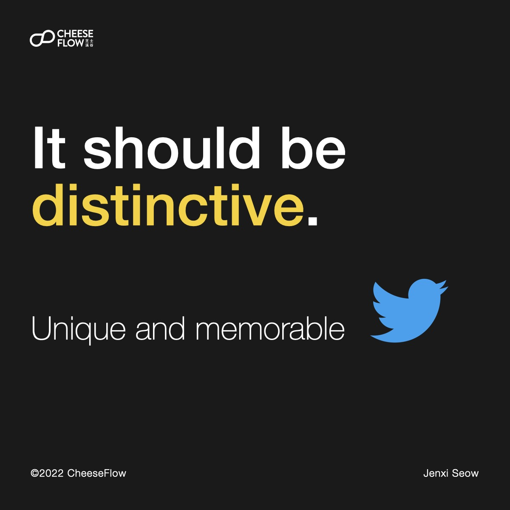
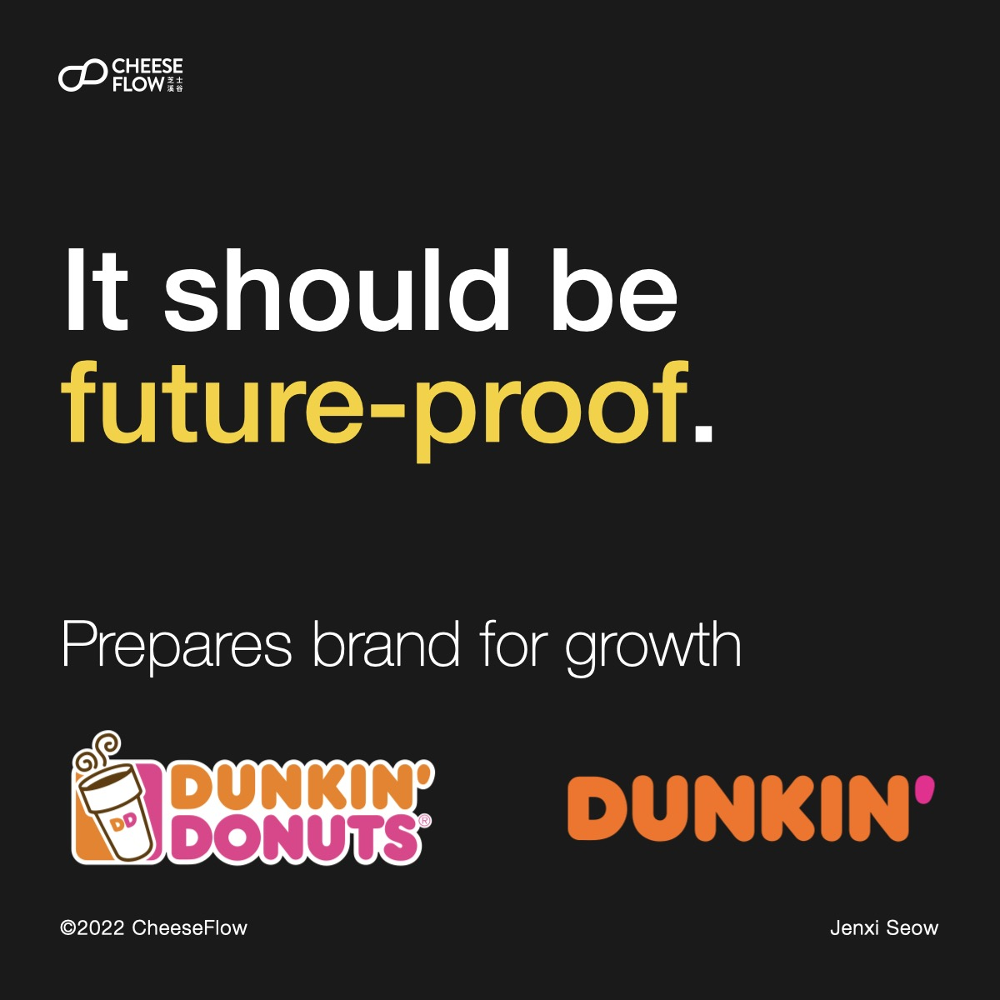
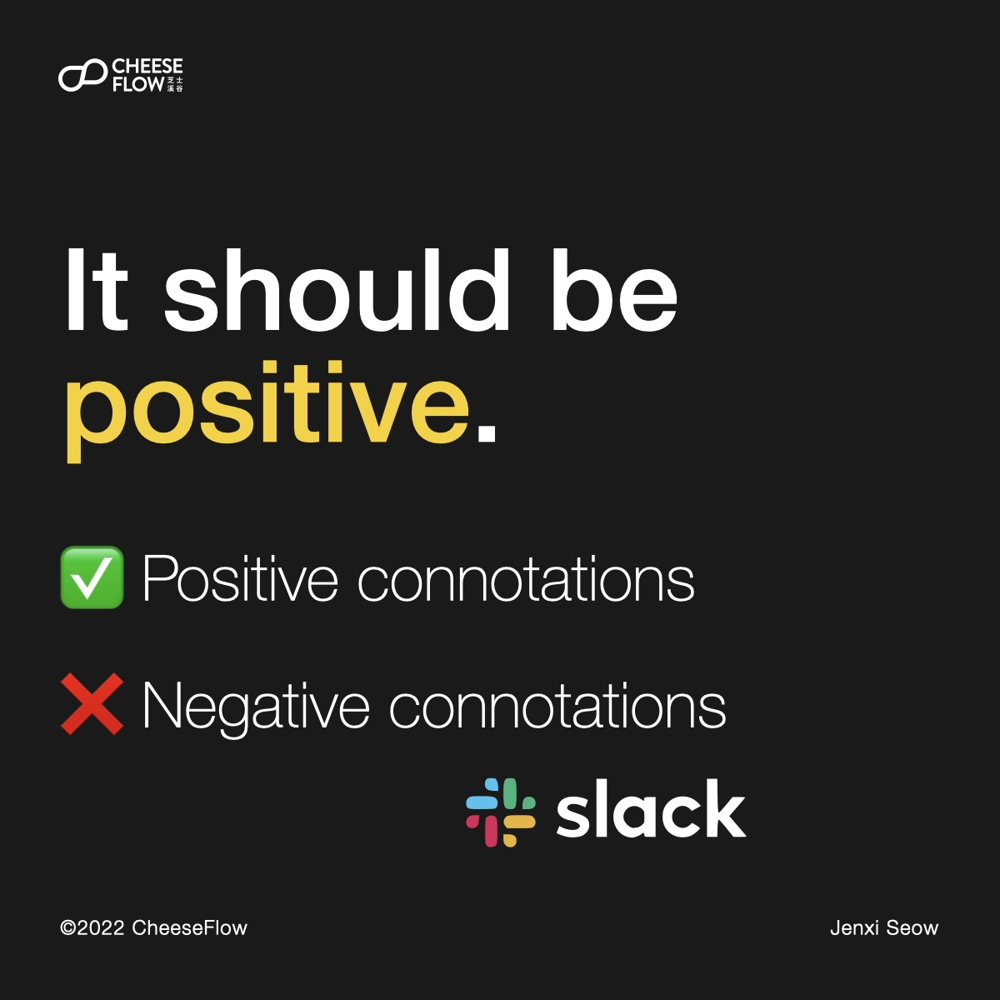
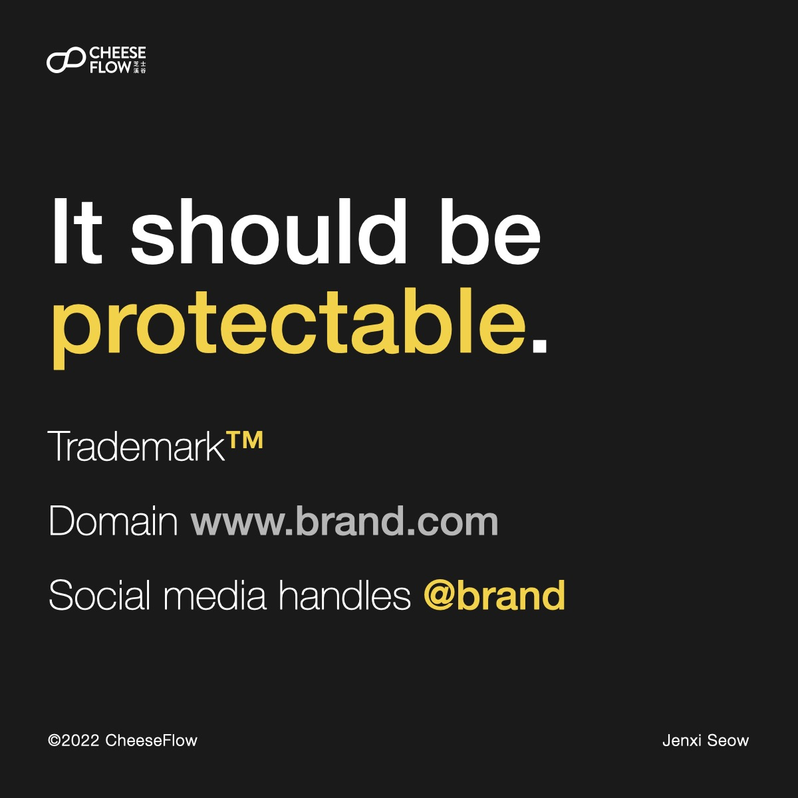
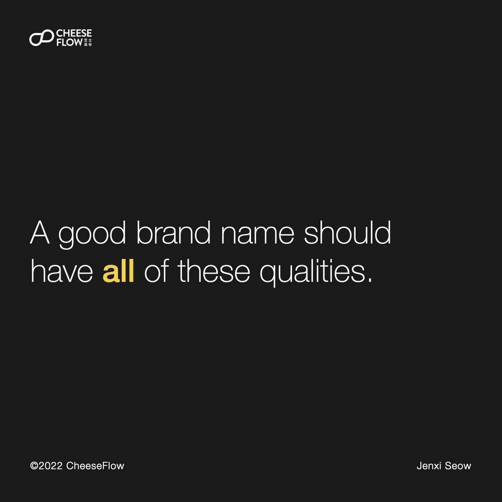
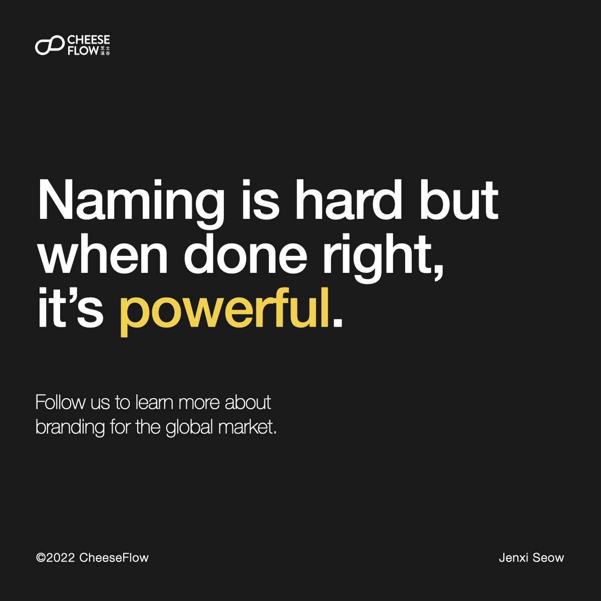

We talked about the [myths of brand names](https://cheeseflow.com/4-myths-of-brand-names/). So are the qualities a brand name must have to work well and stand out in the crowded market?

## It should be meaningful

A brand name should communicate the brand’s essence and support the brand’s image.

## It should be distinctive

We all know brand names should be unique and memorable, but we see so many brands that jump on a trend instead of trying to be different. Just look at the number of brands that started dropping the “e” in their names to look cool like Flickr, Tumblr, and Grindr to name a few.

Some unique names we love are Sony and Kodak. These are names that mean nothing but have come to embody what each brand stands for.

## It should be future-proof

A brand name should be ready for changes in the future. By preparing for the brand’s growth, it ensures the brand’s longevity.

Dunkin’ Donuts dropped the “donuts” from its name and rebranded as Dunkin’ to be a beverage-led company instead of just focusing on the food. We suspect it is also to avoid the unhealthy image linked to donuts.

## It should be positive

This is a no-brainer. Avoiding negative connotations ensues that the brand avoids controversy. That said, certain brands want to be associated with negative connotations to stand out, but it takes skill and courage to handle that.

We might not want to associate being slack with work, but that’s what Slack did. And it works because the app works so well that it allows for slack while improving productivity.

## It should be modular

Being modular is to allow the brand to retain its identity in product names.

When you see the product names Adizero and Adiprene, chances are you’ll think of Adidas and guess that they are related to the brand.

How about MacBook, Mac Studio, Mac Pro, and iMac?

## It should be protectable

Being able to trademark the brand is not just to protect the brand, but it is also an indication that the brand name is unique enough to be registered.

When the domain name and social media handles are available, it also goes to show that the name is unique and you are able to provide a uniform identity across platforms.

## Naming a brand is a difficult process.

How many of these qualities does your brand have? A good brand should have all of them.

The first vital step in the right direction is to acknowledge that it is not easy and reach out to experts who are able to help you in the journey of finding your brand name.

Follow us on [Instagram @thecheeseflow](https://instagram.com/thecheeseflow/) to learn more about branding or subscribe to get the latest articles in your inbox.

