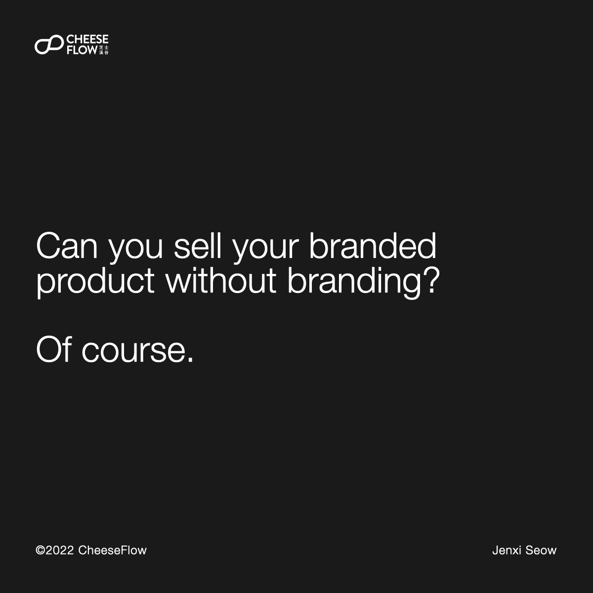
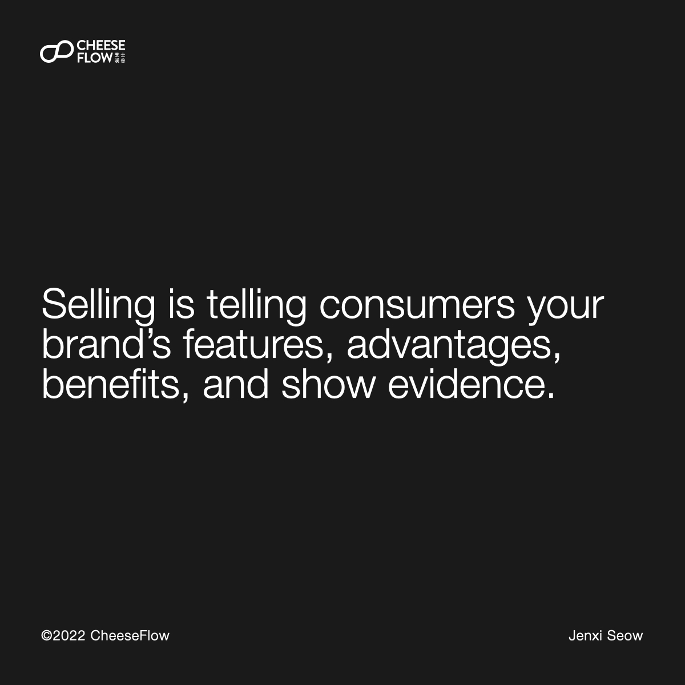
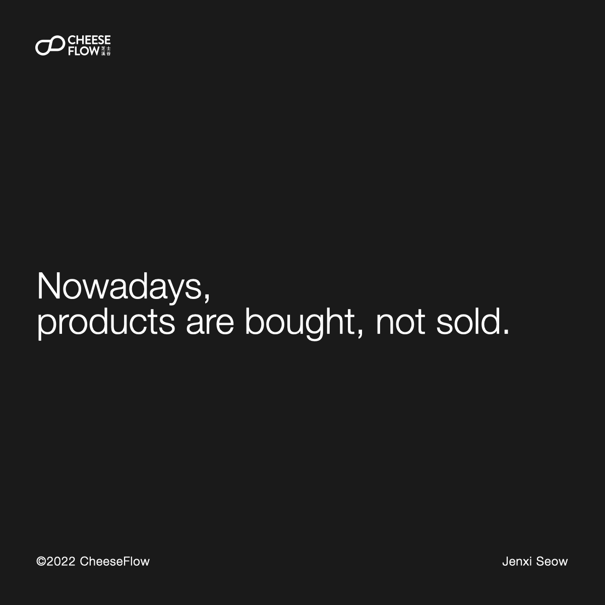
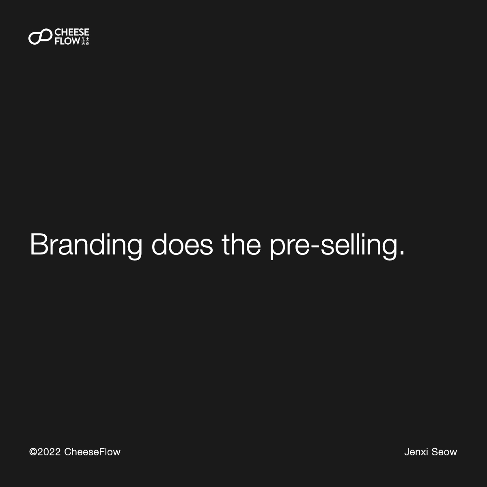
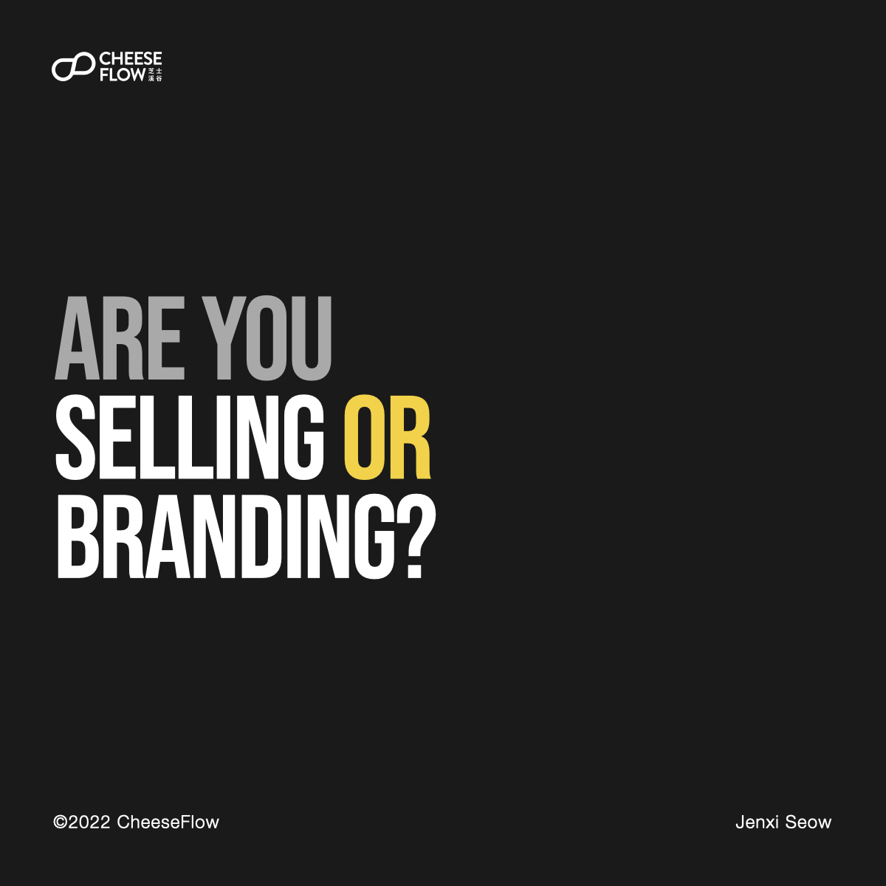
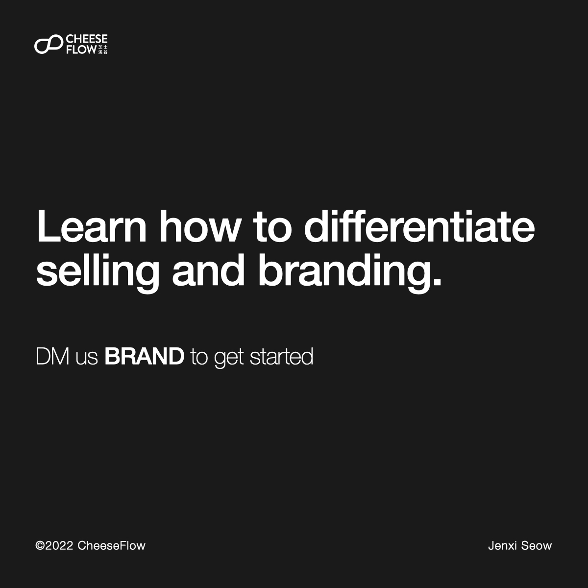

Many brands think that they are branding, when in reality they are selling. How do selling and branding differ?

Can you sell your branded product without branding? Of course.

But when a cheaper competitor appears, it will kill your brand. Unless you go cheaper, or offer more value. Then it becomes a race to the bottom.

There’s not cheapest, only cheaper. We all know this.

## Selling and marketing

We often encounter brands who think they are doing branding. They create a brand name, brand logo, and brand visual image, then slap these onto the product, packaging, website, and billboards. But it’s not branding.

Many brands confuse brand expression with branding. They have the brand visuals on the products to differentiate it visually from the competitors.

They focus on telling consumers their brand’s features, advantages, benefits, and show evidence. The FABE sales technique. This is selling.

Many brands make the mistake of thinking that their selling efforts is marketing. A brand’s marketing effort should be building a brand.

Selling is what the brand says. Of course the brand would say good things about itself. Why should consumer believe what the brand says?

Consumers are suspicious of product claims, and it makes them believe you less if you put a marketing spin to your claims.

Put yourself in their shoes. You’re shopping online and you come across a product. Would you believe all the benefits a product tells you? Or would you research what others say about it?

If that’s the case, then why do people believe Apple’s claims of its product features and benefits? Branding creates trust and builds credibility.

## Consumers buy products

Nowadays, products are bought, not sold.

You shouldn’t be thinking of selling or marketing. Branding is the key.

Branding does the pre-selling. So instead of brands having to sell the product, the consumers goes to buy the product.

Branding is how the brand is perceived. Branding is what news and consumers say about the brand.

Brands are built in the minds of consumers. When Apple puts a marketing spin to their product claims, some consumers lap it up, while others see it as a reality distortion sphere.

Those who buy what Apple says already built an image of a trusted brand in their minds. Whereas those who think otherwise built an image of a brand they dislike or distrust.

Brand influence purchasing behaviour. Poor branding means you need to sell the products, as in, convince them to make the purchase.

Good branding doesn’t require you to sell because pre-selling is already done in the branding process. Good branding also creates loyalty. Loyal customers will make recurring purchases, and they would often help to sell your brand to people around them.

## How do you know if you’re selling or branding?

Consider the category your brand sells in. When consumers think of this category, what’s the first brand that comes to their mind? Why isn’t it your brand?

If your name is not the first that comes to mind, then you need to work on your branding.

If you’re talking about your brand, you’re selling. If others are talking about your brand, you’re probably branding, though in certain cases you’re not. It depends on what they are talking about.

Having a good brand name makes it easier for others to talk about your brand.

Are you selling or branding? Learn how to differentiate selling and branding.

[Speak to us](https://cheeseflow.com/contact/) if you are interested to understand how we can help you improve your brand.

Follow us on [Instagram @thecheeseflow](https://instagram.com/thecheeseflow/) to learn more about branding or subscribe to get the latest articles in your inbox.

