We came across an interesting branding myth recently. It claims that consumers should be able to draw remember brand logos and draw them from memory. Is this true? Let’s find out.

People create a visual association with brands. When brands become famous, their logos also become recognised. However, it doesn’t mean that people would recognise the features and details of famous logos.

The team at [Signs.com](https://www.signs.com/branded-in-memory) did a study to understand how people perceive logos, and the findings are quite interesting.

## Apple

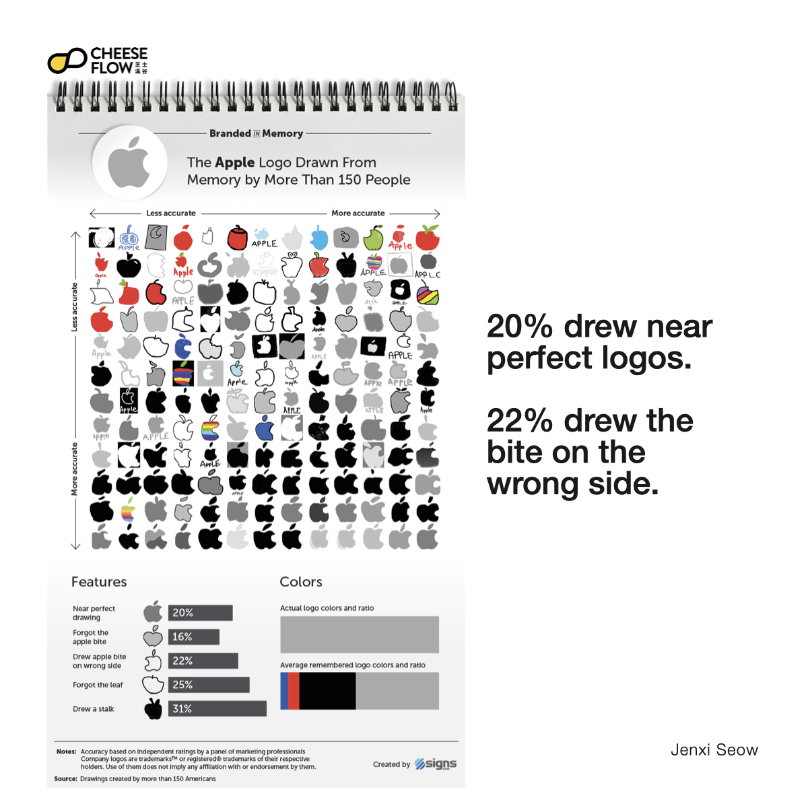

Apple brand recall

We first look at the results for Apple. We covered the evolution of Apple’s logo before. However, it is interesting to see that most of the people surveyed recalled Apple’s newest logo design.

20% of the people drew a near perfect drawing of the Apple logo. Is this a high for low number? Read on to compare with the other brands below.

16% forgot to include the apple bite and drew a whole apple. The bite is the most iconic feature in the logo, so it is natural that most people (84%) remembered it. It is still interesting to note that some people don’t recall the logo having a bite. 22% drew the bite on the wrong side.

25% forgot the leaf. 31% added a stalk.

Around half of them remembered that the logo is grey. About a third drew the logo as black. This is understandable as the logo is presented in the black in certain surfaces. 5% of the people drew the logo in rainbow colours used in the old logo used from 1977 to 1998.

The results show that most people (77%) remember Apple’s colours. Even if they recall the older colours, it still goes to show that the old logo left a strong enough impression for them to recall the colours. Only 6% mistakenly drew the logo in red, with a handful drawing blue and green.

## Adidas

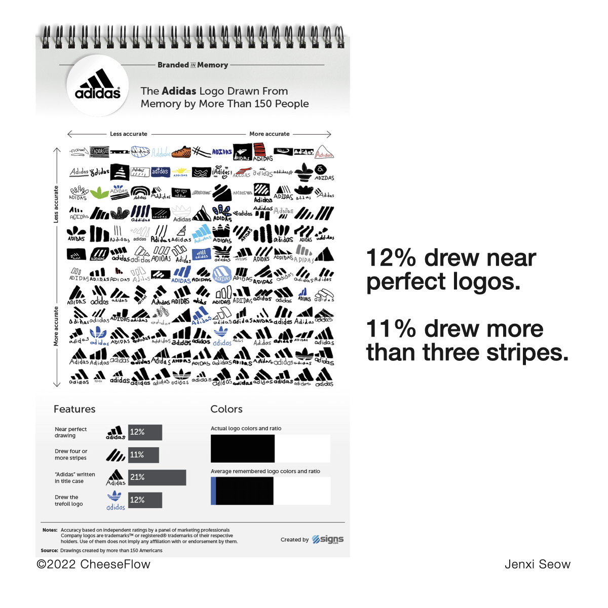

Adidas brand recall

Despite its popularity, only 12% of the people drew a near perfect drawing of the Adidas logo. This is slightly more than half compared to Apple’s 20%.

12% of people drew the Adidas trefoil logo that is used mainly on the Adidas Originals line. If this were to be considered as drawing the logo correctly, then Adidas would actually come in at 24% near perfect drawing.

11% drew the logo with more than three stripes. Besides the number of stripes, people seem to not recall the direction the stripes slope towards or the shape of the stripes.

21% drew the logo with the word Adidas in title case. The actual logo uses all lowercase.

Most of the people were able to reproduce the logo in black and white. However, 8% drew the logo in blue. This is understandable given how blue is a prominent secondary colour used in the packaging, paper bags, and other visuals.

Even though Adidas is an iconic logo, people still have a hard time recalling the details of the logo.

## Burger King

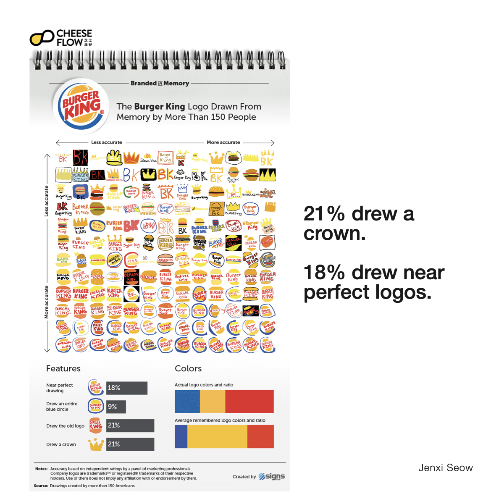

Burger King brand recall

18% of people drew a near perfect drawing of the Burger King logo. This is more than Adidas, but still slightly lower than Apple. However, it is still a decent result given that it is more complex than the other two we’ve looked at.

9% drew a blue circle instead of a crescent shape. 21% drew the old logo that is simpler -- the words Burger King sitting between two buns halves.

21% drew a crown even though the logo does not have a crown. I guess people tend to associate a crown with the word King in the name. I doubt they would be thinking of the 1957 Burger King logo that features a crowned king in the logo.

The people recalled the logo’s colour pretty well even though it is three colours compared to the previous two monochromatic logos.

## Domino’s

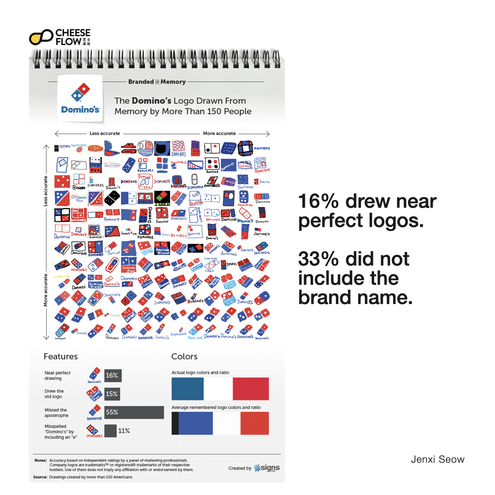

Domino’s brand recall

16% of people drew a near perfect drawing of the Domino’s logo, not too far off from Burger King’s score.

15% drew the tilted square logo used from 1996 to 2012.

55% did not draw the apostrophe in the word Domino’s and 11% added an ‘e’. This is a very interesting aspect of grammar since people might read and remember the brand as Dominos instead. Those who added an ‘e’ were probably thinking of the correct plural for dominoes.

28% drew the logo with three dots in the right position, two below and one on top. 27% drew more than three dots. 14% did not include any dots. This is rather strange since they probably did not associate the brand with domino pieces.

The people recalled the logo’s colour pretty well, with a minority drawing the logo in black. They were probably thinking of black domino pieces.

## 7-Eleven

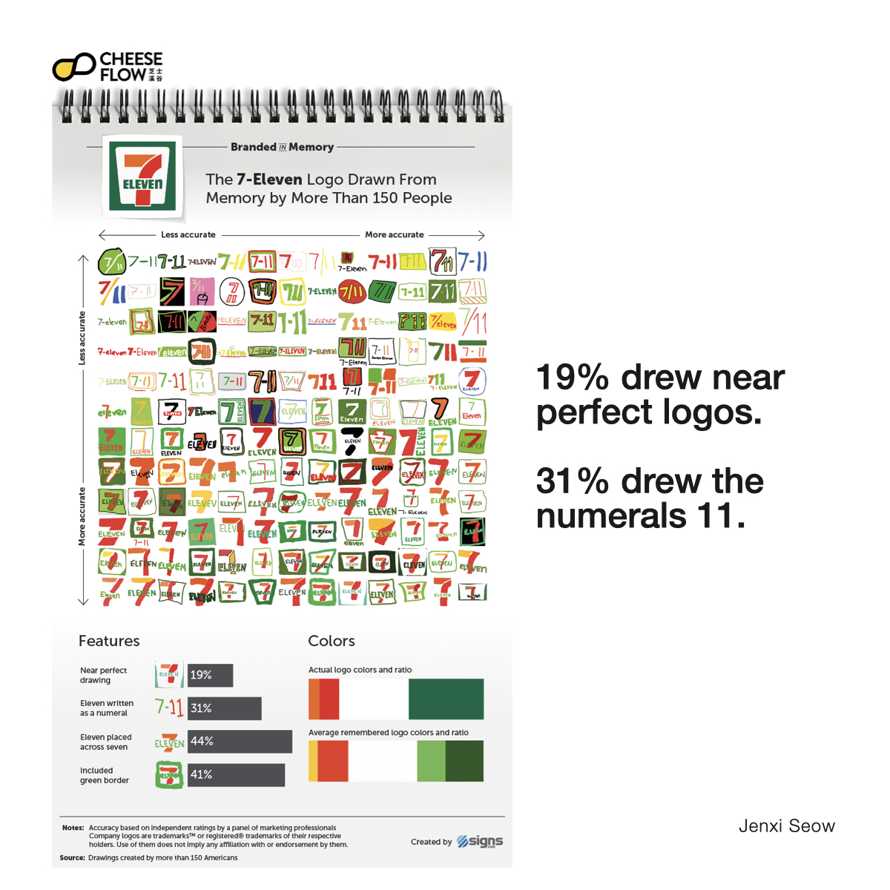

7-Eleven brand recall

19% of people drew a near perfect drawing of the 7-Eleven logo, similar to what Burger King and Dominos had.

31% wrote Eleven as the numeral 11 instead of spelling it out, and only 1% of the people remembered that the logo is written as “ELEVEn” with all uppercase except the “n”.

44% drew the logo with the Eleven across the “7”. The others drew the Eleven below or to the side of “7”.

41% included the green border. Although most people remembered that the brand had green in the logo, 59% did not remember the border was green.

## Foot Locker

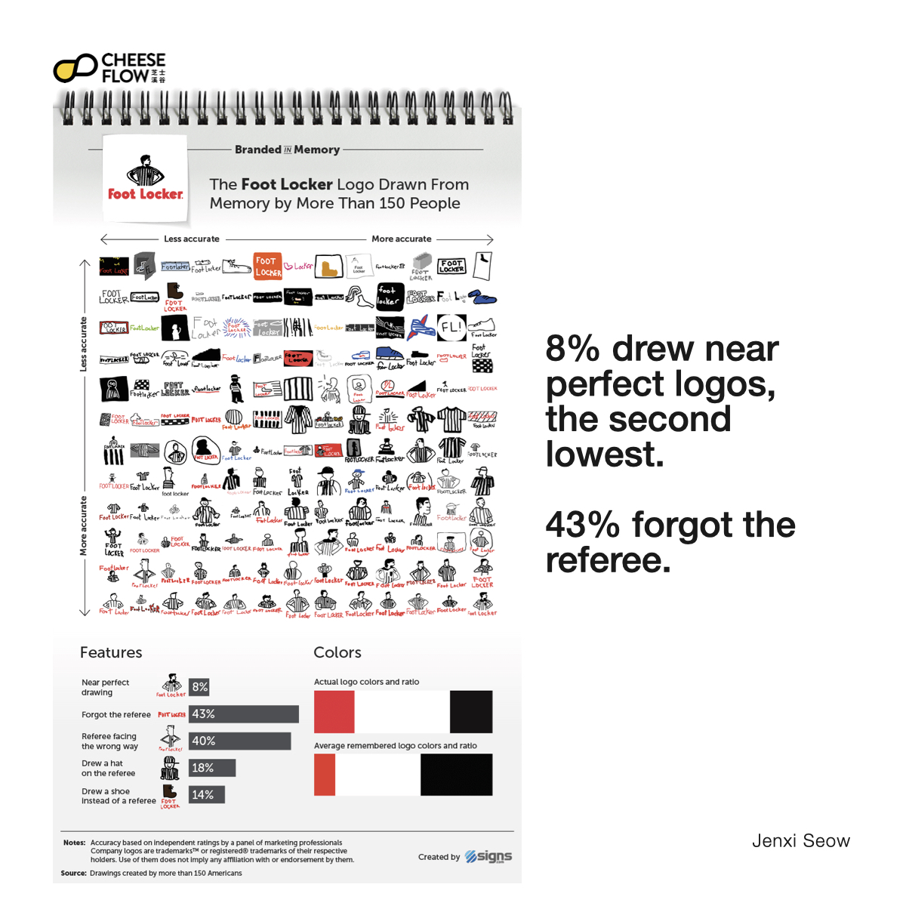

Foot Locker brand recall

8% of people drew a near perfect drawing of the Foot Locker logo. This is the lowest we have seen so far.

43% drew the logo without the referee , even though the referee is the key feature of the logo. It is interesting to note that 14% drew a shoe or foot instead of the referee.

Of the people who drew the referee, only 50% remembered that his hands are on his hips, and 40% drew him facing the wrong direction. 31% of those who drew the referee added a cap.

## Starbucks

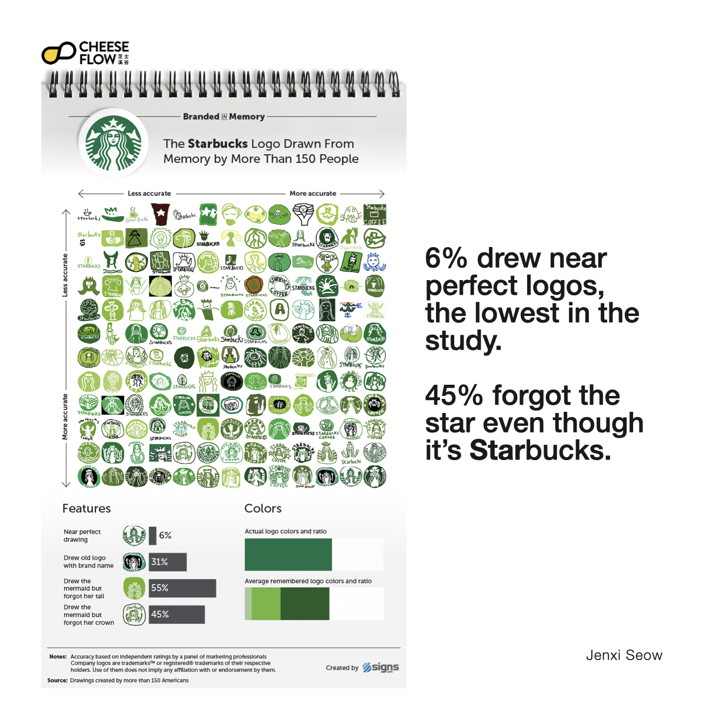

Starbucks brand recall

The Starbucks logo is iconic, but only 6% of people drew a near perfect drawing of it. This makes it the lowest out of all ten logos in the survey.

Unlike Foot Locker’s referee, 90% remembered to include the mermaid. However, 55% of these forgot her tails and 45% forgot her crown.

Out of the people who drew the crown, only 16% remembered the the star in the crown. This means that only 8% of all the people surveyed drew the star. Is this surprising? Yes, given that the brand’s name has the word “star” in it.

## Walmart

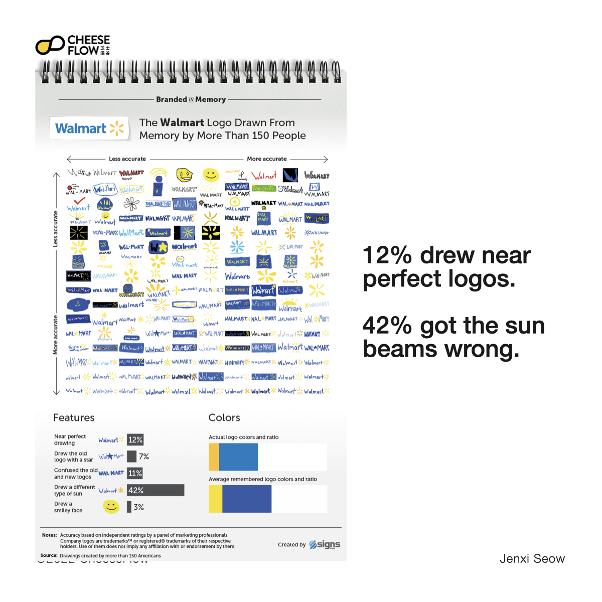

Walmart brand recall

12% of people drew a near perfect drawing of Walmart’s logo, tying it with Adidas.

7% drew the old logo that included a star. In contrast, 68% drew the sunburst that replaced the star in the logo since 2008. However, out of those who drew the sunburst, 42% drew an incorrect number of points.

11% confused the old logo with the new logo by including a hyphen between “Wal” and “Mart”.

3% drew a smiley face. Walmart’s famous Smiley face icon is the brand’s mascot and does not appear in the logo.

## Target

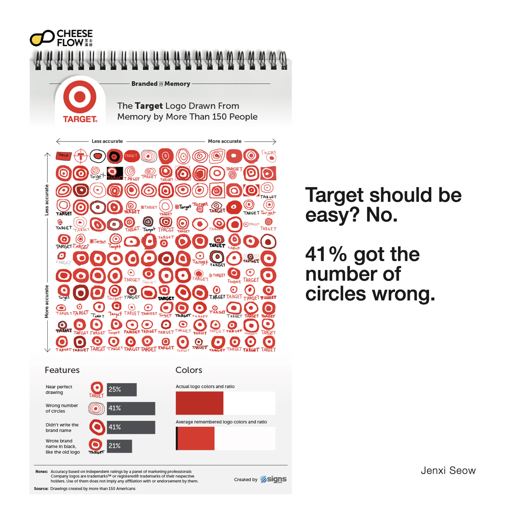

Target brand recall

25% of people drew a near perfect drawing of Target’s logo, making it the highest so far. 52% were able to draw it well with some flaws.

41% drew the logo with more than one circle around the dot. Target’s original logo was made up of three circles but it started using the dot and circle logo since 1968.

41% omitted the brand name. This might indicate that Target’s logo is so ubiquitous that they did not require the brand name to recall. Out of the 59% that remembered the brand name, 36% drew the name in black. The Target name was black in the logo from 1975 to 2003, but has been red since 2004.

## IKEA

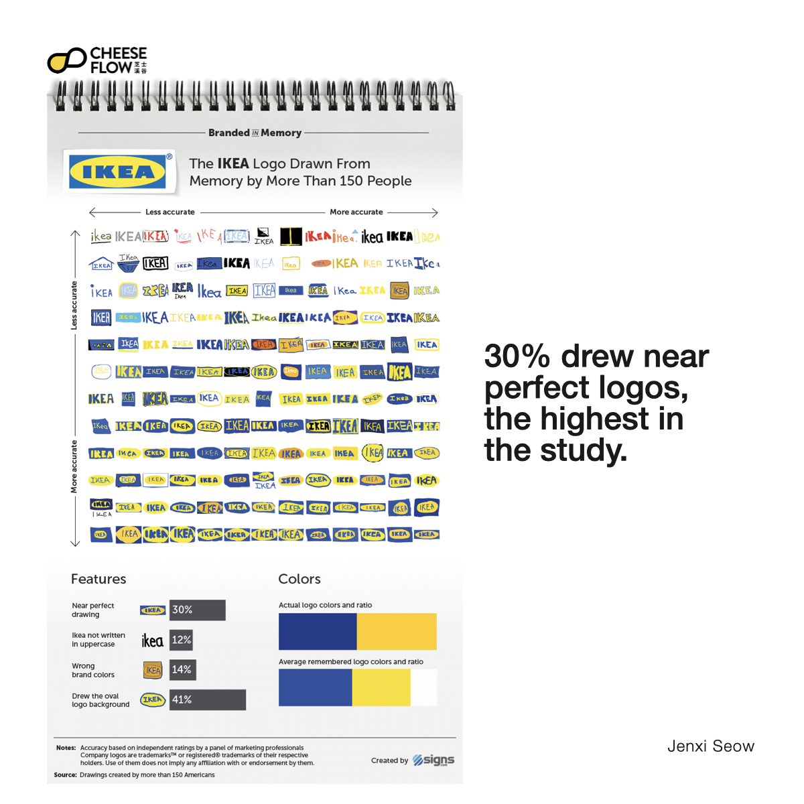

IKEA brand recall

30% of people drew a near perfect drawing of IKEA’s logo, the highest out of all ten logos surveyed.

12% did not write the brand name in uppercase, even though the uppercase letters is one of the most important design element in the logo.

59% did not draw the oval background in the logo, the key distinguishing feature of the logo since 1967.

14% used the wrong brand colours. I’m curious to understand what caused this.

## People don’t remember brand logos

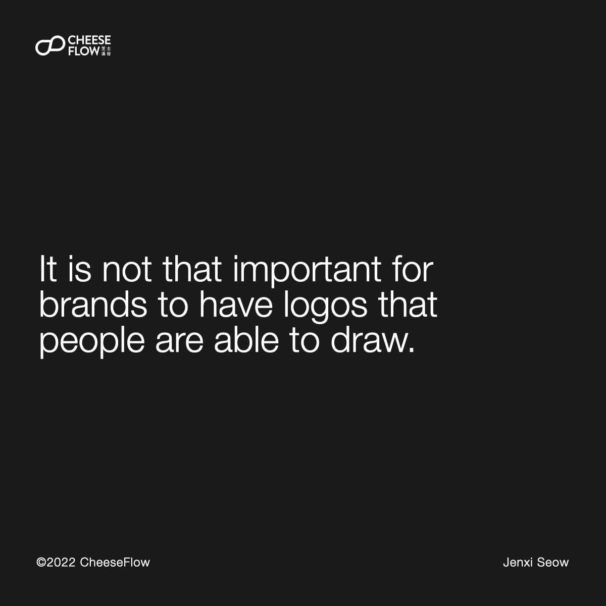

We can see from the survey that even though these are famous brands, most consumers are unable to recall the brand logos. They associate the visual image to the brand but they don’t remember it fully.

When it comes to brand, the visuals play some part but many other factors contribute to how consumers perceive brands, such as emotions and the brand experience itself. Brand logos and colours, despite their importance in branding, make up only a fraction of the brand visual.

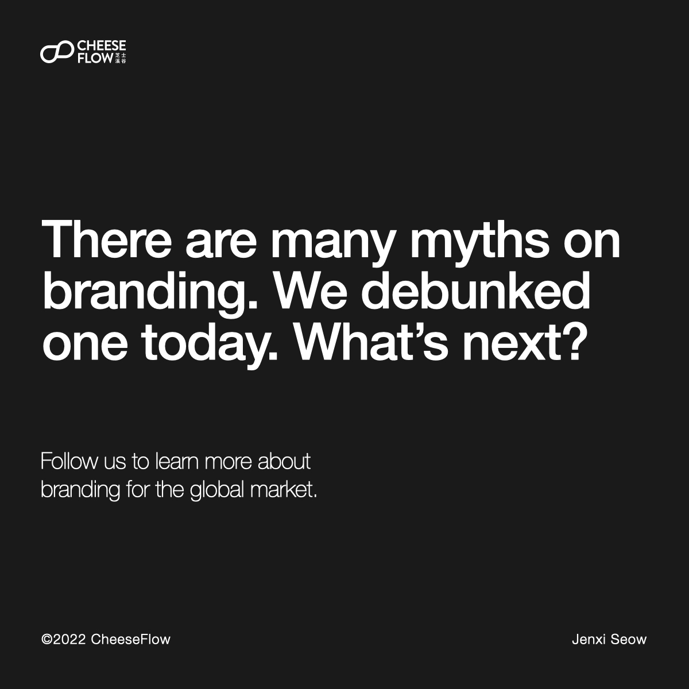

[Speak to us](https://cheeseflow.com/contact/) if you are interested to understand how we can help you improve your brand.

Follow us on [Instagram @thecheeseflow](https://instagram.com/thecheeseflow/) to learn more about branding or subscribe to get the latest articles in your inbox.

Source: [Signs.com](https://www.signs.com/branded-in-memory)

