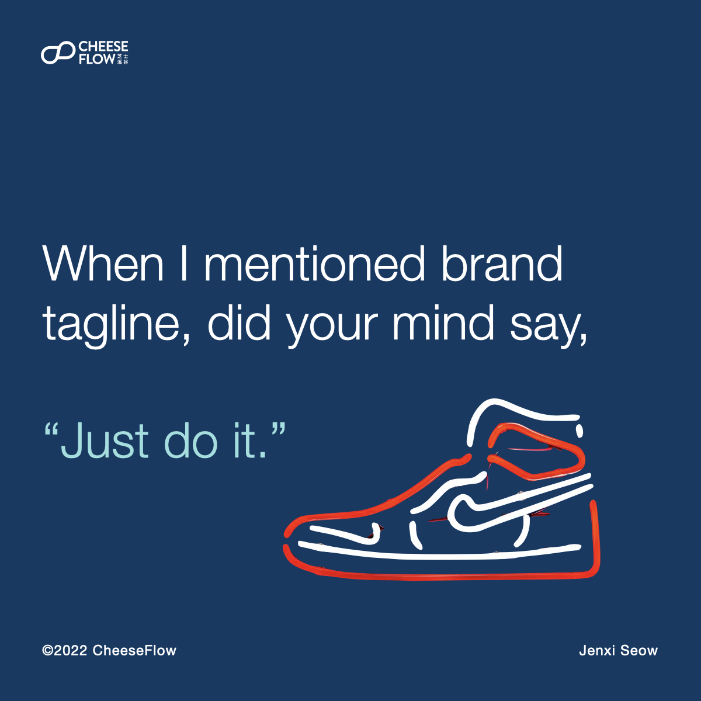
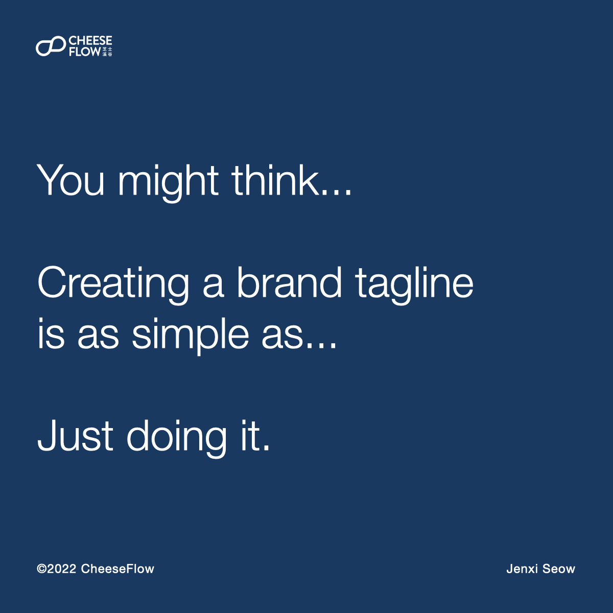
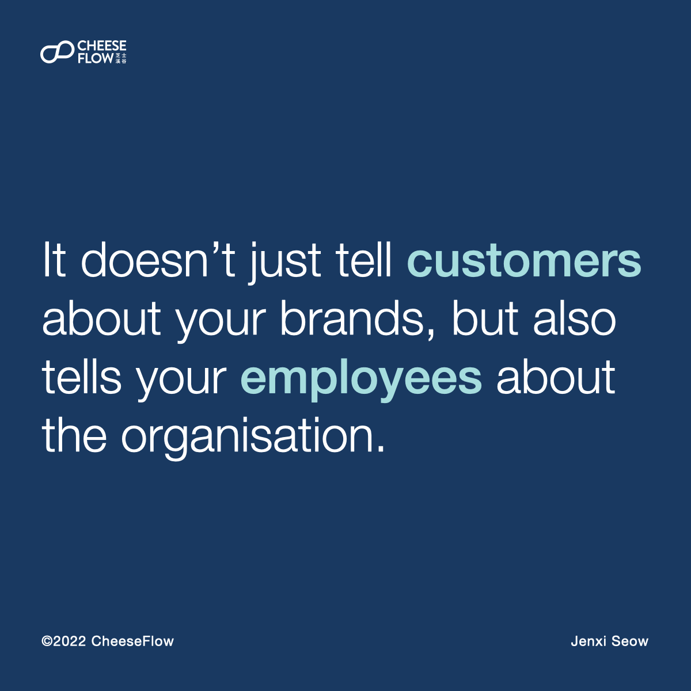
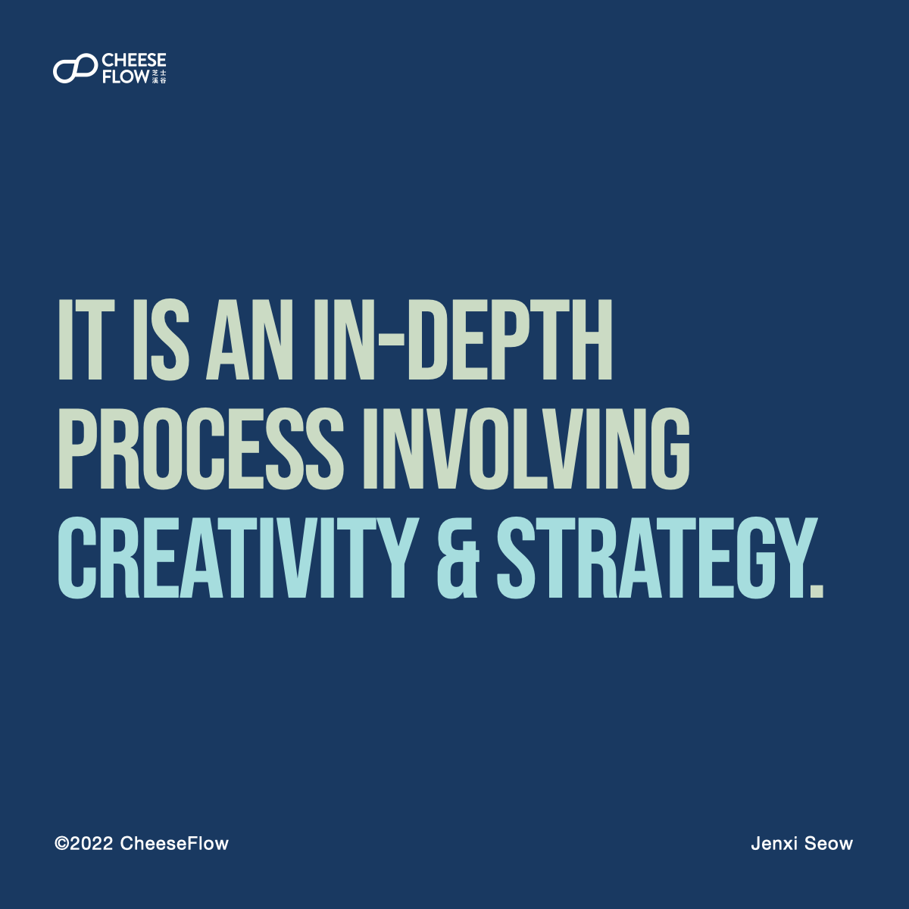

A brand tagline is more than just a concise way of describe what your brand does. It is the essence of what your brand stands for, both to your customers and employees, aka internal customers.

We often see new brands that try to use their brand tagline to describe the brand in a smart and witty way. That helps to make it memorable, but does that make it meaningful enough?

## What’s the first brand tagline you can think of?

What’s the first thing that comes to mind when you hear “brand tagline”? The most frequent answer I get is, “Just do it.”

Nike’s tagline is simple, and has become so iconic and memorable. But there is more to it. It also symbolises the freedom to do what you want to without feeling restrained. We see Adidas using a similar approach with its tagline, “Impossible is nothing.”

You might think that creating a brand tagline is as simple as just doing it, but it is actually a complex process. Brands don’t just come up with taglines that have layers of meaning hidden within or even visible for all to see. It takes a lot of work to distil what you want to express into a few words.

## What is a brand tagline?

Most people are aware that a brand tagline tells people what a brand does in a memorable way. It is a simple line that is a possible ear worm to help a brand to get consumers to remember what it is.

“Melts in your mouth, not in your hands.”

It is more than that. A brand tagline encapsulates a brand’s essence, personality, and positioning. That’s the beauty of a great brand tagline. Nike’s “Just do it” tells you what Nike stands for, the brand’s personality, and how it positions itself in the market.

Brand taglines also sets brand apart from competitors. Nike wants you to do it. But Adidas wants you to do the impossible.

Taglines don’t just tell customers about the brand. It tells the employees about the organisation. Apple’s tagline is “Think different”, a constant reminder to employees that the company’s wants to bring the best user experience through innovative products.

## What makes a good brand tagline?

For a brand tagline to be considered good, it should have the following features:

*   Be short
*   Be unique
*   Be meaningful
*   Rolls of the tongue
*   Can be trademarked
*   Be easy to remember
*   Be readable in small font
*   Evoke an emotional response
*   Have no negative connotations

## It is an in-depth process involving creativity and strategy

In order to check all the above boxes, it takes an in-depth process that involves creativity and strategy to craft the tagline for the brand.

We know how difficult the process it. [Speak to us](https://cheeseflow.com/contact/) if you are interested to understand how we can help you create a tagline that truly represents your brand.

Tell me about brand taglines that you’ve seen that make you cringe. How do you think your brand’s tagline can be be improved?

Follow us on [Instagram @thecheeseflow](https://instagram.com/thecheeseflow/) to learn more about branding or subscribe to get the latest articles in your inbox.

