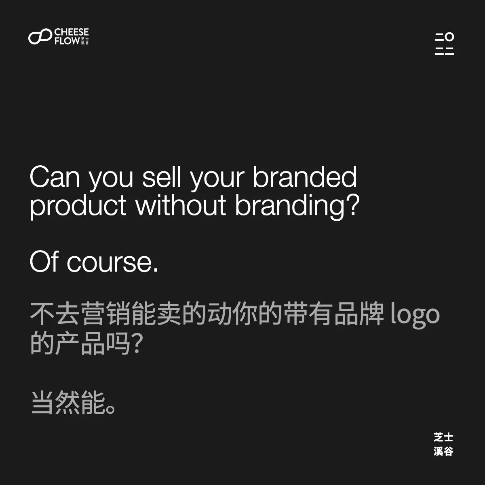
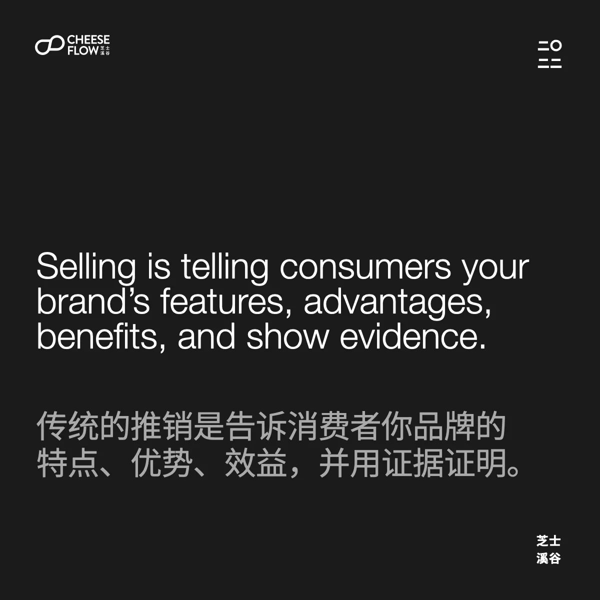
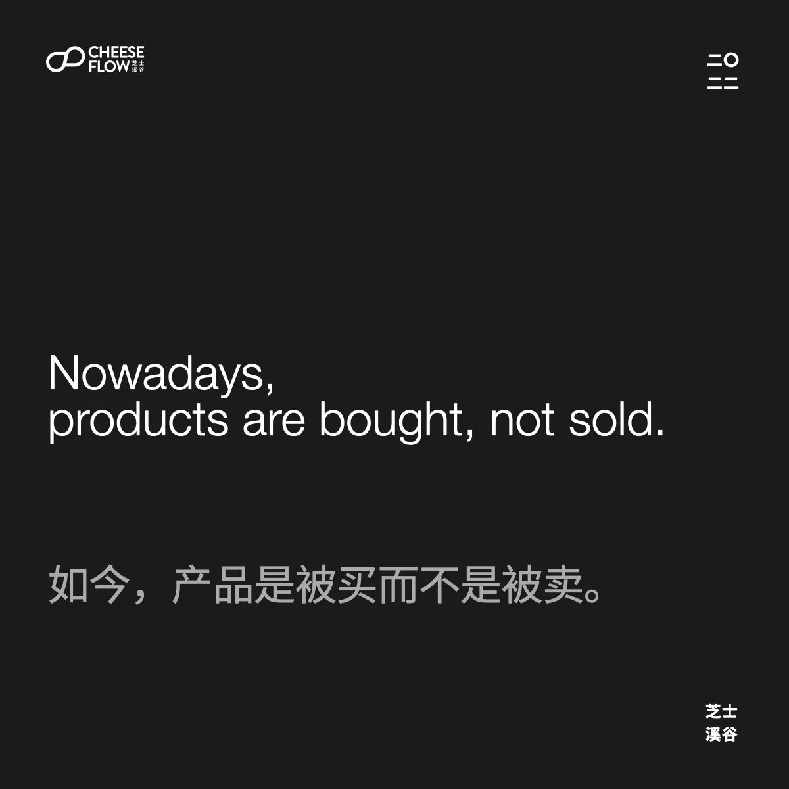
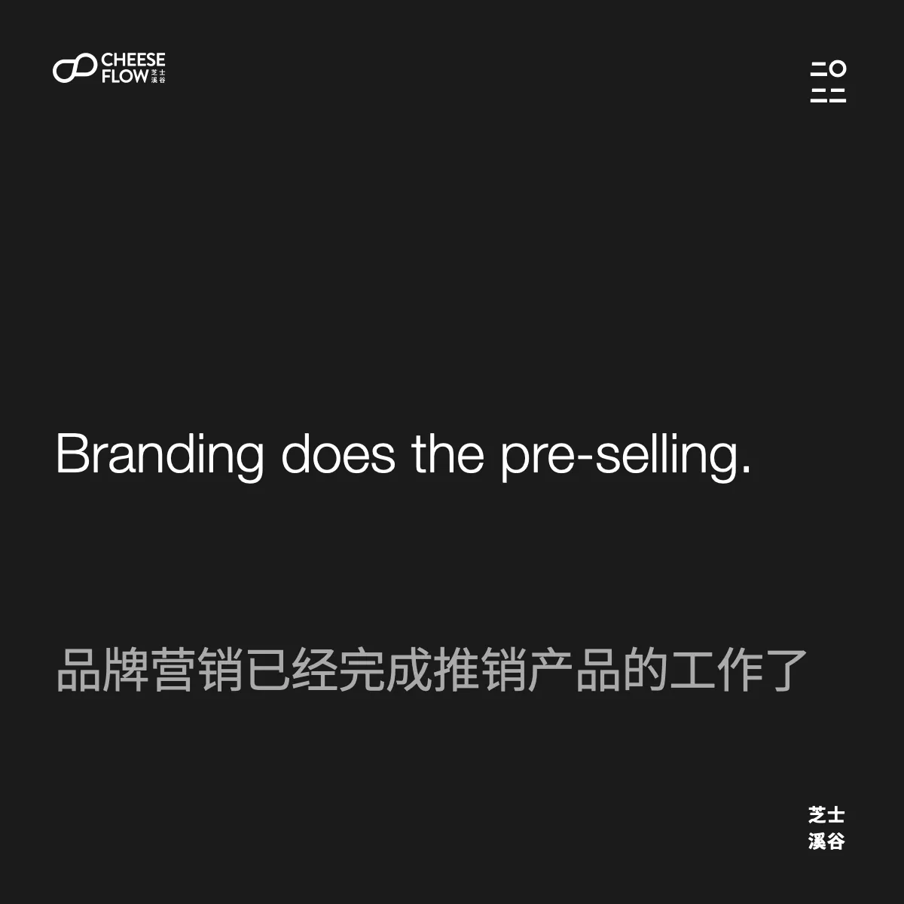
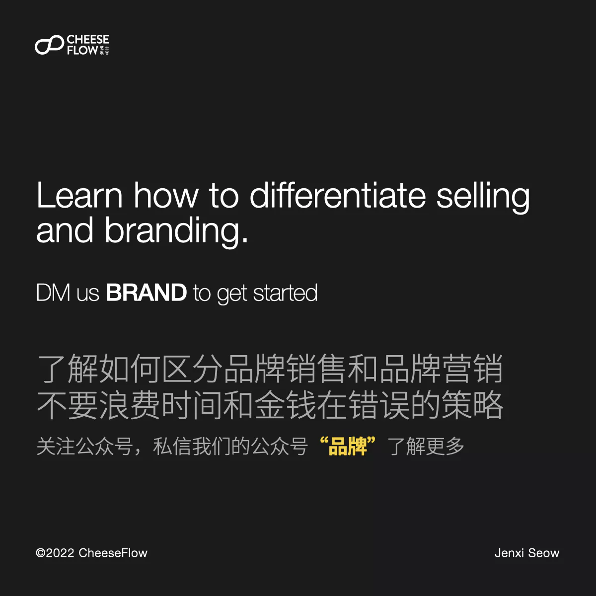

很多品牌觉得它们是在做品牌营销，实际上它们是在做品牌推销。品牌推销和营销的区别究竟在哪？

不营销能卖的动带有你品牌 logo 的产品吗？当然能。

但是一个价格更便宜的竞争对手就有可能把你干掉，除非你比它价格更便宜，或更有价值。接下来就是价格战，朝底线赛跑了。

我们都知道没有最便宜，只有更便宜。

## 推销和市场营销

我们经常接触到一些品牌，认为自己是在做品牌营销。它们创建了品牌名称、品牌 logo 和品牌视觉形象，然后将这些放在产品、包装、网站、广告牌等。但是这不是品牌营销。

很多品牌把品牌表现当作品牌营销。它们只不过是把品牌视觉元素放在品牌上，让它们的产品容易和竞争对手辨别出来。

它们执着于告诉消费者它们品牌的特点、优势、效益，并用证据证明。这是经典的 FABE 销售术。这是品牌推销。

很多品牌总是误以为他们的品牌推销工作是市场营销。其实品牌的市场营销工作应该是打造品牌。

品牌推销是品牌所说的，那它当然会自卖自夸，消费者有什么会相信品牌所说的呢？

消费者通常是会对产品声称的特点和功能感到怀疑的，如果这些声明还是营销自旋的手段，那就会更不信任该品牌。

设身处地的从消费者的角度去看待。你在网上购物时是否会相信一个产品自称所有的优点呢？还是会先去搜一下其他人是怎么评价这个产品的？

那你就会想，如果是那样的话，那为什么很多人还是相信苹果自称的产品特征和优点呢？品牌营销建立信任和信誉。

## 消费者是在买产品

如今，产品是被买而不是被卖。

你不应该想着品牌推销或市场营销，品牌营销才是关键。

品牌营销已经完成推销产品的工作了。所以品牌不需要推销产品，消费者就会去买产品。

品牌营销是他人如何感知你的品牌。品牌营销是媒体和消费者对你品牌的评价。

品牌是消费者在脑海里建立的认知。当苹果在产品声称里用营销手段，有些消费者完全接受，但是有些人会觉得是在忽悠人。

那些认可苹果所说的脑海里已经建立了一个可信任的品牌形象，而那些否定的人们的脑海里已经建立了一个讨厌或不信任的品牌形象。

品牌影响消费习惯。差劲的品牌营销导致你需要去推销产品，说服消费者购买。

优秀品牌营销让你不需要做品牌推销，因为品牌营销的过程已经帮你把品牌推销的工作完成了。优秀品牌营销也会培养品牌的忠诚度。忠诚客户都是回头客，也会帮你把品牌推销给身边的亲戚朋友们。

## 你是在做品牌推销还是品牌营销呢？

想一想你品牌所在的产品分类。当消费者想到这个产品类时第一个想到的是哪个品牌？为什么不是你的品牌？

如果你的品牌不是第一个出现在消费者脑海里的，那你的品牌营销有待改进。

如果你在讲述自己的品牌，即是在推销。如果他人在讨论你的品牌，那多半是在做品牌营销，但是有些情况下也不算数，具体要看他们说的是什么。

有个好的品牌名称也能让其他人更容易了解讲述你的品牌。

你究竟是在做品牌推销还是品牌营销？了解如何区分品牌销售和品牌营销不要浪费时间和金钱在错误的策略。
