最近我们遇到一个蛮有趣的品牌观念：消费者必须能从记忆中把品牌标志画出来，才算是个好 logo。这个说法是否正确呢？

人们会通过视觉联想到品牌。当品牌出名后，它们的标志也会跟着变得很有识别度。但是这不意味着人们能完全能够记得住这些有名品牌logo的特征和细节。

今天我们来看看 [Signs.com](https://web.archive.org/web/20240424001438/https://www.signs.com/branded-in-memory) 做的一个的关于消费者如何看待品牌logo的调查，通过让消费者凭着记忆把一些有名的品牌的logo画出来，发现结果还挺有趣的。

## Apple 苹果

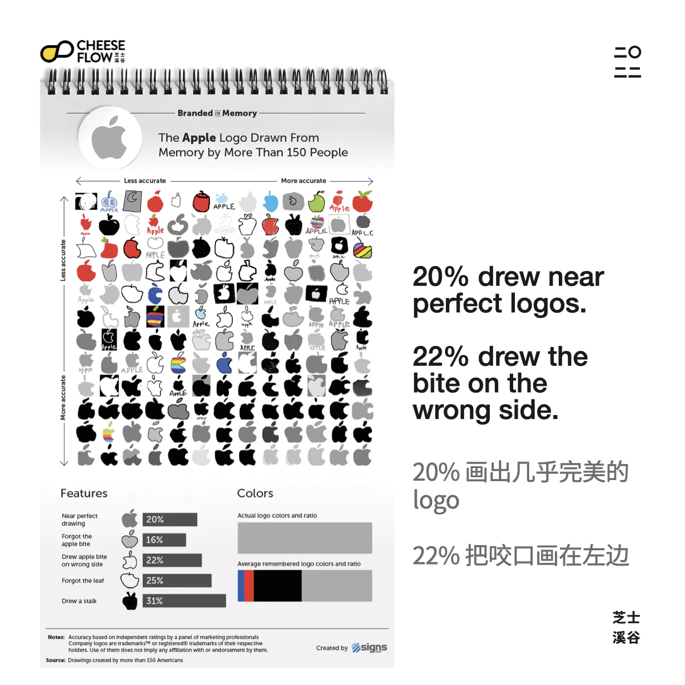

Apple brand recall

首先，我们看看苹果获得的成绩。我们在之前的文章里聊过苹果品牌的 logo 的演变，但是有趣的是大部分的受访者能只能记起苹果品牌最新的 logo 设计。

结果是只有20% 的受访者能画出几乎完美的正确的苹果品牌的 logo，这算是高还是低呢？让我们继续看下去和其他品牌对比的情况吧。

16% 的受访者忘了画个咬口，反而画了个完整的苹果图案。那上帝咬口是苹果 logo 里最标志性的特征，所以大部分（84%）的受访者记得它，但是有趣的是还是有些人忘了它的存在。22% 的受访者把咬口的位置搞错了。

25% 的受访者忘了画苹果叶，31% 加了个柄。

大概有一半的受访者记得 logo 是灰色的。三分之一的受访者则把它画成黑色，苹果品牌在某些地方是会用黑色的 logo，所以这个是能理解的。5% 的受访者把 logo 画成 1977年到 1998 年之间用的彩色旧 logo。

结果显示77% 的受访者记得苹果的品牌颜色。其实就算他们记错了，记成了旧的品牌颜色，但这也表示旧的 logo 给他们留下了深刻的印象，导致他们还会想起它。只有 6% 的受访者把 logo 画成一个蓝色或红色苹果图案。

## Adidas 阿迪达斯

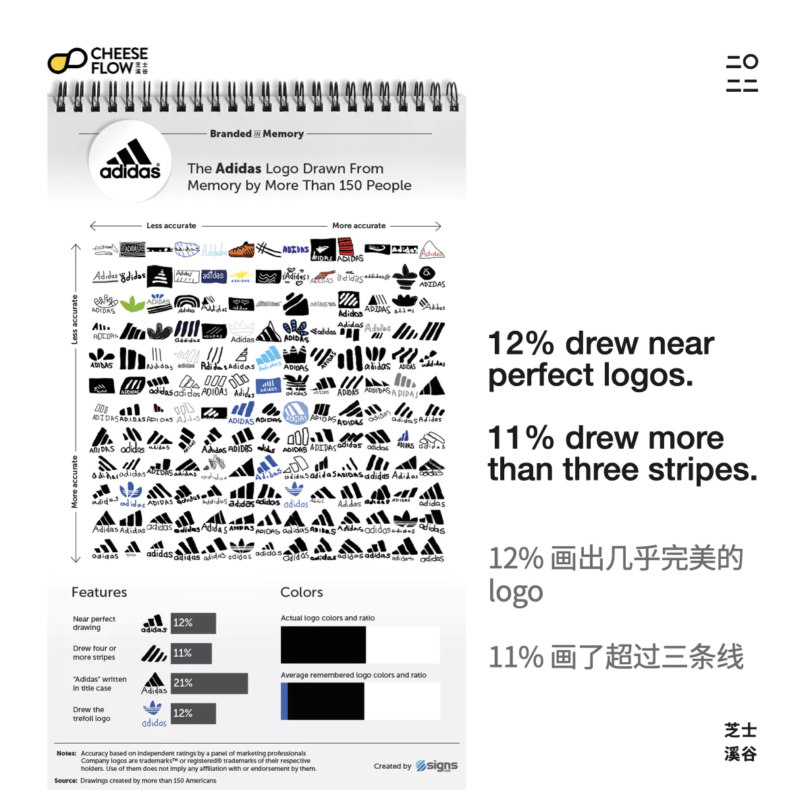

Adidas brand recall

尽管阿迪达斯品牌很出名，但是只有 12% 的受访者能画出个几乎完美的 logo图案。和苹果的 20% 的成绩对比这才只有它大概的一半成绩。

12% 的受访者画了阿迪达斯的三叶草 logo，这是主要用在阿迪达斯经典三叶草系列上的。如果把这部分也算成是正确画出 logo图案的，那阿迪达斯的成绩可算成是 24% 的完成了几乎完美答案。

11% 的受访者把 logo图案的线条多画了，超出了三个线条，除了线条的数量，很多受访者不记得线条的倾斜方向和形状。

21% 的受访者把 logo 里的阿迪达斯品牌名字的首字母画成大写字母，实际上，阿迪达斯 logo 用的是全小写的。

大多数的受访者是能够把 logo 图案画成正确的黑白色，但是有 8% 的受访者是把 logo 画成蓝色的。对此也能理解，因为蓝色也是蛮突出的次要品牌颜色，都有在阿迪达斯的包装、袋子和其他视觉展示上出现。

虽然阿迪达斯的 logo 非常标志性，但是很多人无法记住 logo 的细节。

## Burger King 汉堡王

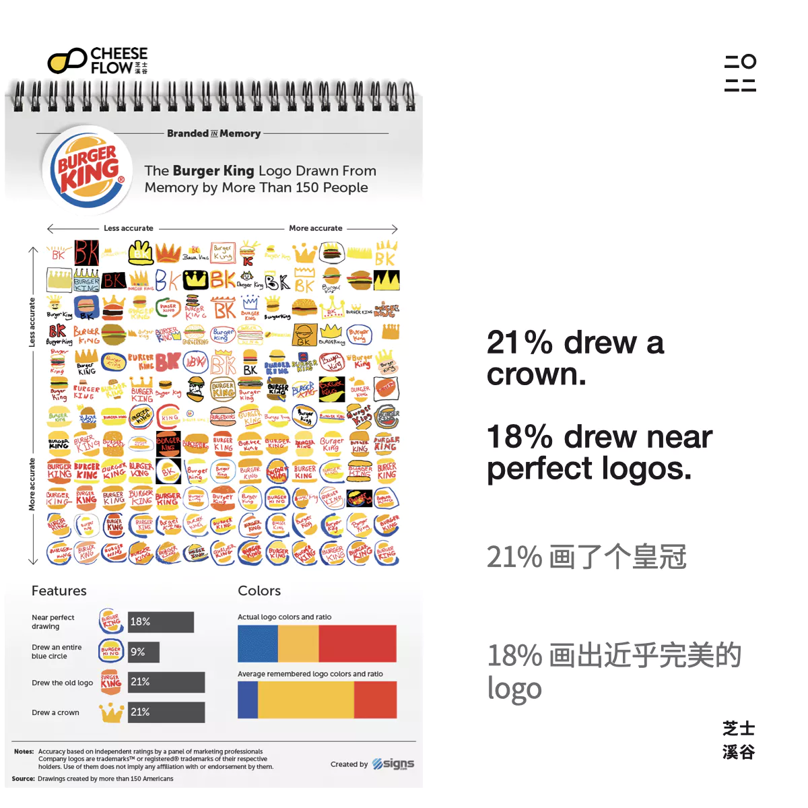

Burger King brand recall

18% 的受访者画了几乎完美的汉堡王 logo图案，这成绩比阿迪达斯好些但是还是比苹果略低。不过这个成绩还算是不错的，毕竟汉堡王的 logo 比前面两个更复杂。

9% 的受访者把蓝色月牙湾画成了圆圈，21% 的受访者画了旧的 logo。旧 logo 比较简单：就是汉堡王的字夹在两块面包中间。

21% 的受访者画了个皇冠，虽然汉堡王的 logo 里没皇冠，这应该是因为人们还是难免会通过品牌名字的意思联想到皇冠吧。或者他们不会是因为想起 1957 年那个国王带着皇冠灯 的logo 图案吧。

前面两个品牌的logo 都是单色的，汉堡王 logo 里虽然有三个颜色，但是受访者还是很好的记得它的颜色。

## Domino’s 达美乐

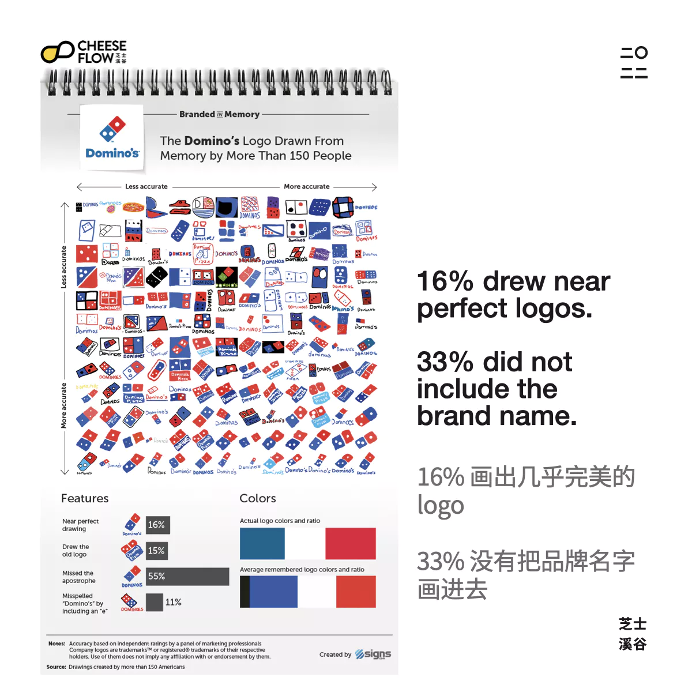

Domino’s brand recall

16% 的受访者画了几乎完美的达美乐 logo图案，和汉堡王的成绩差不多。

15% 的受访者画了1996 年到 2012 年之间该品牌用的倾斜方形旧 logo图案。

55% 的受访者忘了画达美乐品牌名字里的撇号，11% 的却多加了个 “e”。这是蛮有趣的现象，也是和语法学有关系。他们应该是把品牌记成 Dominos，而加了个 “e” 的应该是想起了domino 的正确复数拼写是 dominoes。

28% 的受访者把 logo 里的三个点画在正确的位置：两个在下面，一个在上面。27% 的受访者多画了点，超过了三个点，14% 忘了画点。没画点的是个蛮奇怪的现象，他们或许没把品牌和多米诺骨牌联想起来。

受访者还是很好的记得达美乐 logo 的颜色，只有一小部分受访者把 logo颜色 画成黑色，他们应该是想到了黑色多米诺骨牌。

## 7-Eleven 七十一

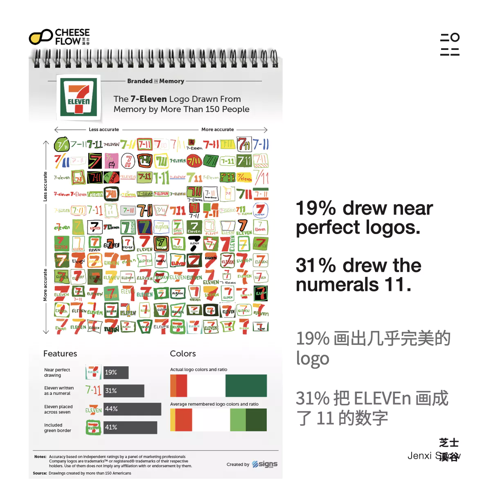

7-Eleven brand recall

19% 的受访者画了几乎完美的七十一 logo图案，和汉堡王以及达美乐的成绩相似。

31% 的受访者把英文字 “Eleven” 画成数字 11，而且只有 1% 的受访者记得品牌是名字里的十一英文字除了字母 “n“ 是小写，其他字母都是大写。

44% 的受访者吧十一的英文字画在七的数字上，其他的受访者都把它画在七的下面或者右边位置。

41% 的受访者画了绿边框，虽然大多数人记得七十一的 logo 里有绿色，但是59% 的受访者不记得它有个绿色边框。

## Foot Locker 富乐客

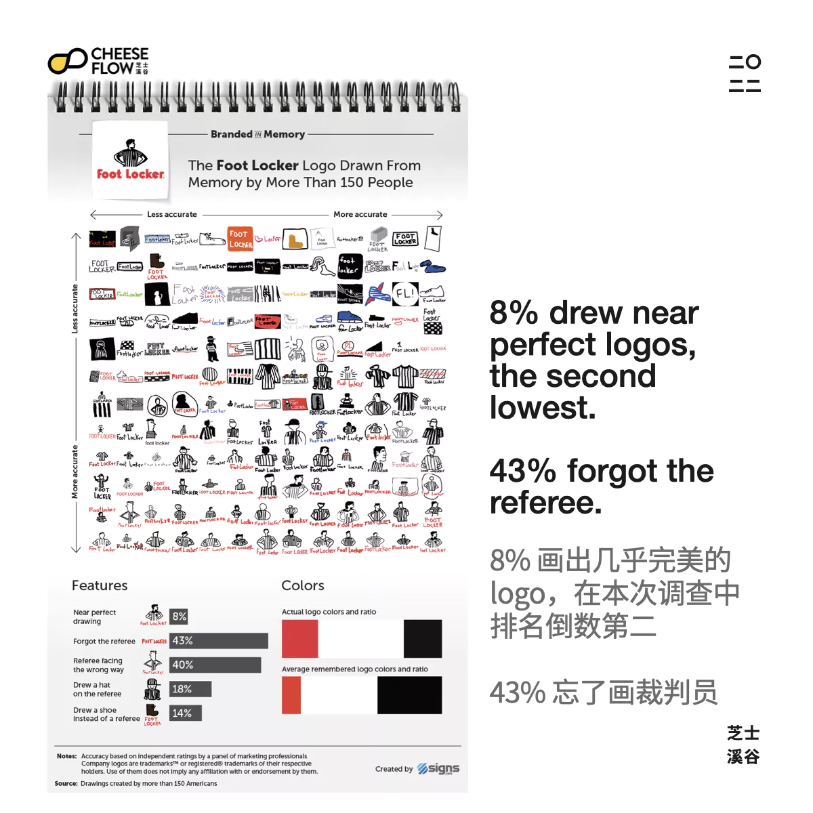

Foot Locker brand recall

8% 的受访者画了几乎完美的富乐客 logo图案，是目前最差的成绩。

虽然裁判员在富乐客的 logo 里是主要特征， 但是43% 的受访者还是忘了画这个裁判员的图案，甚至有 14% 的没画裁判反而画了个鞋子或脚。

在画了裁判员的受访者当中，只有 50% 记得他的双手是插在腰间的，而 40% 把双手的朝向位置弄错了。其中有31%受访者给裁判员多画了顶帽子。

## Starbucks 星巴克

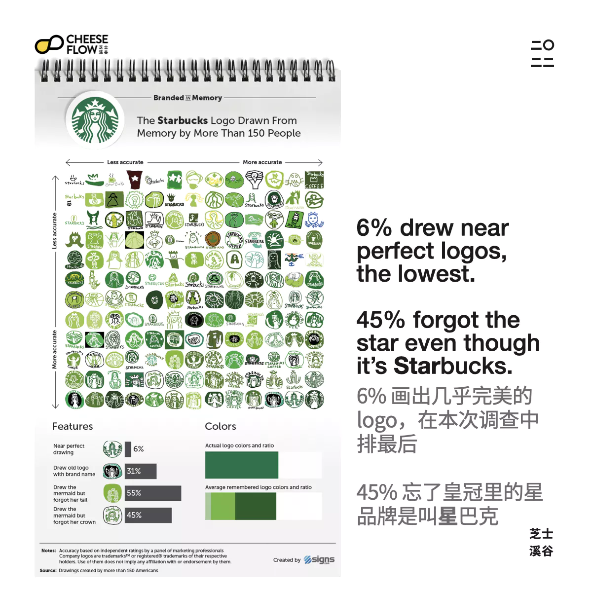

Starbucks brand recall

大家可能认为星巴克的 logo 很标志性，但是只有 6% 的受访者画了几乎完美的 logo，在本次调查里垫底的品牌。

和倒数第二的富乐克不一样的是，90% 的受访者记得 logo 里标志性的美人鱼，但是记得美人鱼的人当中有 55% 忘了画她的尾巴，而 45% 忘了画她的皇冠。

有画皇冠的受访者中只有 16% 的人记得画皇冠里的星星图案，这也意味着仅有 8% 的受访者画了皇冠里的星星图案。这就有点出乎预料了，毕竟品牌名字里有个”星“

## Walmart 沃尔玛

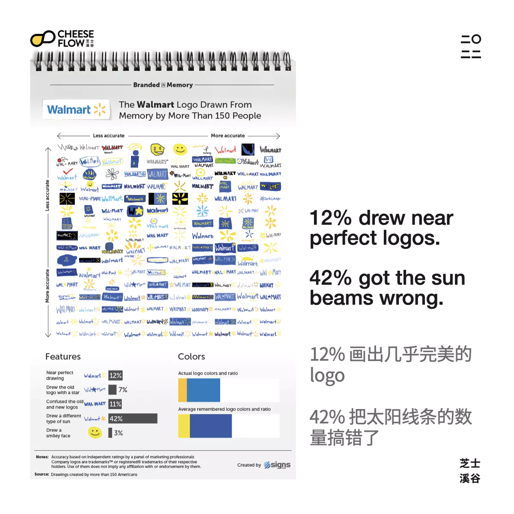

Walmart brand recall

有12% 的受访者画了几乎完美的沃尔玛 logo，结果和阿迪达斯打成平手。

有7% 的受访者画了带星星的旧 logo图案，相比之下有 68% 的受访者画了在 2008 年开始就替代了那颗星星的太阳的图案。但是画了太阳图案的人当中有42% 把太阳的线条数量弄错了。

11% 的受访者把旧 logo 和新 logo 搞混了，在 “Wal” 和 “Mart” 两个字之间加了个连字符（横杠）。

3% 的受访者画了个笑脸图案，沃尔玛很有名的笑脸标志是品牌的吉祥物，但 logo 设计里并没有这个图案。国内很多便利店和小型超市用的袋子上的笑脸，其实就是参照了沃尔玛的笑脸标志。

## Target 塔吉特

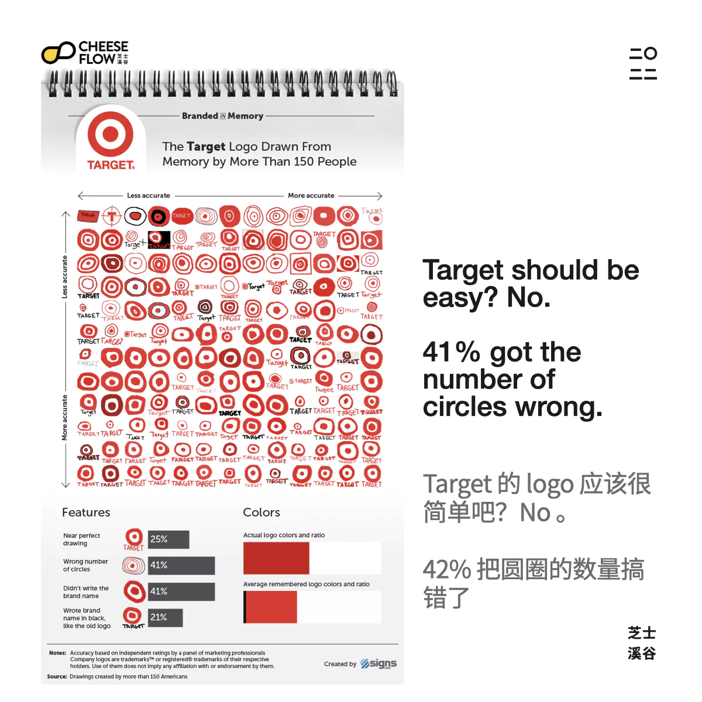

Target brand recall

25% 的受访者画了几乎完美的塔吉特 logo图案，是目前成绩最好的品牌。此外，有52% 的受访者画的logo图案离完美的答案只有少数错误。

41% 的受访者在中间的点的周围画了不止一个圆圈。塔吉特原始 logo 里有三个圆圈，但是从 1968 年开始就已经使用点和单个圆圈的 logo了。

41% 的受访者忘了画品牌名字，这或许说明塔吉特的 logo 辨识度特别高，所以人们不需要品牌名字就能想起品牌logo了。

在那 59% 记得画品牌名字的受访者当中有 36% 把名字画成黑色。塔吉特 logo 里的品牌名字从 1975 年到 2003 年是黑色的，但是 2004 年起就已经改成红色了。

## IKEA 宜家

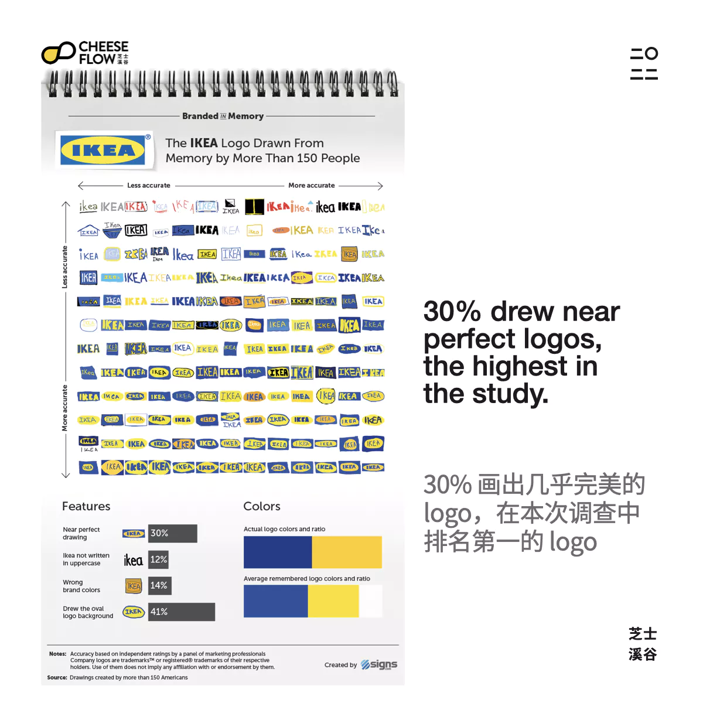

30% 的受访者画了几乎完美的宜家 logo，在本次调查中的十个品牌当中排名第一。

12% 的受访者没把名字画成全大写，而大写的字母是宜家 logo 里一个非常重要的设计元素。

59% 的受访者忘了画 logo 里的椭圆形背景，这是宜家 logo 自 1967 年开始设计的主要区别性特征。

14% 的受访者把品牌颜色弄错了，我还蛮好奇他们为什么会记不起品牌颜色。

## 消费者不记得品牌 logo

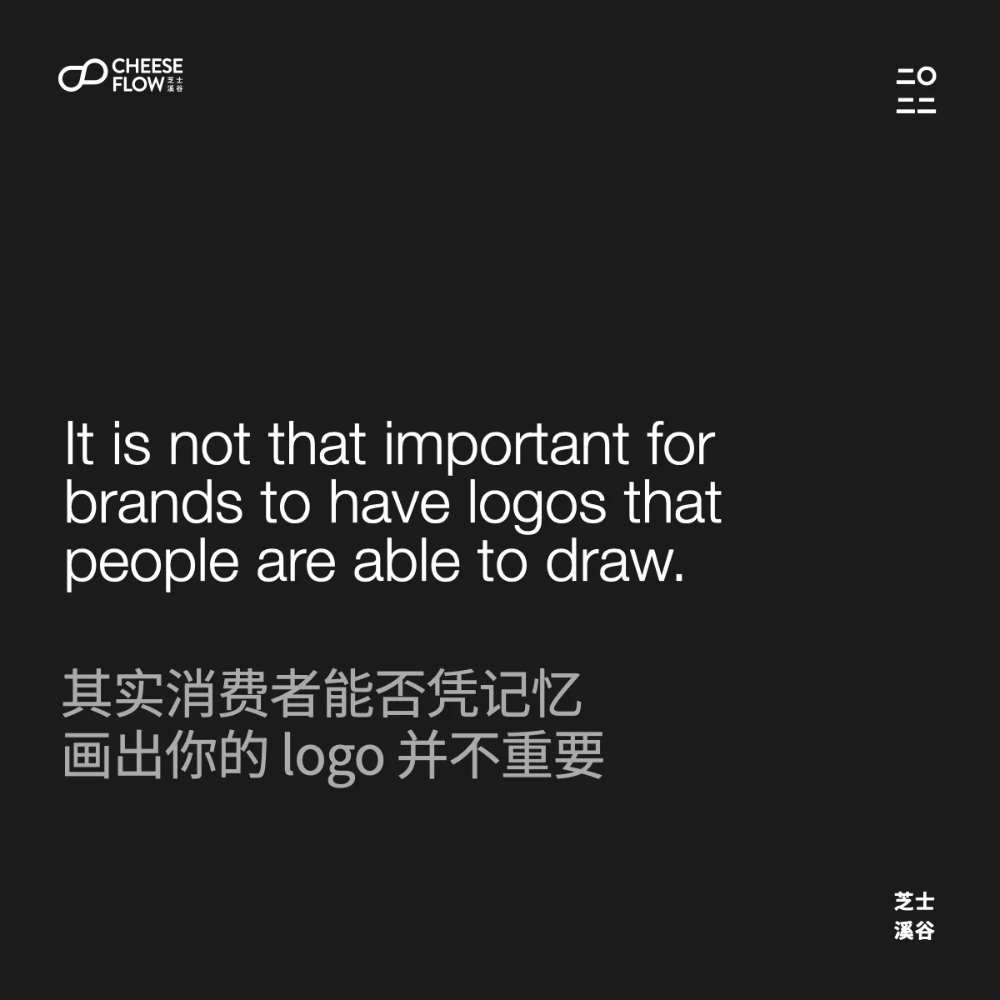

通过这个调查结果我们可以看到尽管很多知名的品牌，许多消费者仍然记不住这些品牌的 logo。人们通常只会通过视觉联想到品牌，但他们不会全面的记住这些 logo。

视觉虽然对品牌化会有一定的影响，但是还有很多其他因素也会影响消费者怎么看待品牌，比如情感方面、品牌体验等。品牌 logo 和品牌颜色虽然对品牌化很重要，但是它们只是塑造品牌视觉的一部分。

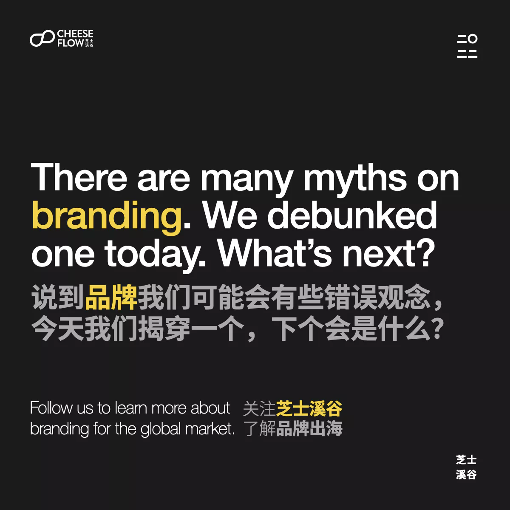

如果有兴趣了解如何优化你的品牌，非常欢迎联系我们。
