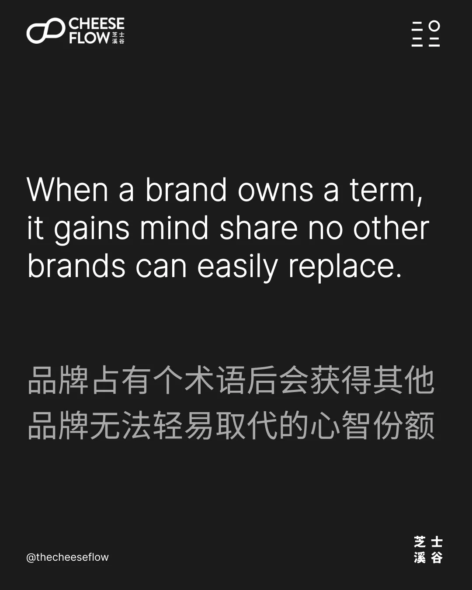
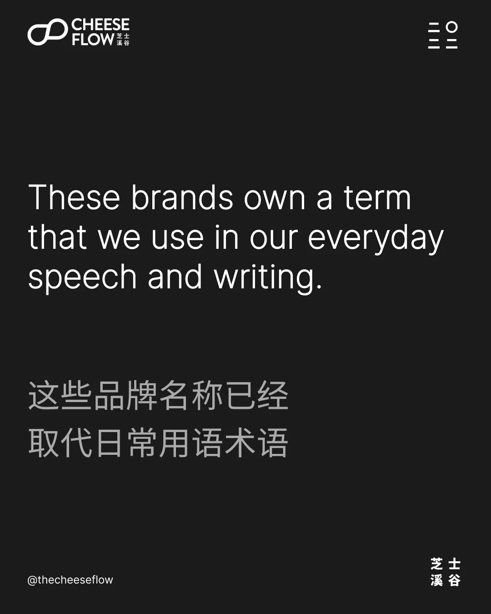
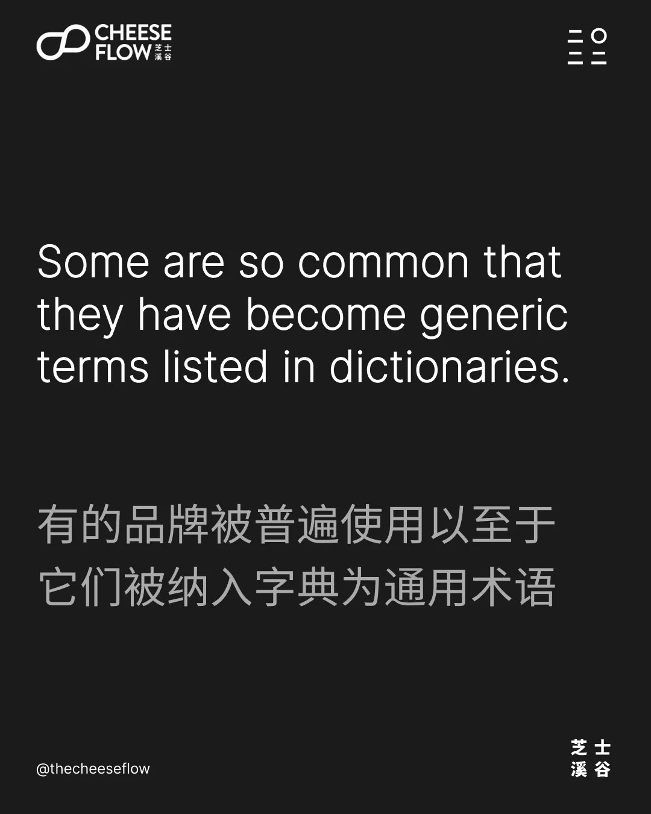
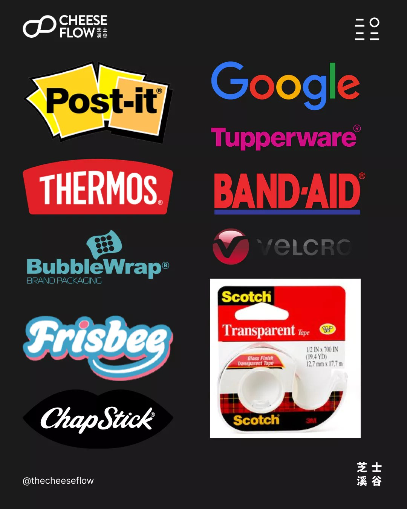
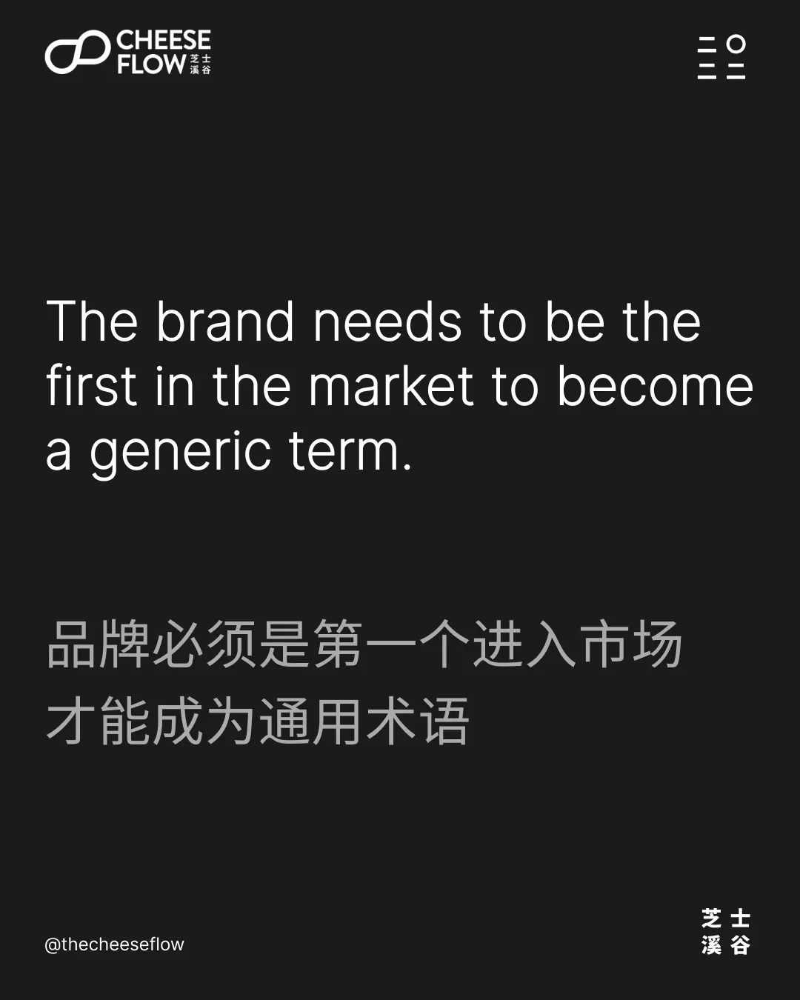
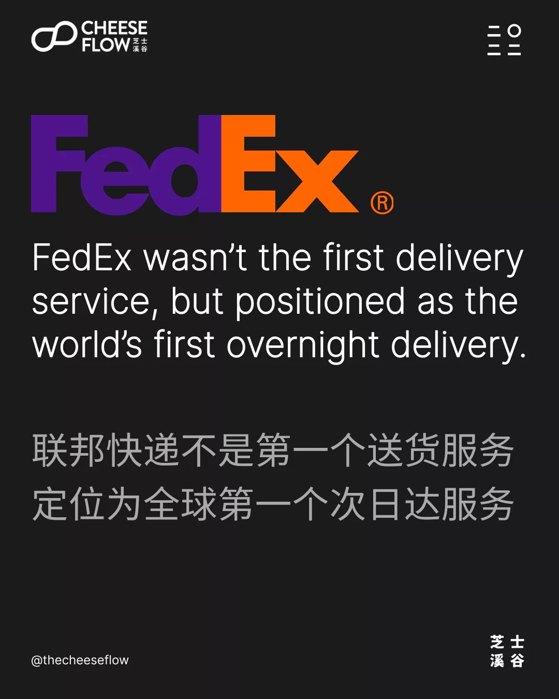
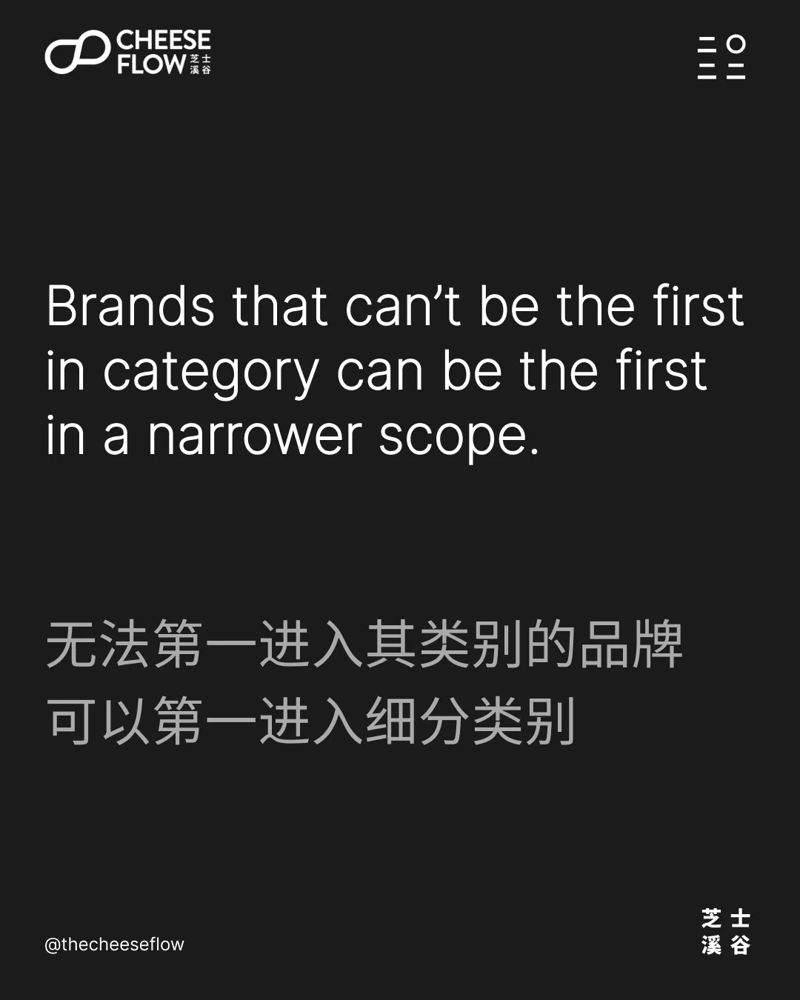

我们之前的文章里讲述了品牌如何增强品牌力，以及如何建立和维护品牌。在我们开始了解占有一个术语词的重要性之前，让我们快速回顾一下之前的内容。品牌力会随着[品牌范围的扩大而降低](https://web.archive.org/web/20231210234717/https://cheeseflow.cn/secret-of-brand-power-part-1/)，[随着品牌聚焦细分而增强](https://web.archive.org/web/20231210234717/https://cheeseflow.cn/secret-of-brand-power-part-2/)。我们[通过媒体宣传建立品牌](https://web.archive.org/web/20231210234717/https://cheeseflow.cn/secret-of-brand-power-part-3/)，[通过投放广告维护品牌](https://web.archive.org/web/20231210234717/https://cheeseflow.cn/secret-of-brand-power-part-4/)。

广告会让品牌在消费者脑海中刷新存在，但仅仅提醒消费者品牌存在是不够的。当一个品牌占有一个术语时，它会获得其他品牌无法轻易取代的消费者心智份额。

## 拥有一个术语的品牌

在国外你会看到人们用品牌名字来称呼，比如：“麻烦递张 Kleenex （克里奈克—）“ 斯而不是纸巾。Q-Tip 而不是棉签，Xerox （施乐）而不是复印， Ziploc （密保诺）而不是可密封袋，Sharpie 而不是马克笔。 Photoshop（PS）而不是图像处理。

这些品牌名称通过取代我们的日常用语而占据了我们的心智份额。事实上，有些被普遍使用以至于它们被纳入字典为通用术语。

人们会用 Post-it （3M 便利贴）代替便利贴。用 Thermos（膳魔师）代替保温瓶。用 Scotch（3M 透明胶带）代替透明胶带。用 Band-Aid（邦迪）贴代替创可贴。用 Chapstick （俏唇）代替润唇膏。Tupperware（特百惠）代替塑料容器。用 Frisbee（飞盘）代替是飞盘。用 Bubble Wrap （泡沫包装）而不是包装气泡膜。用 Velcro （ 威扣）代替魔术贴。 用 Google（谷歌）来形容使用引擎搜索互联网，类似国内的百度一下。

当然，要成为通用术语并不容易。品牌必须是第一个进入市场才能成为通用术语。

## 成为世界第一

有些品牌是无法成为第一进入其类别，它们可以缩小品牌定位的范围，成为第一进入细分类别。

联邦快递本不是第一个提供送货服务的品牌，但它将自己定位为世界上第一个次日达送货服务的品牌。通过缩小品牌承诺的细分领域，您可以正当地声称自己第一进入特定细分市场。

不言而喻，这必须是正当的处理。我们看到许多品牌以荒谬和毫无意义的方式声称自己是全球第一。这样做不会让品牌获得消费者的心智份额。相反，看似虚假或崇高的声明会增加对该品牌的不信任。

我们通过在 Kickstarter 随便浏览一下，找到了 [Zeus](https://web.archive.org/web/20231210234717/https://www.kickstarter.com/projects/asaptechnologies/zeus-charger)。它声称“Zeus：全球第一个和最小的 270瓦 氮化镓（GaN） Type C 充电器”。首先，它把全球拼错了，文案里糟糕的语法是会被看不起的。 Zeus 不是全球第一个氮化镓 Type C 充电器，也不是全球最小的。它声称是全球上第一个也是最小的 270瓦 氮化镓 Type C 充电器。

它没有缩小焦点，而是聚焦了 270瓦 氮化镓 Type C 充电器的细分领域。它的声明是否有助于转化率？当然。但它有助于提升品牌力吗？不。

## 选择正确的术语

你需要找到一个其他竞争品牌没占有的术语。但是，它仍然应该是消费者会想到的一个术语。

消费者会想到购买氮化镓充电器、Type C 充电器或氮化镓 Type C 充电器。在这三个中，他们很可能会记住一个卖质量好的氮化镓充电器品牌。但是，他们不会去记住一个卖质量好的 270瓦氮化镓充电器的品牌。

我们来看看另一个例子。消费者会寻找大屏幕的智能手机品牌、电池寿命长的智能手机品牌或大屏幕且电池寿命长的智能手机品牌。他们不会记得 6.7 英寸屏幕智能手机品牌或视频播放续航 30 小时的品牌。

## 提升品牌力

选择正确的术语很重要。一个能在产品发布后制造短期话题和兴趣的术语，和一个建立品牌力的术语是有区别的。

一旦你能够占有正确的术语，你的品牌就会在消费者心智里扎根，并帮助你的品牌从竞争对手中脱颖而出。

可口可乐将自己定位为永恒的可乐品牌。百事可乐将自己定位为适时的品牌。百事可乐有趣、酷，并通过与名人合作来吸引年轻人群。这使百事可乐把自己与占有可乐术语并被视为经典可乐的竞争对手区分开来。

你想挖掘品牌力的秘密吗？找到您的品牌可以拥有的术语。

如果您有兴趣了解我们能如何帮助您提升品牌影响力，请联系我们。
