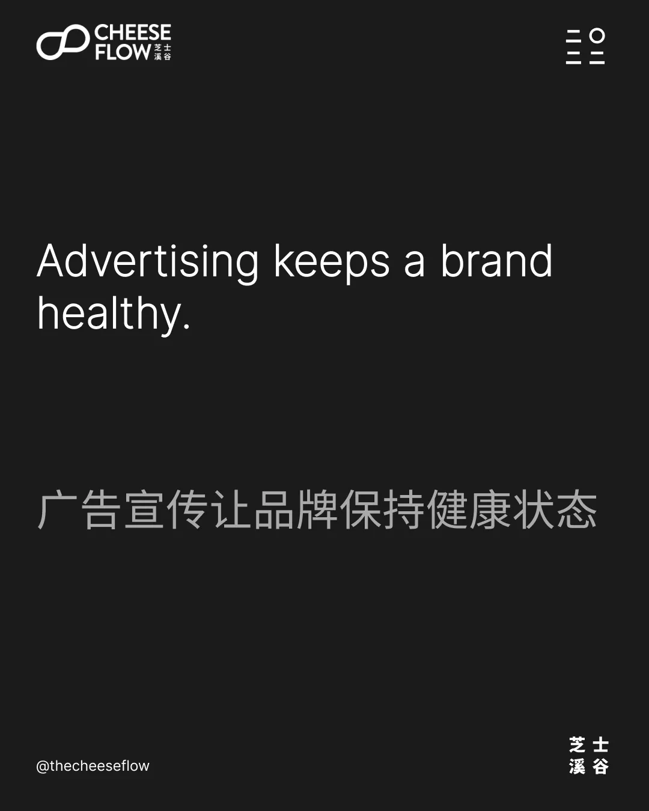
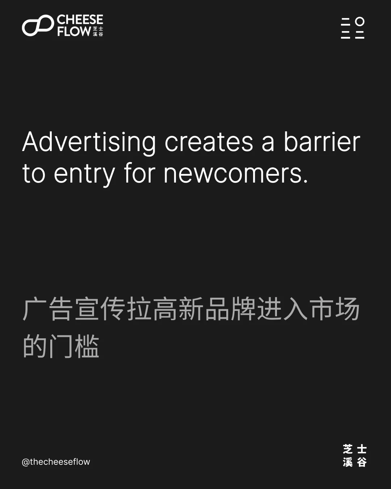
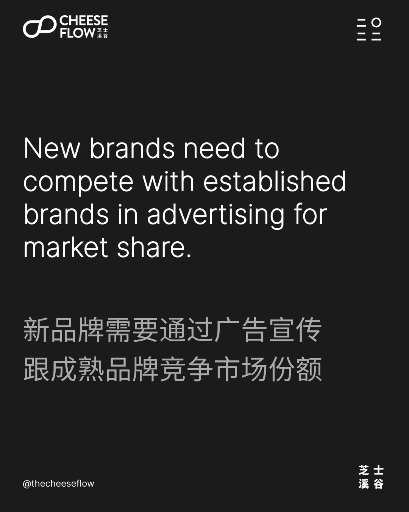
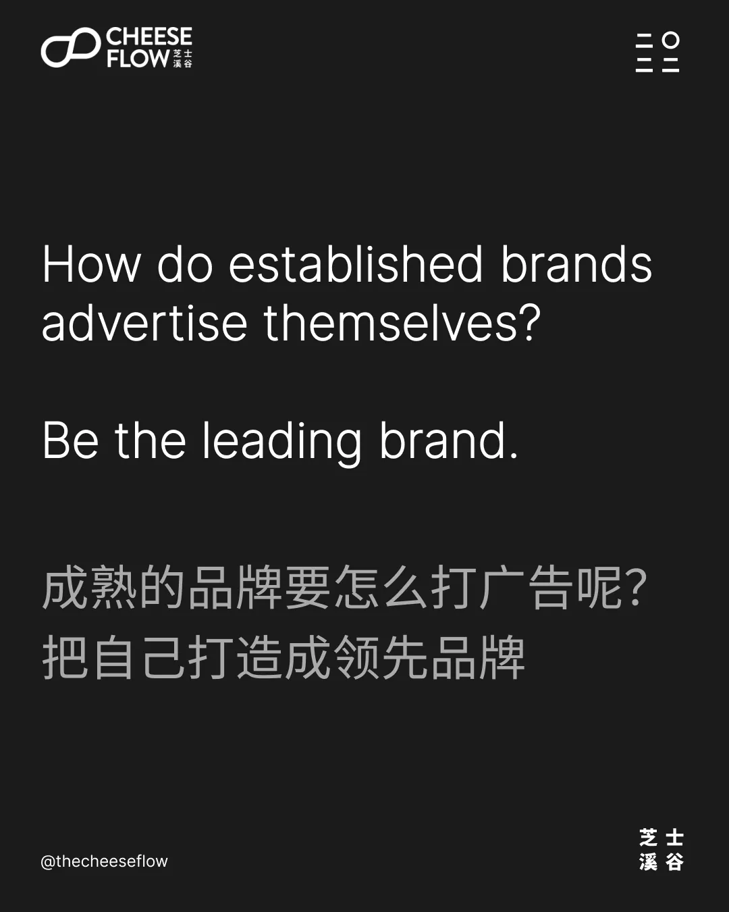
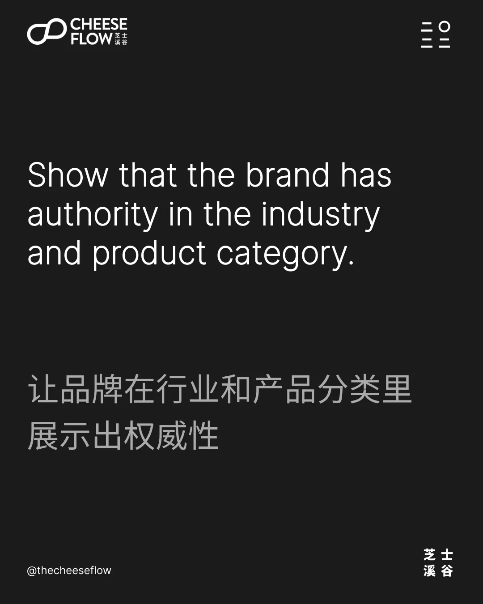
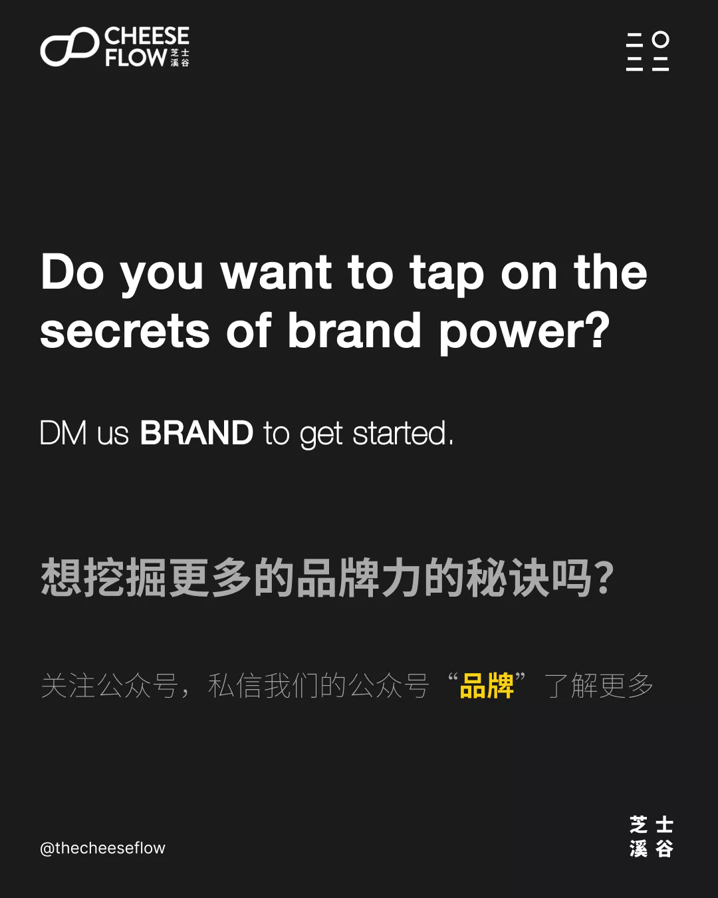

我们在之前三篇文章中了解到，缩小品牌范围和聚焦一个细分领域是增加品牌力的秘诀。我们也探讨里品牌力为何是通过媒体报道提高关注度，而不是通过广告宣传。

## 当媒体曝光的效果开始淡化时，进行广告宣传

然而，当品牌变成熟时，它们依赖广告宣传来维护品牌。

当媒体曝光效果逐渐淡化时，品牌需要通过广告宣传来在消费者的脑海里刷新存在。

市场里有上千上万的品牌，消费者日常生活中每天都会接触到上百个品牌。广告宣传让品牌提醒消费者它们还存在。

既然成熟的品牌通过广告宣传来引起消费者的注意，不打广告的品牌就会少经常出现在消费者的脑海里，甚至有被渐渐被遗忘掉的风险。

## 广告宣传是个门槛

广告宣传需要品牌预留广告投放预算和策划营销活动，它也推动品牌不断思考新的创意来保持自己品牌在消费者脑海中的新鲜感和竞争力。

虽然这看起来是给品牌增加了压力，但品牌需要通过广告宣传来开拓市场份额，这其实对品牌是有益的。

新品牌必须和成熟品牌竞争来得到市场份额，这意味着广告宣传对新品牌来说是个门槛。

这带给成熟品牌一定的保护，尤其是针对只有有限或者完全没预算投入在广告宣传的新品牌。

## 正确的广告宣传

品牌常犯的错误是在广告里跟目标受众说产品的细节和优势，它们还不怎么了解成熟的品牌是怎么有效的做广告宣传。

当你的品牌强调自己为何比较好，消费者听到了是会不理睬你的广告词藻。那只是你自卖自夸，因为你当然只会为自己说好话。

我们之前的文章里已经聊过媒体报道比广告宣传更有影响力的话题，是因为媒体报道说他人对你品牌的评价，所以更可信。

但是，其实是有个方法让你有说服力的去自卖自夸。好的广告战略关键在于把成熟品牌定位为领先品牌。

## 领先品牌的力量

人们往往会把领先品牌和好产品联系起来。因为如果你的品牌是该行业龙头，那你应该很了解它处的行业和产品分类，也知道怎么做出好产品。

百味来把自己定位为意大利的第一意大利面的品牌。可口可乐自称是唯一真正的可乐。亨氏声称是美国最喜爱的番茄酱。

苹果是世界领先的品牌，所以人们都会自然而然觉得苹果产品会比较好。

作为市场龙头会给予品牌在行业和产品分类里有更多权威。

当消费者把你的品牌认定为领先品牌时，那新品牌要和你竞争的时候就需要在广告宣传上投入更多。如果它们没能力和你 PK 对决，消费者就会把他们视为小品牌。

## 提升您的品牌影响力

我们可以通过苹果看到这个转变过程。当苹果在和市场龙头微软竞争时，苹果的广告宣传里说的是苹果产品为什么比市场龙头好。相比之下，今日的苹果把自己定位为在创新和隐私性保护中的领先品牌。

但是，就算苹果当时是和市场龙头竞争时，它是把自己定位为在用户体验方面的领先品牌。换句话说，在拿自己和市场龙头对比时，苹果品牌找到自己的广告宣传策略如何把自己打造成领先品牌。

想挖掘更多的品牌力的秘诀吗？

如果您有兴趣了解我们能如何帮助您提升品牌影响力，请联系我们。

